## **คำอธิบายเพิ่มเติมเกี่ยวกับหัวข้อที่ 5: สร้าง API Client ให้ครบทุก Endpoint**

ไฟล์: `src/features/todos/api/client.ts`

ไฟล์นี้คือ Adapter ระหว่างฟีเจอร์ Todos กับ HTTP API

หน้าที่หลักมี 4 อย่าง:

1. รับ Input ที่มีชนิดข้อมูลที่ชัดเจน
2. แปลง Input เป็น HTTP Request
3. เรียกผ่าน Shared `httpClient`
4. ตรวจ Response ด้วย Zod ก่อนคืนเป็น Domain Data

ภาพรวม:

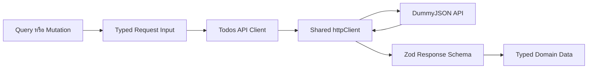

สิ่งสำคัญคือ API Client ไม่ใช่เพียงไฟล์รวม Axios Request แต่เป็นขอบเขตที่เปลี่ยนข้อมูลภายนอก ที่ยังไม่น่าเชื่อถือ ให้กลายเป็นข้อมูลภายในที่ผ่านการตรวจสอบแล้ว

---

### ตำแหน่งของ API Client ใน Architecture

Dependency Flow คือ: 

```bash
routes
→ feature query/mutation
→ feature API client
→ shared HTTP client
→ external API
```

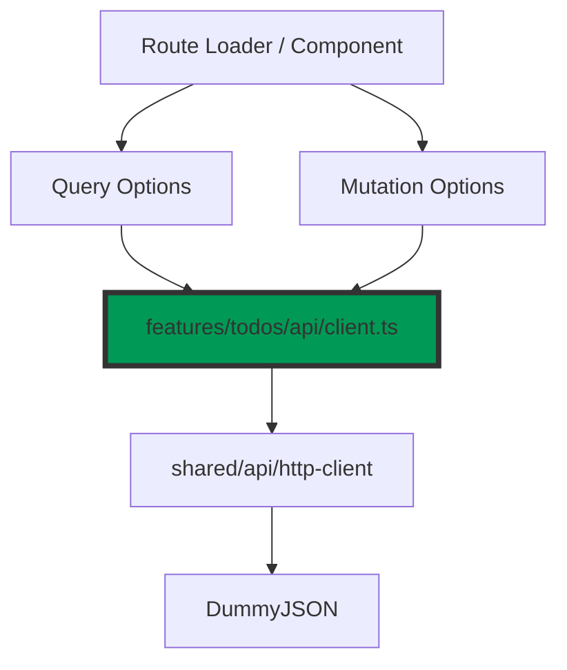

API Client ของ Feature รู้จักเรื่องเฉพาะของ Todos เช่น:

- `/todos`
- `/todos/:id`
- `/todos/user/:userId`
- `/todos/random`
- Create, Update และ Delete Payload
- สัญญา Response ของ Todo

ส่วน Shared HTTP Client ควรรู้เฉพาะเรื่อง Transport เช่น:

- Base URL
- Timeout
- Axios Configuration
- Headers กลาง
- Transport Error Normalization

ดังนั้น Feature API Client ไม่ควรสร้าง Axios Instance เอง และ Shared HTTP Client ก็ไม่ควรรู้ว่า Todo คืออะไร

---

### การนำเข้าสกีมาและชนิดข้อมูล

```tsx
import { z } from "zod";

import {
  createTodoInputSchema,
  deletedTodoSchema,
  randomTodoCountSchema,
  randomTodosSchema,
  todoSchema,
  todosListResponseSchema,
  updateTodoInputSchema,
} from "./contracts";
```

ส่วนนี้ Import Zod Schema มาใช้ตรวจข้อมูลตอน Runtime

ตัวอย่าง:

```tsx
todoSchema.parse(response.data)
```

ส่วนต่อมา:

```tsx
import type {
  CreateTodoInput,
  DeletedTodo,
  Todo,
  TodosListResponse,
  UpdateTodoInput,
} from "./contracts";
```

ใช้ `import type` เพราะข้อมูลเหล่านี้มีไว้เฉพาะตอนคอมไพล์ และจะถูกลบออกจาก JavaScript ที่ Build แล้ว

ความต่างคือ:

| Schema | Type |
| --- | --- |
| มีอยู่ตอน Runtime | มีอยู่เฉพาะ Compile Time |
| ใช้ parse ข้อมูลจริง | ใช้ตรวจความถูกต้องของโค้ด |

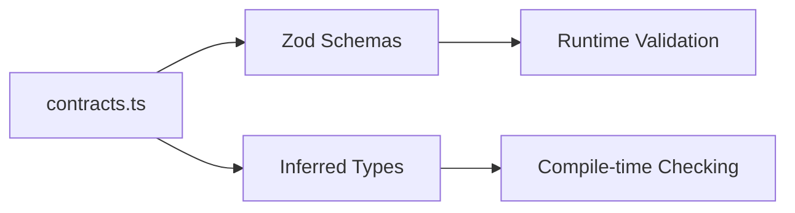

---

### Shared Infrastructure Imports

```tsx
import { httpClient } from "#/shared/api/http-client";
import { ApplicationError } from "#/shared/errors/application-error";
```

#### `httpClient`

เป็น Axios Client กลางของ Application แทนที่จะเขียนแบบนี้ในทุก Feature:

```tsx
axios.get("https://dummyjson.com/todos")
```

เราทำให้ฟีเจอร์ใช้แค่:

```tsx
httpClient.get("/todos")
```

Base URL, Timeout และ Transport Policy ถูกกำหนดจากจุดกลาง

ข้อดีคือ:

- เปลี่ยน Base URL ได้จาก Environment
- ใช้ Timeout Policy เดียวกัน
- เพิ่ม Header หรือ Authentication Adapter ได้จากจุดกลาง
- Normalize Network Error ได้สม่ำเสมอ
- Feature ไม่ผูกกับรายละเอียดการตั้งค่า Axios

#### `ApplicationError`

เป็นแบบจำลอง Error กลางของ Application

API Contract Error จึงไม่ถูกปล่อยออกมาเป็น `ZodError` ดิบ แต่ถูกแปลงเป็น Error ที่ระบบรู้จัก:

```
ZodError
  → ApplicationError
  → code: API_CONTRACT_ERROR
```

สิ่งนี้ช่วยให้ Route Error Boundary, Logging และ Observability จัดการ Error แบบสม่ำเสมอ

---

### Request Input Interfaces

ฟังก์ชั่นสำหรับ API ทุกตัวรับออบเจ็กต์แทนการรับอาร์กิวเมนต์ทีละหลายๆตัว

ตัวอย่าง:

```tsx
getTodos({
  page: 2,
  pageSize: 10,
  signal,
});
```

แทน:

```tsx
getTodos(2, 10, signal);
```

รับพารามิเตอร์แบบออบเจ็กต์อ่านง่ายกว่า และขยายในอนาคตได้โดยไม่ทำลายลำดับของอาร์กิวเมนต์

#### `RequestInput`

```tsx
interface RequestInput {
  signal?: AbortSignal | undefined;
}
```

เป็น Base Interface ที่รวม `AbortSignal` ซึ่งใช้ยกเลิก Request, Interface นี้ไม่ได้ Export เพราะใช้เป็น Internal Building Block ภายในไฟล์เท่านั้น

API Input อื่นสามารถ Extend ได้:

```tsx
export interface GetTodosInput extends RequestInput {
  page: number;
  pageSize: number;
}
```

จึงเทียบเท่ากับ:

```tsx
interface GetTodosInput {
  page: number;
  pageSize: number;
  signal?: AbortSignal | undefined;
}
```

ข้อดีคือไม่ต้องประกาศ `signal` ซ้ำทุก Interface

#### `GetTodosInput`

```tsx
export interface GetTodosInput extends RequestInput {
  page: number;
  pageSize: number;
}
```

รับ Pagination ในรูปแบบที่ Application เข้าใจง่าย:

```tsx
{
  page: 3,
  pageSize: 10
}
```

แต่ DummyJSON ใช้:

```
limit
skip
```

API Client จึงมีหน้าที่แปลง Application Model เป็น Transport Model

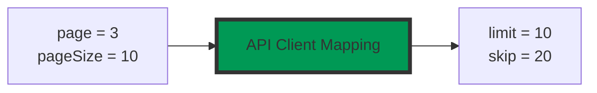

#### Input ของ Endpoint อื่น

ใช้สำหรับ Detail Endpoint:

```tsx
export interface GetTodoInput extends RequestInput {
  todoId: number;
}
```

ใช้สำหรับ User-scoped Todos:

```tsx
export interface GetTodosByUserInput extends RequestInput {
  userId: number;
}
```

ใช้สำหรับ Random Todos หลายรายการ:

```tsx
export interface GetRandomTodosInput extends RequestInput {
  count: number;
}
```

Mutation Request แยกข้อมูล Identity และ Payload ชัดเจน:

```tsx
export interface UpdateTodoRequest extends RequestInput {
  todoId: number;
  input: UpdateTodoInput;
}
```

ตรงนี้แบ่งเป็น:

- `todoId` → ระบุ Resource ใน URL
- `input` → ข้อมูลที่จะส่งใน Request Body

---

### `parseResponse` ใช้สำหรับ Random Todos หลายรายการ

```tsx
function parseResponse<TSchema extends z.ZodType>(
  schema: TSchema,
  data: unknown,
  message: string,
): z.infer<TSchema> {
```

Function นี้รับสามอย่าง:

- `schema`: สกีมาที่ใช้ตรวจ
- `data`: Response Data ที่ยังเป็น `unknown`
- `message`: ข้อความ Error ที่อธิบายบริบทของ Endpoint

ชนิดข้อมูลที่ส่งกลับมาคือ `z.infer<TSchema>` โดยจะถูกอนุมานจากสกีมาที่ส่งเข้ามา เช่น:

- `parseResponse(todoSchema, response.data, "...")` → `Todo`
- `parseResponse(todosListResponseSchema, response.data, "...")` → `TodosListResponse`

นี่คือ Generic Function ที่รักษาความสัมพันธ์ระหว่างสกีมาและชนิดข้อมูลที่ส่งกลับมา

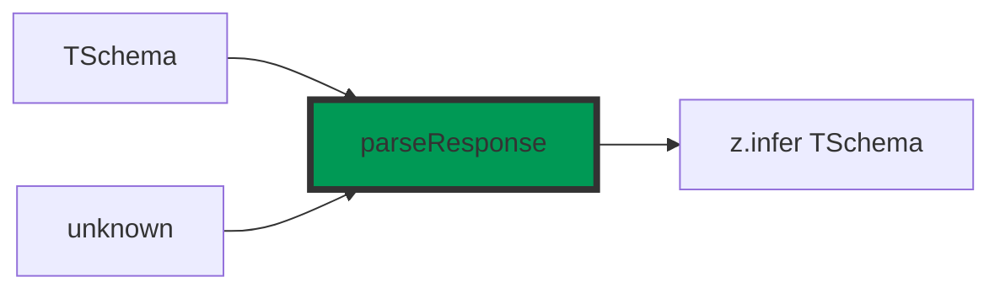

#### ทำไม `data` ต้องเป็น `unknown` ?

เพราะ Response จาก External API ยังไม่ควรถูกเชื่อว่าเป็น Todo แม้ Axios จะสามารถกำหนด Generic แบบนี้:

```tsx
httpClient.get<Todo>("/todos/1")
```

Generic ดังกล่าวตรวจเฉพาะ TypeScript ไม่ได้ตรวจ JSON จริง ดังนั้นแนวคิดที่ปลอดภัยคือ:

```
HTTP Response
  → unknown
  → Schema Parse
  → Trusted Domain Data
```

#### การ Parse

```tsx
return schema.parse(data);
```

ถ้าข้อมูลถูกต้อง:

- Zod Validate
- Zod Normalize หรือบังคับตามสกีมา
- คืนข้อมูลที่ถูกตีความตามชนิดนั้นแล้ว (Typed Data)

ถ้าไม่ถูกต้อง `schema.parse()` จะโยน `ZodError` กลับมา

#### แปลง `ZodError` เป็น `ApplicationError`

```tsx
catch (error: unknown) {
  if (error instanceof z.ZodError) {
    throw new ApplicationError(message, {
      code: "API_CONTRACT_ERROR",
      details: z.flattenError(error),
      cause: error.cause,
    });
  }

  throw error;
}
```

Error Flow:

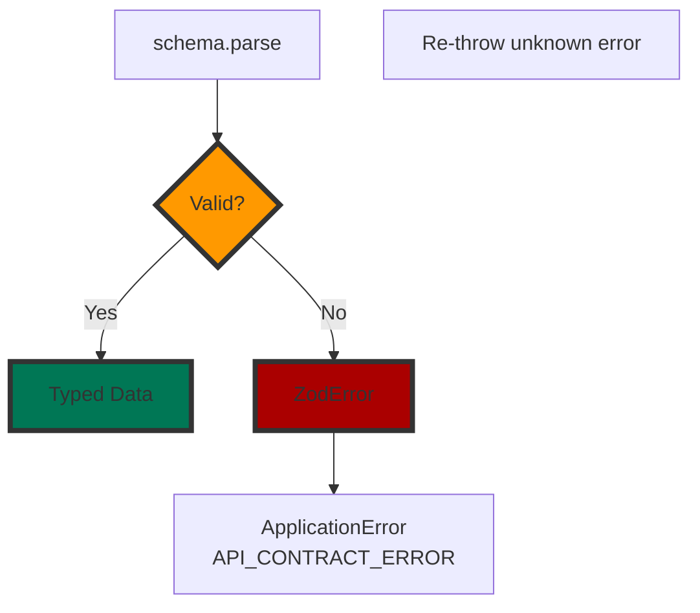

`ApplicationError` ประกอบด้วย:

- `message` ข้อความที่อธิบายบริบทของ Endpoint เช่น: “Todos API ส่ง Response รายการไม่ตรง Contract” ซึ่งดีกว่าข้อความทั่วไปว่า Validation Failed เพราะทำให้รู้ทันทีว่าเกิดที่ Endpoint ใด
- `code:` เป็น Machine-readable Error Code โดยระบบสามารถใช้แยกประเภท Error:
    
    ```tsx
    if (error.code === "API_CONTRACT_ERROR") {
      // ส่งเข้า observability หรือแสดง fallback ที่เหมาะสม
    }
    ```
    
- `details`: แปลงรายละเอียด Zod Error ให้อยู่ในโครงสร้างที่อ่านง่ายขึ้น แนวคิดประมาณ:
    
    ```tsx
    {
      fieldErrors: {
        id: ["Expected number"],
        completed: ["Expected boolean"]
      },
      formErrors: []
    }
    ```
    
- `cause`**:** เก็บ Error ต้นทางไว้สำหรับ Debugging และ Error Chaining

#### ทำไม Error อื่นต้อง `throw error`

ฟังก์ชันนี้ควรแปลงเฉพาะ Zod Validation Error เท่านั้น ไม่ควรจับ Error ทุกชนิดแล้วเปลี่ยนเป็น Contract Error เพราะอาจมี Error อื่น เช่น:

- Programming Error
- Getter Throw Error
- Custom Transformation Error
- Unexpected Runtime Error

การ Re-throw เป็นการรักษาความหมายเดิมของ Error ไว้

---

### `withSignal`: ประกอบ Axios Config อย่างปลอดภัย

```tsx
function withSignal(signal: AbortSignal | undefined) {
  return signal === undefined ? {} : { signal };
}
```

ฟังก์ชันนี้จะคืนค่า `{}` มาให้ถ้าไม่มี `signal` แต่ถ้ามีก็จะคืน `{ signal }` กลับมา จากนั้นนำไปกระจาย (spread) ใน Axios Config:

```tsx
{
  params: { ... },
  ...withSignal(signal),
}
```

เหตุผลที่ไม่ส่ง `{ signal: undefined }` ตรง ๆ คือการไม่ใส่คุณสมบัติเลยจะทำให้ Config สะอาดกว่า และเข้ากับ Type ที่เปิด Strict Optional Property Semantics ได้ดี

#### ทำไมต้องรองรับ `AbortSignal`?

TanStack Query ส่ง `AbortSignal` เข้า `queryFn` ได้เมื่อ Query ไม่จำเป็นแล้ว เช่น:

- ผู้ใช้เปลี่ยนหน้าเร็ว
- Search Parameter เปลี่ยน
- คอมโพเนนต์ถูกถอดออก (Unmount)
- Query ถูกยกเลิก
- Route Navigation เปลี่ยนก่อน Request เสร็จ

TanStack Query สามารถ Abort Request เดิมได้

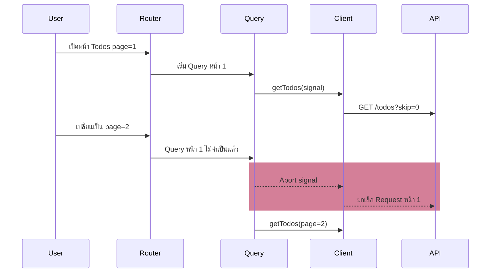

ถ้า API Client ไม่ส่ง Signal ต่อไปยัง Axios กระบวนการหยุดยั้งจะหยุดอยู่ที่ Query Layer แต่ Network Request ยังทำงานต่อ

---

### `getTodos`: List พร้อม Server Pagination

```tsx
export async function getTodos({
  page,
  pageSize,
  signal,
}: GetTodosInput): Promise<TodosListResponse> {
```

หังก์ชันรับ Application-level Pagination แล้วคืน `TodosListResponse`

Request:

```tsx
	const response = await httpClient.get("/todos", {
	  params: {
	    limit: pageSize,
	    skip: (page - 1) * pageSize,
	  },
	  ...withSignal(signal),
	});
```

สูตรคือ: `skip = (page - 1) × pageSize`

ตัวอย่าง:

| page | pageSize | skip |
| --- | --- | --- |
| 1 | 10 | 0 |
| 2 | 10 | 10 |
| 3 | 10 | 20 |
| 2 | 20 | 20 |

Caller ใช้ Page-based Pagination แต่ API Client แปลงเป็น Offset-based Pagination

หลัง Request:

```tsx
return parseResponse(
  todosListResponseSchema,
  response.data,
  "Todos API ส่ง Response รายการไม่ตรง Contract",
);
```

ฟังก์ชันจะไม่คืน `AxiosResponse` แต่คืนเฉพาะ Domain Data มาเป็น `TodosListResponse` ช่วยไม่ให้ชนิดข้อมูลจาก Axios รั่วออกไปยัง Query และ UI

---

### **`getTodo`: อ่าน Todo รายการเดียว**

```tsx
export async function getTodo({
  todoId,
  signal,
}: GetTodoInput): Promise<Todo> {
  const response = await httpClient.get(
    `/todos/${todoId}`,
    withSignal(signal),
  );

  return parseResponse(
    todoSchema,
    response.data,
    "Todos API ส่ง Todo ไม่ตรง Contract",
  );
}
```

Flow:

```
todoId
  → /todos/:todoId
  → HTTP GET
  → todoSchema
  → Todo
```

Client สร้าง Endpoint URL จาก ID และตรวจ Response ด้วย `todoSchema`

ข้อสังเกตคือ `todoId` ยังไม่ได้ Parse ในฟังก์นี้ เพราะคาดว่า Boundary ก่อนหน้า เช่น Route Parameter Schema ได้ตรวจมาแล้ว หรือ Caller ส่ง Number ตาม Interface

อย่างไรก็ตาม TypeScript Type เพียงอย่างเดียวไม่กัน Runtime Input ที่ผิด หากฟังก์ชันถูกเรียกจาก JavaScript หรือผ่าน Cast ดังนั้นระบบ Production บางแห่งอาจเพิ่ม ID Schema ที่ Boundary นี้อีกชั้นได้ ขึ้นอยู่กับระดับ Defensive Validation ที่ต้องการ

---

### `getTodosByUser`: ใช้สัญญาเดิมกับ Endpoint ต่างกัน

```tsx
export async function getTodosByUser({
  userId,
  signal,
}: GetTodosByUserInput): Promise<TodosListResponse> {
```

เรียก `GET /todos/user/:userId` 

แม้ Endpoint ต่างจาก `/todos` แต่รูปทรง Response มาเหมือนกัน จึงใช้ `todosListResponseSchema` ซ้ำได้ถือเป็นการใช้สัญญาเดิมซ้ำตามรูปร่างจริงไม่ใช่ตามชื่อ Endpoint

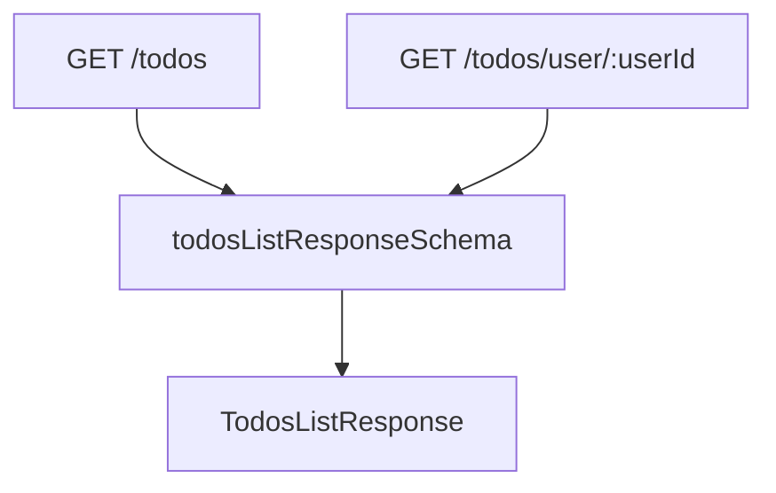

แต่ข้อความแสดง Error แยกตามบริบท `"Todos By User API ส่ง Response ไม่ตรง Contract"` จึงยังระบุแหล่งปัญหาได้

---

### `getRandomTodo`: Optional Parameter Object

Endpoint คืน Todo รายการเดียว จึงใช้ `todoSchema`

```tsx
export async function getRandomTodo(
  { signal }: RequestInput = {},
): Promise<Todo>
```

จุดที่น่าสนใจคือค่าเริ่มต้นของพารามิเตอร์ `= {}` ทำให้เรียกได้สองแบบ คือ `getRandomTodo()` หรือ `getRandomTodo({ signal })` เพราะถ้าไม่มีค่าเริ่มต้นเป็น `{}` การเรียกโดยไม่ส่งอาร์กิวเมนต์จะ Error เพราะมันจะพยายามแตก `undefined`

---

### `getRandomTodos`: Normalize Return Shape

```tsx
export async function getRandomTodos({
  count,
  signal,
}: GetRandomTodosInput): Promise<Array<Todo>> {
```

ฟังก์ชันนี้รับประกันว่าจะคืนอาร์เรย์เสมอ (`Promise<Array<Todo>>`) แม้ `count = 1`:

#### Validate Count ก่อนสร้าง URL

```tsx
const parsedCount = randomTodoCountSchema.parse(count);
```

ป้องกัน:

```tsx
count = 0
count = 11
count = 1.5
```

ก่อนนำไปประกอบ URL เป็นการตรวจสอบความถูกต้องของข้อมูลจากฝั่ง Request แต่เป็นการตรวจจาก Path Parameter ไม่ใช่ Body Payload

#### Endpoint ของ DummyJSON ไม่สม่ำเสมอ

สำหรับหนึ่งรายการใช้ `GET /todos/random` และคืนออบเจ็กต์ `Todo` แต่หลายรายการใช้ `GET /todos/random/:count` และคืนอาร์เรย์ `Todo[]`

API Client ซ่อนความไม่สม่ำเสมอนี้จาก Caller แม้ API จะคืนออบเจ็กต์ แต่ Client ก็จะช่วยห่อเป็นอาร์เรย์ให้: `[Todo]`

```tsx
if (parsedCount === 1) {
  return [await getRandomTodo({ signal })];
}
```

ดังนั้นจึงเรียกใช้งานง่าย แค่:

```tsx
const todos = await getRandomTodos({ count });
```

และไม่ต้องเขียน:

```tsx
if (count === 1) {
  // Handle object
} else {
  // Handle array
}
```

นี่เรียกว่า Normalize Transport Shape ให้เป็น Stable Domain Interface

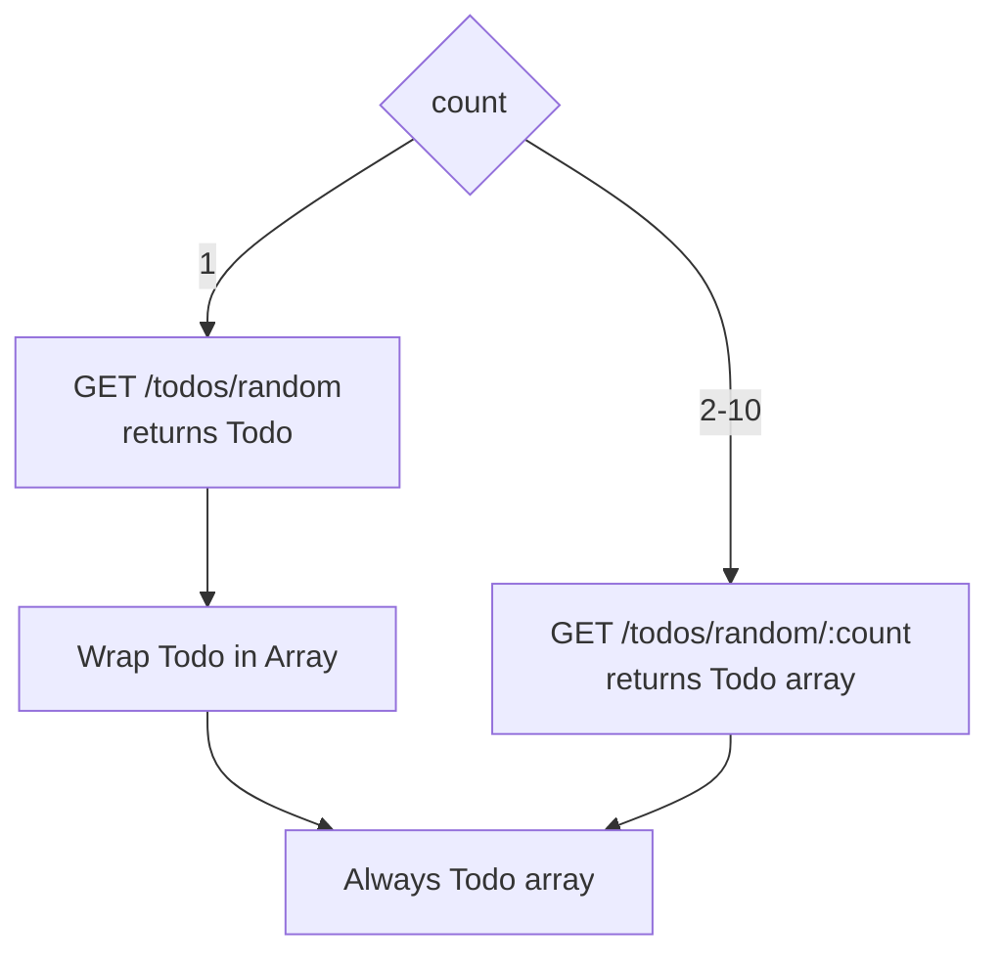

---

### `addTodo`: Validate Request และ Response

```tsx
export async function addTodo({
  input,
  signal,
}: AddTodoRequest): Promise<Todo> {
```

ขั้นแรก:

```tsx
const payload = createTodoInputSchema.parse(input);
```

แม้ `input` มีชนิดข้อมูลเป็น `CreateTodoInput` อยู่แล้ว ก็ยังต้อง Parse ตอน Runtime เหตุผลคือ TypeScript Type อาจถูกข้ามได้จาก:

- Form Data
- URL Data
- JavaScript Caller
- Unsafe Type Assertion
- Data ที่มาจาก Storage
- Test Fixture ที่ผิด

จากนั้นส่ง Payload ที่ผ่านการตรวจแล้ว:

```tsx
const response = await httpClient.post(
  "/todos/add",
  payload,
  withSignal(signal),
);
```

และตรวจ Response อีกครั้ง:

```tsx
return parseResponse(todoSchema, response.data, ...);
```

ดังนั้น Create Flow มี Validation สองทิศทาง:

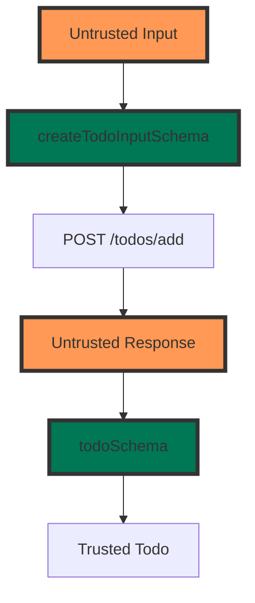

นี่คือ Boundary Symmetry:

- ก่อนส่งออก → Validate Request
- หลังรับเข้า → Validate Response

---

### `updateTodo`: PATCH และ Partial Payload

```tsx
export async function updateTodo({
  todoId,
  input,
  signal,
}: UpdateTodoRequest): Promise<Todo> {
```

ตรวจ Input ด้วย:

```tsx
const payload = updateTodoInputSchema.parse(input);
```

สกีมาจะรับรองว่า:

- ส่งได้เฉพาะ `todo` และ `completed`
- ฟิลด์เป็น Optional
- ต้องมีอย่างน้อยหนึ่งฟิลด์

จากนั้น:

```tsx
httpClient.patch(`/todos/${todoId}`, payload, ...)
```

ใช้ `PATCH` เพราะ Payload เป็น Partial Update

ตัวอย่าง:

```tsx
{
  completed: true
}
```

ไม่จำเป็นต้องส่ง `todo` และ `userId` ทั้งก้อน

Flow:

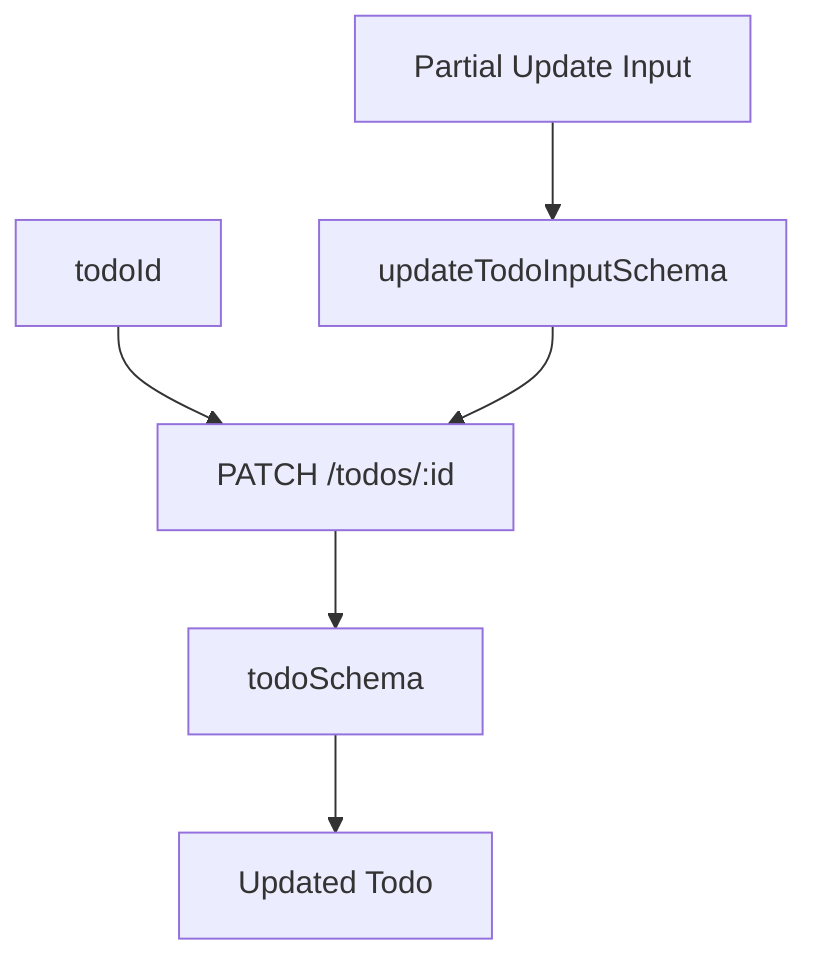

---

### `deleteTodo`: Response ไม่ใช่ Todo ปกติ

```tsx
export async function deleteTodo({
  todoId,
  signal,
}: DeleteTodoRequest): Promise<DeletedTodo> {
```

เรียก: `DELETE/todos/:todoId`

DummyJSON คืน Resource พร้อม Metadata:

```tsx
{
  ...todo,
  isDeleted: true,
  deletedOn: "..."
}
```

จึงไม่ใช้ `todoSchema` แต่ใช้ `deletedTodoSchema` แทน ชนิดข้อมูลที่คืนกลับมาจึงเป็น `DeletedTodo`

นี่แสดงให้เห็นว่า HTTP Method เดียวกันไม่ได้แปลว่า Response จะเป็น `void` เสมอ ดังนั้นสัญญาต้องอิงพฤติกรรมจริงของ API

---

### เหตุใด Client คืน Domain Data ไม่คืน `AxiosResponse`

ทุก Function ทำรูปแบบนี้:

```tsx
const response = await httpClient.get(...);

return parseResponse(schema, response.data, ...);
```

แทนการคืน:

```tsx
return response;
```

Caller จึงได้รับ:

```tsx
Todo
TodosListResponse
DeletedTodo
```

ไม่ใช่:

```tsx
AxiosResponse<Todo>
```

ข้อดี:

- Query Layer ไม่ผูกกับ Axios
- UI ไม่ต้องใช้ `response.data`
- เปลี่ยน Transport Library ได้ง่ายกว่า
- Header และ Status Code ไม่รั่วเข้า Business Layer โดยไม่จำเป็น
- Mock และ Test ง่ายขึ้น

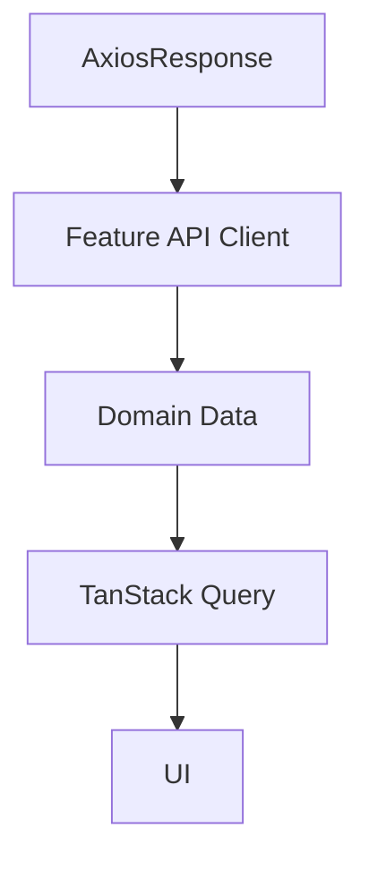

Axios จึงเป็น Implementation Detail ของ Infrastructure ถ้าบาง Use Case ต้องใช้ Header เช่น Pagination Token ควร Map เป็น Domain Result ที่ชัดเจน เช่น:

```tsx
type TodosPage = {
  data: Todo[];
  nextCursor: string | null;
}
```

ไม่ควรปล่อย AxiosResponse ทั้งก้อนออกไปเพียงเพราะต้องใช้ Header หนึ่งค่า

---

### สิ่งที่ API Client ไม่รับผิดชอบ

ไฟล์นี้ไม่ควรทำสิ่งต่อไปนี้:

- **ไม่จัดการ Query Cache** เพราะเป็นหน้าที่ของ Query หรือ Mutation Layer
    
    ```tsx
    // ห้ามมี
    queryClient.invalidateQueries(...)
    ```
    
- **ไม่จัดการ UI State** เพราะ API Client ไม่ควรรู้จัก React หรือ Router
    
    ```
    // ห้ามมี
    setLoading(true)showToast(...)navigate(...)
    ```
    
- **ไม่จัดการ Route Parameters โดยตรง**
    
    ```tsx
    // ไม่ควรใช้:
    Route.useParams()
    ```
    
    Route ควร Parse Parameter แล้วส่ง `todoId` เข้ามา
    
- **ไม่ Render Error Message:** Client สร้าง Semantic Error แต่ UI หรือ Error Boundary ตัดสินใจว่าจะนำเสนออย่างไร
- **ไม่เก็บ Server State:** Client เป็น Stateless Function Layer ไม่ใช่ Cache

---

### Error มีหลายขอบข่าย

API Call หนึ่งครั้งอาจล้มเหลวได้หลายระดับ:

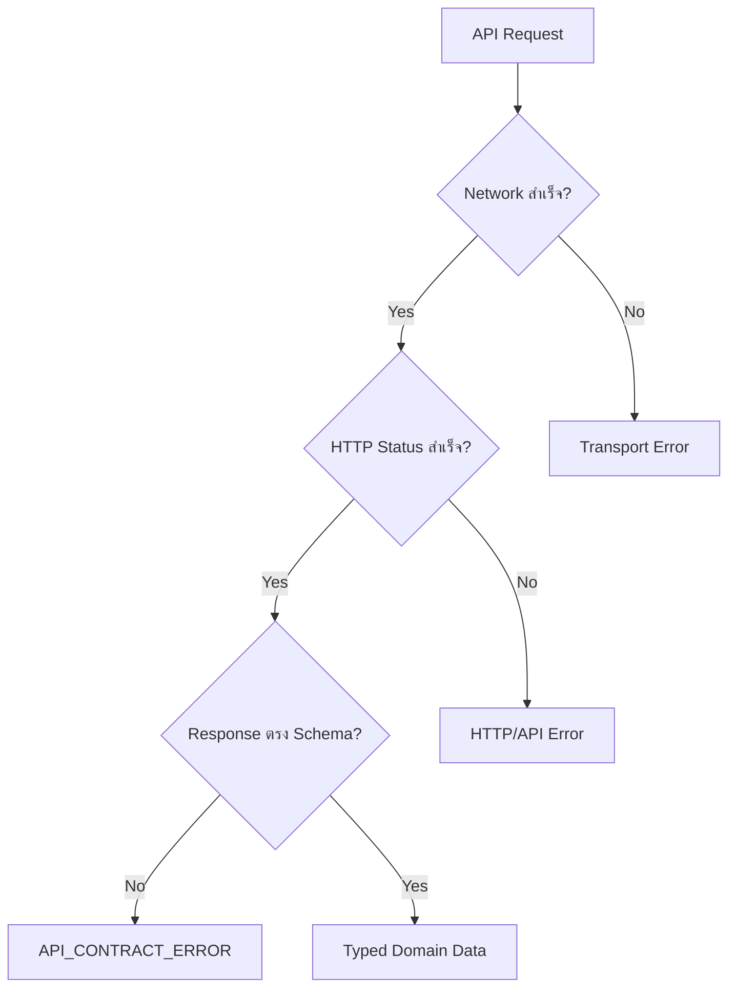

หน้าที่โดยทั่วไป:

| Error | Owner |
| --- | --- |
| Network, Timeout, HTTP Status | Shared HTTP Client |
| Response Shape ผิด | Feature API Client |
| Query Retry และ Cache State | TanStack Query |
| การแสดงผล | Route Error Boundary หรือ UI |

การแยกแบบนี้ทำให้ Error Handling ไม่กระจายและไม่ซ้ำกัน

---

### Endpoint Matrix

| Function | Method | Endpoint | Request Validation | Response Validation |
| --- | --- | --- | --- | --- |
| `getTodos` | GET | `/todos` | Pagination จาก Type | `todosListResponseSchema` |
| `getTodo` | GET | `/todos/:id` | `todoId` จาก Caller | `todoSchema` |
| `getTodosByUser` | GET | `/todos/user/:userId` | `userId` จาก Caller | `todosListResponseSchema` |
| `getRandomTodo` | GET | `/todos/random` | ไม่มี | `todoSchema` |
| `getRandomTodos` | GET | `/todos/random/:count` | `randomTodoCountSchema` | `randomTodosSchema` |
| `addTodo` | POST | `/todos/add` | `createTodoInputSchema` | `todoSchema` |
| `updateTodo` | PATCH | `/todos/:id` | `updateTodoInputSchema` | `todoSchema` |
| `deleteTodo` | DELETE | `/todos/:id` | `todoId` จาก Caller | `deletedTodoSchema` |

---

### แก่นสำคัญของหัวข้อนี้

API Client Layer นี้ทำหน้าที่เป็น Anti-corruption Layer ขนาดเล็กระหว่าง Application กับ External API

มันซ่อนรายละเอียดของ DummyJSON เช่น:

- ใช้ `skip` แทน `page`
- Random 1 รายการคืน Object
- Random หลายรายการคืน Array
- Create ใช้ `/todos/add`
- Delete คืน Metadata เพิ่มเติม
- Response อาจมีรูปแบบไม่ตรง Contract

Caller จึงเห็น Interface ที่สม่ำเสมอกว่า:

```
getTodos(...)
  → TodosListResponse

getTodo(...)
  → Todo

getRandomTodos(...)
  → Todo[]

addTodo(...)
  → Todo

updateTodo(...)
  → Todo

deleteTodo(...)
  → DeletedTodo
```

สรุป Data Flow ของไฟล์นี้:

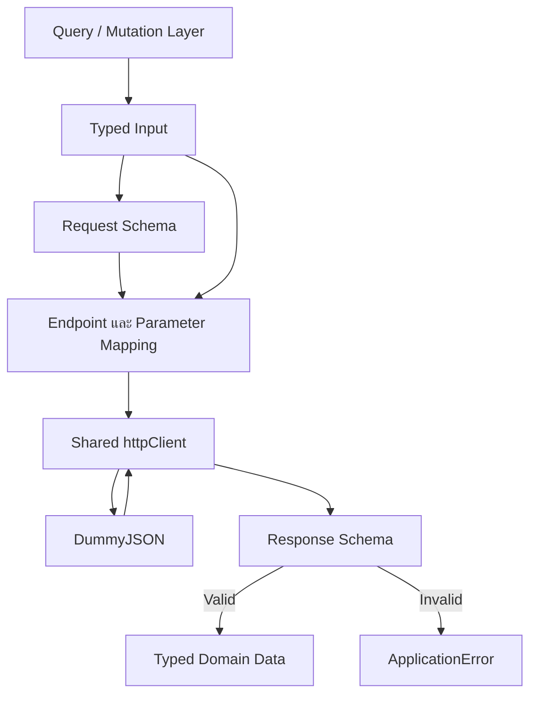

ดังนั้นแก่นของ `client.ts` ไม่ใช่ “เขียน Axios ให้ครบทุก Endpoint” อย่างเดียว แต่คือ:

```
Typed Input
  → Validated Request
  → Transport Mapping
  → Validated Response
  → Stable Domain Data
```

โดยไม่ปล่อยให้ Axios, รูปแบบ Response ที่ไม่แน่นอน หรือรายละเอียดของ External API รั่วออกไปยัง Query, Route และ UI.
