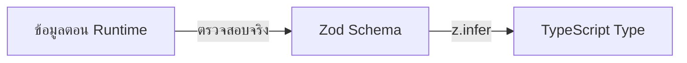
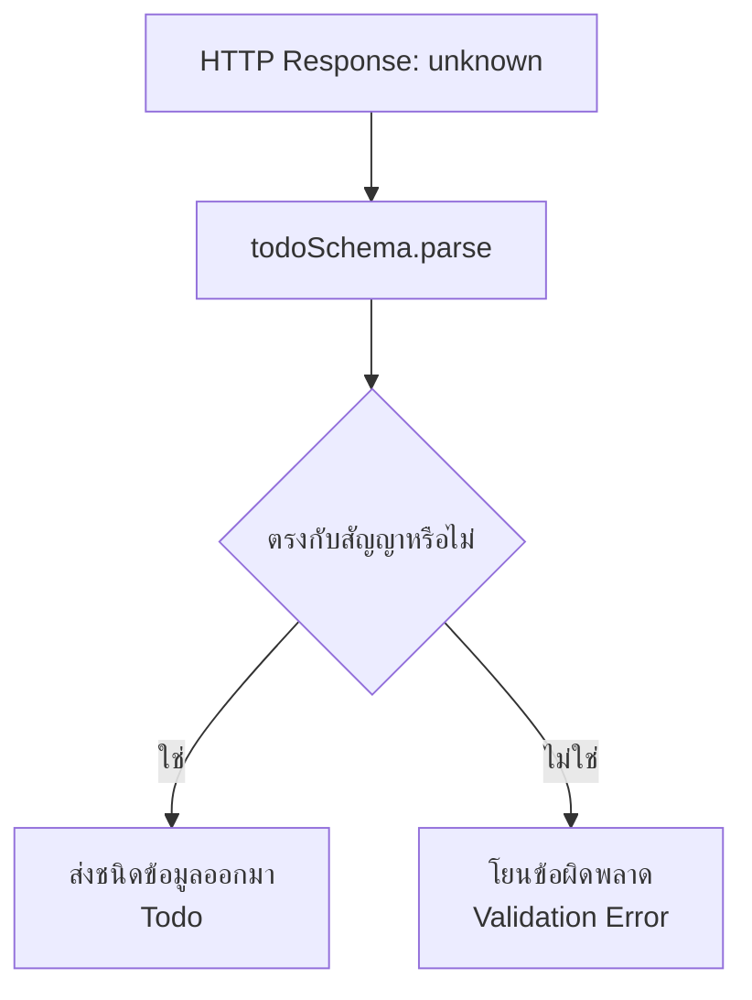
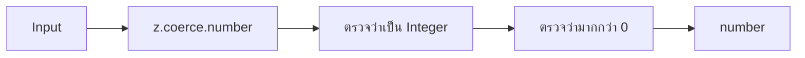
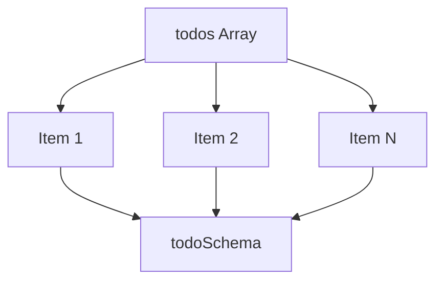
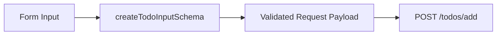
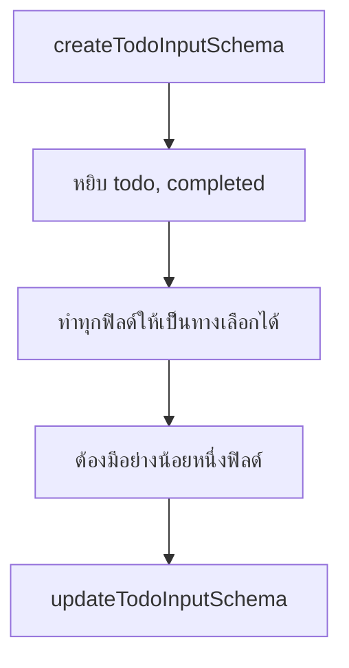
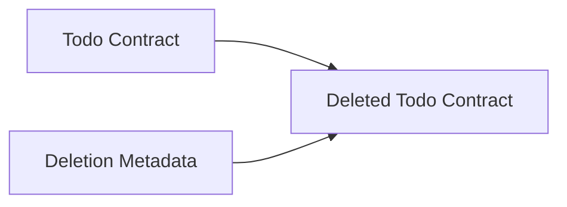
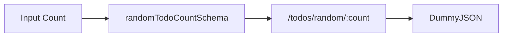
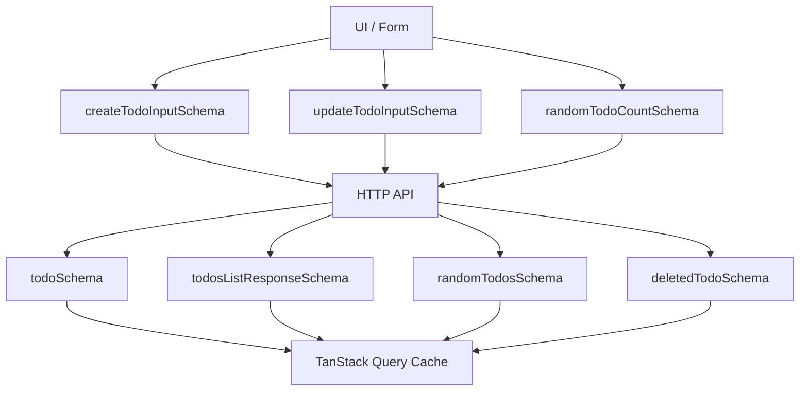

## คำอธิบายเพิ่มเติมเกี่ยวกับหัวข้อที่ 4: สร้าง API Contract

ไฟล์: `src/features/todos/api/contracts.ts`

ไฟล์นี้มีหน้าที่กำหนดว่า “ข้อมูลที่เกี่ยวข้องกับ Todos ต้องมีรูปร่างแบบใด” ทั้งข้อมูลที่รับมาจาก API และข้อมูลที่ Frontend เตรียมส่งออกไปยัง API

ในสถาปัตยกรรมนี้ Contract ไม่ได้หมายถึง TypeScript type อย่างเดียว แต่ประกอบด้วยสองสิ่งพร้อมกัน:



กล่าวคือ:

- Zod Schema ตรวจข้อมูลจริงตอนโปรแกรมกำลังทำงาน
- TypeScript Type ช่วยตรวจโค้ดตอนพัฒนาและ Build
- `z.infer` ทำให้ Schema และ Type มาจากแหล่งเดียวกัน

นี่คือเหตุผลที่ไฟล์นี้ถือเป็น Boundary สำคัญของ Feature ไม่ใช่เพียงไฟล์รวม Type ธรรมดา

ใน Tutorial ไฟล์นี้ยังไม่ได้อยู่ใน Source Code ของ Boilerplate โดยตรง แต่เป็นไฟล์ที่ผู้ใช้จะสร้างขึ้นตามขั้นตอนของเอกสาร โดยถูกวางไว้ใน `features/todos/api` เพราะเป็น Contract ที่เป็นของ Todos Feature โดยเฉพาะ

---

### ทำไมต้องมี Runtime Contract

สมมติเราเขียนเพียง TypeScript interface:

```tsx
interface Todo {
  id: number
  todo: string
  completed: boolean
  userId: number
}
```

จากนั้นเรียก API:

```tsx
const response = await axios.get('/todos/1')
const todo = response.data as Todo
```

คำสั่ง `as Todo` ไม่ได้ตรวจข้อมูลจริง มันเพียงบอก TypeScript ว่า:

> "ให้เชื่อฉันว่าข้อมูลนี้เป็น Todo"
> 

ถ้า API ส่งข้อมูลผิด เช่น:

```json
{
  "id": "invalid",
  "todo": null,
  "completed": "yes",
  "userId": -1
}
```

TypeScript จะไม่ช่วย เพราะข้อมูลนี้เกิดขึ้นหลังคอมไพลแล้ว Zod จึงเข้ามาแก้ปัญหานี้ด้วยการแปลงข้อมูลจริงให้ตรงตามสัญญา (Contract):

```tsx
const todo = todoSchema.parse(response.data)
```

ถ้าข้อมูลไม่ตรงสัญญาระบบจะหยุดที่เขตแดนของ API ทันที แทนที่จะปล่อยข้อมูลผิดรูปเข้า Query Cache และ UI



---

### `todoSchema`: สัญญาหลักของ Todo

```tsx
export const todoSchema = z.object({
  id: z.coerce.number().int().positive(),
  todo: z.string().trim().min(1),
  completed: z.boolean(),
  userId: z.coerce.number().int().positive(),
})
```

สกีมานี้อธิบาย Todo หนึ่งรายการ ข้อมูลที่ผ่านสกีมาแล้วจะมีรูปร่างประมาณนี้:

```tsx
{
  id: number
  todo: string
  completed: boolean
  userId: number
}
```

แต่ละฟิลด์มีข้อกำหนดมากกว่าแค่บอกชนิด

#### `id`

```tsx
id: z.coerce.number().int().positive()
```

แยกได้เป็นสามขั้น:



- `z.coerce.number()`: พยายามแปลงค่าที่รับมาเป็น `number`
    
    ตัวอย่างค่าที่อาจผ่าน:
    
    ```tsx
    1
    "1"
    "25"
    ```
    
    ผลลัพธ์หลังแปลง:
    
    ```tsx
    1
    1
    25
    ```
    
    จุดประสงค์คือรองรับ API จากภายนอกที่อาจส่งข้อมูลชนิดตัวเลขมาเป็นสตริงโดยไม่ทำให้ชั้น Domain ต้องมากำหนดชนิดข้อมูลแบบนี้:
    
    ```tsx
    number | string
    ```
    
    หลังผ่านสัญญาได้ ระบบจะคืนค่ามาเป็น `number` เสมอ
    
- `.int()`: บังคับให้เป็นเลขจำนวนเต็ม
    
    
    | ✅ ผ่าน | 🚫 ไม่ผ่าน |
    | --- | --- |
    | 1, 25, 100 | 1.5, 3.14 |
- `.positive()`: บังคับให้ค่ามากกว่า `0` ดังนั้น `id` ต้องเป็นจำนวนเต็มบวกเท่านั้น
    
    
    | ✅ ผ่าน | 🚫 ไม่ผ่าน |
    | --- | --- |
    | 1, 50 | 0, -1, -50 |

#### `todo`

```tsx
todo: z.string().trim().min(1)
```

- `z.string()`: ค่าต้องเป็น String
    
    
    | ✅ ผ่าน | 🚫 ไม่ผ่าน |
    | --- | --- |
    | "Buy milk" | null, 123, true |
- `.trim()`: ตัดช่องว่างด้านหน้าและด้านหลังออก ไม่ใช่เพียงตรวจสอบข้อมูลแต่เป็นการทำให้ข้อมูลตรงกับมาตรฐานที่กำหนดไว้ด้วย
    
    ```tsx
    "  Buy milk  "
    ```
    
    จะกลายเป็น:
    
    ```tsx
    "Buy milk"
    ```
    
- `.min(1)`: หลังจากเล็มแล้ว ต้องเหลือตัวอักษรอย่างน้อยหนึ่งตัว ดังนั้นค่าต่อไปนี้ ไม่ผ่าน 🙅🏻‍♀️ เพราะหลัง `.trim()` จะกลายเป็นสตริงๆ ว่างๆ:
    
    ```tsx
    ""
    " "
    "      "
    ```
    

#### `completed`

```tsx
completed: z.boolean()
```

กำหนดให้ค่าเป็น Boolean จริงเท่านั้น (`true`/`false`) ค่าประเภทนี้ไม่ผ่าน:

```tsx
"true"
"false"
1
0
```

ตรงนี้จงใจไม่ใช้ `z.coerce.boolean()` เพราะการบังคับแปลงเป็น Boolean ใน JavaScript อาจให้ผลที่ชวนเข้าใจผิด เช่น String ที่ไม่ว่างถือเป็น `true`:

```tsx
Boolean("false") // true
```

สำหรับ API Contract การบังคับให้ Server ส่ง Boolean ที่ถูกต้องจึงปลอดภัยกว่า

#### `userId`

```tsx
userId: z.coerce.number().int().positive()
```

ใช้กฎเดียวกับ `id`:

- แปลงเป็น Number
- ต้องเป็น Integer
- ต้องมากกว่า 0

`userId` ทำหน้าที่เป็น Reference ไปยัง User เจ้าของ Todo แม้ Frontend จะไม่ได้ตรวจว่าผู้ใช้ ID นั้นมีอยู่จริง แต่ Contract สามารถรับประกันได้อย่างน้อยว่า ID มีรูปแบบสมเหตุสมผล

---

### `todosListResponseSchema`: สัญญาของรายการ Todo

```tsx
export const todosListResponseSchema = z.object({
  todos: z.array(todoSchema),
  total: z.coerce.number().int().nonnegative(),
  skip: z.coerce.number().int().nonnegative(),
  limit: z.coerce.number().int().nonnegative(),
})
```

สกีมานี้ใช้กับ Response ของรายการ Endpoint เหล่านี้:

```
GET /todos
GET /todos?limit=10&skip=20
GET /todos/user/5
```

รูปร่างข้อมูลที่คาดหวังคือ:

```tsx
{
  todos: Todo[]
  total: number
  skip: number
  limit: number
}
```

ตัวอย่าง:

```json
{
  "todos": [
    {
      "id": 1,
      "todo": "Do something",
      "completed": false,
      "userId": 26
    },
    { ... },
  ],
  "total": 254,
  "skip": 0,
  "limit": 30
}
```

#### `todos`

```tsx
todos: z.array(todoSchema)
```

หมายความว่า ค่าต้องเป็น Array และ สมาชิกทุกตัวต้องผ่าน `todoSchema`



ถ้ามี Todo ผิดเพียงรายการเดียว ทั้ง Response จะไม่ผ่านสัญญา

ตัวอย่าง:

```json
{
  "todos": [
    {
      "id": 1,
      "todo": "Valid todo",
      "completed": false,
      "userId": 5
    },
    {
      "id": null,
      "todo": "Invalid todo",
      "completed": false,
      "userId": 5
    }
  ]
}
```

รายการที่สองทำให้ Response ทั้งชุดไม่ผ่าน เพราะ `id` ไม่ถูกต้อง นี่เป็นพฤติกรรมที่เหมาะสม เพราะไม่ควรนำข้อมูลบางส่วนที่ไม่แน่นอนเข้า Query Cache แบบเงียบ ๆ

#### `total`

```tsx
total: z.coerce.number().int().nonnegative()
```

`total` คือจำนวนรายการทั้งหมดในชุดข้อมูล เราใช้ `.nonnegative()` แทน `.positive()` เพราะจำนวนทั้งหมดสามารถเป็น `0` ได้

| ✅ ผ่าน | 🚫 ไม่ผ่าน |
| --- | --- |
| 0, 1, 254 | -1, 1.5 |

#### `skip`

```tsx
skip: z.coerce.number().int().nonnegative()
```

`skip` คือจำนวนรายการที่ข้ามไปก่อนเริ่มคืนข้อมูล

ตัวอย่าง:

```
page = 3
pageSize = 10
skip = (3 - 1) × 10
skip = 20
```

หน้าแรกจึงมี `skip = 0` ซึ่งเป็นเหตุผลที่ต้องใช้ `.nonnegative()`

#### `limit`

```tsx
limit: z.coerce.number().int().nonnegative()
```

`limit` คือจำนวนสูงสุดที่ API คืนกลับมา เราเลือกใช้ `.nonnegative()` เพราะ DummyJSON รองรับ `limit=0` แต่กรณีทั่วไปเราอาจคาดว่า Page Size ต้องมากกว่า 0 ก็ได้ แต่สัญญานี้กำลังอธิบายความสามารถจริงของ API ไม่ใช่เพียงกฎ UX ของ Application

นี่เป็นความแตกต่างสำคัญ:

| API Contract | UI Validation |
| --- | --- |
| API สามารถรับหรือส่งอะไรได้ | ผู้ใช้ในหน้าจอควรเลือกอะไรได้ |

UI อาจจำกัด `pageSize` เป็น:

```
10, 20, 50
```

แต่สัญญาของ Response ยังยอมรับ `limit = 0` ตามพฤติกรรมของ API

---

### `randomTodosSchema`: Array ที่มีจำนวนจำกัด

```tsx
export const randomTodosSchema = z.array(todoSchema).min(1).max(10)
```

Schema นี้ใช้สำหรับ Random Todos Endpoint ที่คืนหลายรายการ

กฎคือ:

- ต้องเป็น Array
- ทุก Item ต้องเป็น Todo ที่ถูกต้อง
- ต้องมีอย่างน้อย 1 รายการ
- ต้องไม่เกิน 10 รายการ

```
Todo[] ที่ยอมรับ:
1 ≤ จำนวนสมาชิก ≤ 10
```

- ตัวอย่างที่ผ่าน:
    
    ```tsx
    [todo1]
    [todo1, todo2, todo3]
    ```
    
- ตัวอย่างที่ไม่ผ่าน:
    
    ```tsx
    []
    ```
    
- หรือ Array ที่มี 11 รายการ

เหตุผลที่จำกัดถึง 10 เพราะ Tutorial กำหนด Random Panel ให้รองรับสูงสุด 10 รายการ และสอดคล้องกับ Endpoint ที่กำลังใช้

---

### `createTodoInputSchema`: Contract สำหรับ Create Request

```tsx
export const createTodoInputSchema = z.object({
  todo: z.string().trim().min(3).max(300),
  completed: z.boolean(),
  userId: z.number().int().positive(),
})
```

Schema นี้ไม่ได้ใช้ตรวจ API Response แต่ใช้ตรวจข้อมูลที่ Frontend กำลังจะส่งไปสร้าง Todo



#### ทำไมไม่ใช้ `todoSchema` สำหรับ Create

เพราะ Resource ที่ Server คืนมา กับข้อมูลที่ Client ส่งไปสร้าง Resource ไม่ใช่สัญญาเดียวกัน

Todo Response มี:

```tsx
{
  id
  todo
  completed
  userId
}
```

แต่ Create Input มี:

```tsx
{
  todo
  completed
  userId
}
```

ไม่มี `id` เพราะ Server เป็นผู้สร้าง ID ดังนั้นจึงควรแยกไปเลยว่า 

```
Todo Response Contract ≠ Create Todo Request Contract
```

การแยกนี้ทำให้ Ownership ชัดเจน:

- Client เป็นเจ้าของ Input ที่ส่ง
- Server เป็นเจ้าของฟิลด์ที่สร้างขึ้นเองอัตโนมัต เช่น `id`

#### ความเข้มงวดของ `todo`

```tsx
todo: z.string().trim().min(3).max(300)
```

ใน Response Schema ใช้ `.min(1)` แต่ Create Input ใช้ `.min(3).max(300)` นี่ไม่ใช่ความขัดแย้ง เพราะ Input และ Response มีหน้าที่คนละอย่าง

- Response Schema ถามว่า: ข้อมูลจากระบบภายนอกยังถือเป็น Todo ที่ใช้งานได้หรือไม่
- Create Schema ถามว่า: Application ของเราจะอนุญาตให้สร้างข้อความแบบใด

Application จึงสามารถตั้งกฎการสร้างให้เข้มงวดกว่าข้อมูลที่ API อาจส่งกลับมาได้ ตัวอย่างเช่น API Response อาจมี `todo = "Hi"` แล้ว Frontend อาจเลือกไม่อนุญาตให้ผู้ใช้สร้างคำสั้นกว่า 3 ตัว

#### ทำไม `userId` ไม่ใช้ `coerce`

```tsx
userId: z.number().int().positive()
```

ซึ่งต่างจาก Response Schema ที่ใช้ `z.coerce.number()` เหตุผลคือ Frontend เป็นเจ้าของ Request Payload จึงควรจัดข้อมูลให้ถูกชนิดก่อนมาถึง API Contract

| External Response | Internal Request |
| --- | --- |
| อาจควบคุมไม่ได้ | Frontend ควบคุมได้ |
| Coercion อาจช่วย Normalize | ควรส่ง Type ที่ถูกต้องตั้งแต่แรก |

ถ้า Form รับค่าเป็นสตริงเช่นจาก `<input>` ชั้น Form Adapter ควรแปลงเป็น Numberก่อน แล้วจึงส่งเข้าสู่สัญญา แนวทางนี้ช่วยให้บั๊กไม่ถูกซ่อนด้วย Coercion มากเกินไป

---

### `updateTodoInputSchema`: สัญญาสำหรับการอัพเดทเพียงบางส่วน

```tsx
export const updateTodoInputSchema = createTodoInputSchema
  .pick({ todo: true, completed: true })
  .partial()
  .refine((value) => Object.keys(value).length > 0, {
    message: "ต้องมีข้อมูลอย่างน้อยหนึ่ง Field สำหรับการแก้ไข",
  })
```

นี่เป็นส่วนที่มีแนวคิดสำคัญมากที่สุดส่วนหนึ่งของไฟล์ สกีมานี้สร้างจาก `createTodoInputSchema` แทนที่จะประกาศกฎซ้ำ ซึ่งกระบวนการมีสามขั้น:



#### `.pick()`

```tsx
.pick({ todo: true, completed: true })
```

ในกรณีนี้ เราเลือกเฉพาะฟิลด์ที่ต้องการจาก Create Schema:

```tsx
{
  todo: string
  completed: boolean
}
```

`userId` ถูกตัดออก หมายความว่า Tutorial นี้ไม่อนุญาตให้ Update เจ้าของ Todo นี่เป็นตัวอย่างของการใช้ Schema สื่อ Business Capability:

- Create Todo: `todo`, `completed`, `userId`
- Update Todo: `todo`, `completed`

แม้ API อาจยอมรับ Field อื่น แต่ Frontend Contract กำหนดขอบเขตที่ Application รองรับ

#### `.partial()`

ก่อนใช้ `.partial()` แต่เดิมฟิลด์ทั้งหมดจะเป็น Required:

```tsx
{
  todo: string
  completed: boolean
}
```

หลังใช้ `.partial()` จะเทียบเท่ากับ:

```tsx
{
  todo?: string
  completed?: boolean
}
```

จึงรองรับ Partial Update เช่น:

```tsx
{
  completed: true
}
```

หรือ:

```tsx
{
  todo: "Updated task"
}
```

เหมาะกับ HTTP `PATCH` เพราะ PATCH ใช้ส่งเฉพาะ Field ที่ต้องการเปลี่ยน ตรงข้ามกับ `PUT` ซึ่งโดยหลักมักหมายถึงการแทน Resource ทั้งก้อน

**ปัญหาของ `.partial()` เพียงอย่างเดียว**

หลัง `.partial()` ค่าอ็อบเจ็กต์ว่างๆ (`{}`) สามารถผ่านได้ เพราะทุกฟิลด์เป็น Optional แต่ Request แบบนี้จึงไม่มีความหมายเลย:

```
PATCH /todos/1

{}
```

จึงต้องเพิ่ม `.refine()`

#### `.refine()`

```tsx
.refine((value) => Object.keys(value).length > 0, {
  message: "ต้องมีข้อมูลอย่างน้อยหนึ่ง Field สำหรับการแก้ไข",
})
```

ตรวจว่า Object มี Key อย่างน้อยหนึ่งตัว

| ผ่าน | ไม่ผ่าน |
| --- | --- |
| `{ todo: "New value" }` | `{}` |
| `{ completed: true }` |  |
| `{ todo: "New value", completed: false }` |  |

ผลลัพธ์เชิง TypeScript ของสกีมานี้ยังใกล้เคียง:

```tsx
{
  todo?: string
  completed?: boolean
}
```

แต่ตอน Runtime จะมีเงื่อนไขเพิ่มเติมว่าต้องมีฟิลด์อย่างน้อยหนึ่งตัว จุดนี้แสดงความแตกต่างระหว่าง Structural Type และ Runtime Business Constraint

TypeScript แสดง Optional Fields ได้ แต่ไม่สามารถสื่อเงื่อนไข Runtime นี้ได้ง่ายเท่า Zod Refinement

---

### `deletedTodoSchema`: ขยายสัญญาเดิม

```tsx
export const deletedTodoSchema = todoSchema.extend({
  isDeleted: z.literal(true),
  deletedOn: z.iso.datetime(),
})
```

Delete Endpoint ของ DummyJSON ไม่ได้คืนเพียงสถานะสำเร็จ แต่คืน Todo เดิมพร้อม Metadata เพิ่มเติม ซึ่งรูปร่างข้อมูลคือ:

```tsx
{
  id: number
  todo: string
  completed: boolean
  userId: number
  isDeleted: true
  deletedOn: string
}
```

#### `.extend()`

```tsx
todoSchema.extend({
  ...
})
```

นำ Field ทั้งหมดของ `todoSchema` มาใช้ แล้วเพิ่ม Field ใหม่ โดยมีแนวคิดคือ:



ช่วยป้องกันการประกาศ Field เดิมซ้ำ และรักษาความสอดคล้องกับ Todo หลัก

#### `z.literal(true)`

```tsx
isDeleted: z.literal(true)
```

ไม่ได้หมายถึง Boolean ทั่วไป แต่ต้องเป็นค่า `true` เท่านั้น

| ผ่าน | ไม่ผ่าน |
| --- | --- |
| `true` | `false` |
|  | `"true"` |
|  | `1` |

เพราะ Response นี้กำลังรับรองว่า Resource ถูกลบแล้ว ถ้าใช้ `z.boolean()` ค่า `false` ก็จะผ่าน ซึ่งขัดกับความหมายของ Delete Response, `literal` จึงใช้สื่อถึงสถานะที่เฉพาะเจาะจง ไม่ใช่แค่ชนิดข้อมูล

#### `deletedOn`

```tsx
deletedOn: z.iso.datetime()
```

กำหนดให้เป็น String ที่มีรูปแบบ Date-Time มาตรฐาน เช่น ISO 8601:

```
2026-08-05T02:30:00.000Z
```

ข้อสังเกตคือผลลัพธ์ยังเป็น `string` ไม่ได้กลายเป็น JavaScript `Date`

```tsx
typeof deletedTodo.deletedOn // "string"
```

Schema นี้รับประกันเพียงว่า String มีรูปแบบ Date-Time ที่ถูกต้อง ถ้า Application ต้องใช้ `Date` จริง อาจใช้ฟังก์ชันแปลงชนิดเพิ่มเติม แต่ในขอบข่ายนี้นี้การรักษา Serialized Format ไว้เป็นสตริงมักชัดเจนกว่า

---

### `randomTodoCountSchema`: สัญญาของพารามิเตอร์

```tsx
export const randomTodoCountSchema = z.number().int().min(1).max(10)
```

สกีมาไม่จำเป็นต้องใช้กับออบเจ็กต์หรือ Response เท่านั้น มันสามารถใช้ตรวจพารามิเตอร์เดี่ยวได้ด้วย

สกีมานี้กำหนดว่าจำนวนที่ใส่มา:

- ต้องเป็น Number
- ต้องเป็น Integer
- อย่างน้อย 1
- สูงสุด 10

| ✅ ผ่าน | 🚫 ไม่ผ่าน |
| --- | --- |
| `1`, `5`, `10` | `0`, `11`, `1.5`, `"5"` |

ซึ่ฃจะถูกใช้ก่อนสร้าง URL เช่น `/todos/random/:count` เพื่อป้องกัน Request ที่ Application ไม่รองรับ



### `z.infer`: สร้าง Type จาก Schema

ส่วนสุดท้าย:

```tsx
export type CreateTodoInput = z.infer<typeof createTodoInputSchema>
export type DeletedTodo = z.infer<typeof deletedTodoSchema>
export type Todo = z.infer<typeof todoSchema>
export type TodosListResponse = z.infer<typeof todosListResponseSchema>
export type UpdateTodoInput = z.infer<typeof updateTodoInputSchema>
```

`z.infer` จะช่วยดึงชนิดข้อมูลของ TypeScript จาก สกีมา ตัวอย่างเช่น:

```tsx
export type Todo = z.infer<typeof todoSchema>
```

จะได้ของที่เทียบเท่ากับ:

```tsx
type Todo = {
  id: number
  todo: string
  completed: boolean
  userId: number
}
```

ข้อดีคือไม่ต้องประกาศสกีมาและ Interface แยกกัน ซึ่งแนวทางที่เสี่ยงคือ:

```tsx
interface Todo {
  id: number
  todo: string
}

const todoSchema = z.object({
  id: z.number(),
  todo: z.string(),
  completed: z.boolean(),
})
```

การทำแบบนี้ จะทำให้ชนิดข้อมูลกับสกีมาไม่ตรงกัน เพราะสกีมามี `completed` แต่ Interface ไม่มี แต่เมื่อใช้ `z.infer` สกีมาจะกลายเป็นแหล่งความจริงเดียว และเราจะได้จากผลลัพธ์ของชนิดข้อมูลที่สร้างจากสกีมา จึงช่วยลดปัญหาความแตกต่างกันระหว่างสัญญา (Contract Drift)

---

### สกีมาแต่ละตัวรับผิดชอบคนละขอบข่าย

สรุปความเป็นเจ้าของและความรับผิดชอบ:

| Schema | ใช้กับอะไร | ทิศทางข้อมูล |
| --- | --- | --- |
| `todoSchema` | Todo จาก API | API → Frontend |
| `todosListResponseSchema` | List Response | API → Frontend |
| `randomTodosSchema` | Random List Response | API → Frontend |
| `createTodoInputSchema` | Create Payload | Frontend → API |
| `updateTodoInputSchema` | Patch Payload | Frontend → API |
| `deletedTodoSchema` | Delete Response | API → Frontend |
| `randomTodoCountSchema` | Random Count Parameter | Internal input → API URL |

ภาพรวม:



---

### ทำไมต้องกำหนดให้สัญญาอยู่ใน `features/`

เหตุผลที่เรากำหนดตำแหน่งไฟล์ไว้ที่ `src/features/todos/api/contracts.ts` ไม่ใช่ `src/shared/types/todo.ts` เพราะสัญญานี้เป็นความรู้เฉพาะของฟีเจอร์ Todos เท่านั้น

มันรู้จัก:

- Todo Domain
- DummyJSON Todo Response
- Create Todo Input
- Update Todo Input
- Delete Todo Response
- Random Todo Constraint

ทั้งหมดนี้ไม่ใช่ Infrastructure กลาง เพราะถ้านำไปไว้ใน `shared` จะทำให้ Shared Layer เริ่มรู้จัก Business Domain และค่อย ๆ กลายเป็น Dependency Hub ตามทิศทาง Dependency ต้องเป็น `features → shared` ไม่ใช่ `shared → features` ดังนั้นสัญญาของ Todos จึงควรอยู่กับฟีเจอร์ Todos

---

### สรุปสาระสำคัญ

สิ่งสำคัญที่สุดไม่ใช่การจำ Zod Syntax แต่คือหลักการต่อไปนี้:

1. **สัญญาต้องอยู่ให้ตรงขอบข่าย:** ข้อมูลจากภายนอกควรถูกมองเป็น `unknown` จนกว่าจะผ่านสกีมา
    
    ```
    External Data
      → Validate
      → Normalize
      → Domain Data
    ```
    
2. **Request และ Response ไม่ควรใช้สกีมาเดียวกันโดยอัตโนมัติ:** เพราะการดำเนินการแต่ละอย่างอาจมีฟิลด์และกฎที่แตกต่างกัน:
    
    ```
    Todo
    CreateTodoInput
    UpdateTodoInput
    DeletedTodo
    ```
    
    ซึ่งทั้งหมดนี้เป็นสัญญาคนละฉบับ แม้เกี่ยวข้องกับ Entity เดียวกัน
    
3. **สกีมาเป็นแหล่งความจริงเดียว:** ชนิดข้อมูล TypeScript ควรอนุมานเอาจากสกีมา (`z.infer`) เพื่อป้องกันไม่ให้สกีมาและชนิดข้อมูลแยกออกจากกัน
4. **ใช้การบังคับแปลง (`.coerce`) เฉพาะจุดที่มีเหตุผล:** การตอบกลับที่มาจากภายนอก (Ex/Response) อาจต้องคุมมาตรฐาน แต่หากเป็นการร้องขอจากภายใน (In/Request) ควรใช้ชนิดที่ถูกต้องตั้งแต่ต้น
5. **สัญญาไม่ได้ตรวจแค่ชนิดข้อมูล:** แต่มันยังสื่อกฎของ Domain เช่น:
    - ID ต้องเป็นจำนวนเต็มบวก
    - Todo ต้องไม่ว่าง
    - Update ต้องมีอย่างน้อยหนึ่ง Field
    - Delete Response ต้องมี isDeleted = true
    - Random Count ต้องอยู่ระหว่าง 1–10
    
ดังนั้น `contracts.ts` จึงเป็นเสมือนประตูตรวจข้อมูลของ Todos Feature ก่อนข้อมูลจะเข้า API Client, Query Cache และ UI.
