## คำอธิบายเพิ่มเติมเกี่ยวกับหัวข้อที่ 7: สร้าง Mutation และ Cache Policy

ไฟล์: `src/features/todos/api/mutations.ts`

หัวข้อนี้ต่อจาก Query Layer โดยตรง แต่เปลี่ยนจาก "อ่านข้อมูล" เป็น "สั่งให้ข้อมูลเปลี่ยน"

หน้าที่หลักของไฟล์นี้มี 3 ส่วน:

1. กำหนด Mutation Key
2. ผูก Mutation Function เข้ากับ API Client
3. กำหนด Cache Policy หลัง Mutation สำเร็จ

อ่านเพิ่มเติมเกี่ยวกับ [Mutations](https://thehermitdev.notion.site/Mutations-3950397c16b380d2a392ec150b539acc)

ภาพรวม:

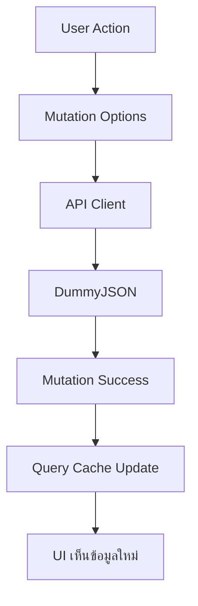

เอกสารระบุชัดว่า Cache Policy ของโมดูลนี้คือ Add แทรกเฉพาะ Active List ที่เหมาะสม, Update แก้ Detail และทุก List ที่มีรายการนั้น, Delete ลบ Detail และนำออกจากทุก List ส่วน Random จะไม่เก็บใน Query Cache

---

### Query กับ Mutation ต่างกันอย่างไร

ใน TanStack Query คำว่า Query และ Mutation ไม่ได้แบ่งตาม HTTP Method อย่างเดียว

Query เหมาะกับการอ่าน Server State ที่มี Identity และต้องการ Cache:

```text
Todo ID 10
Todos หน้า 1
Todos ของ User 5
```

Mutation เหมาะกับ Command หรือการกระทำที่ผู้ใช้สั่งให้เกิดขึ้น:

```text
สร้าง Todo
แก้ไข Todo
ลบ Todo
สุ่มข้อมูลใหม่
```

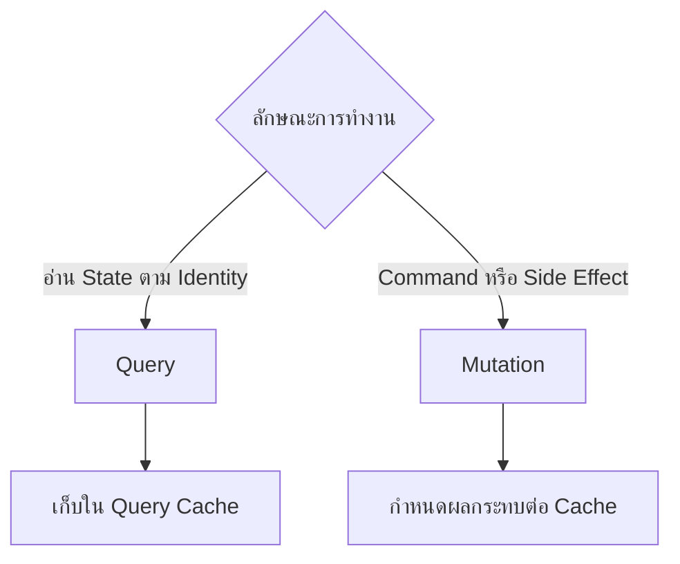

โดยทั่วไป:

| Query                 | Mutation                        |
| --------------------- | ------------------------------- |
| อ่าน Server State     | สั่งเปลี่ยนหรือสร้างผลลัพธ์ใหม่ |
| มี `queryKey`         | มี `mutationKey`                |
| มัก Cache Result      | ไม่ Cache Result แบบ Query      |
| มี Background Refetch | ทำงานตามคำสั่ง                  |
| `useQuery`            | `useMutation`                   |

---

### Imports

```ts
import { mutationOptions } from "@tanstack/react-query";
import type { QueryClient } from "@tanstack/react-query";
```

[`mutationOptions`](https://thehermitdev.notion.site/mutationOptions-3950397c16b38029b778c9e111d55a5e) ทำหน้าที่เหมือน [`queryOptions`](./api-queries.md) ในหัวข้อก่อนหน้า แต่ใช้สำหรับ Mutation Definition

```ts
mutationOptions({
  mutationKey,
  mutationFn,
  onSuccess,
})
```

ส่วน `QueryClient` ถูกใช้สำหรับแก้ Query Cache หลัง Mutation สำเร็จ เช่น:

```ts
queryClient.setQueryData(...)
queryClient.setQueriesData(...)
queryClient.removeQueries(...)
```

API Functions ที่นำมาใช้คือ:

```ts
import {
  addTodo,
  deleteTodo,
  getRandomTodos,
  updateTodo,
} from "./client";
```

Mutation Layer จึงยังคงไม่เรียก Axios โดยตรง

```text
mutations.ts
  → client.ts
  → shared HTTP client
  → DummyJSON
```

---

# 3. Mutation Key Factory

```ts
export const todosMutationKeys = {
  all: ["todos", "mutation"] as const,
  random: () => [...todosMutationKeys.all, "random"] as const,
  add: () => [...todosMutationKeys.all, "add"] as const,
  update: (todoId: number) =>
    [...todosMutationKeys.all, "update", todoId] as const,
  delete: (todoId: number) =>
    [...todosMutationKeys.all, "delete", todoId] as const,
};
```

โครงสร้างเป็น Hierarchy:

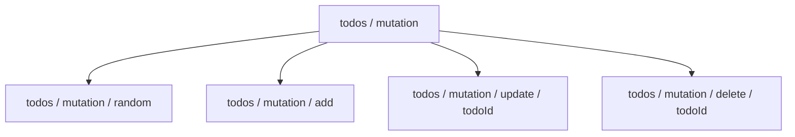

ตัวอย่าง:

```ts
todosMutationKeys.update(10)
```

ได้:

```ts
["todos", "mutation", "update", 10]
```

## Mutation Key ใช้ทำอะไร

Mutation Key ไม่ได้เป็น Primary Key ของ Data Cache แบบ Query Key

มันใช้ระบุชนิดของ Mutation เพื่อ:

* ตรวจ Mutation State แบบรวมกลุ่ม
* ใช้ `useIsMutating`
* ติดตาม Pending Mutation
* ตั้ง Global Mutation Defaults
* Debug ใน Devtools
* แยก Update หรือ Delete ตาม Resource ID

ตัวอย่างแนวคิด:

```ts
useIsMutating({
  mutationKey: todosMutationKeys.all,
});
```

ใช้ตรวจว่ามี Todos Mutation ใดกำลังทำงานอยู่หรือไม่

หรือ:

```ts
useIsMutating({
  mutationKey: todosMutationKeys.update(todoId),
});
```

ใช้ตรวจว่า Todo รายการนี้กำลังถูกแก้ไขอยู่หรือไม่

---

# 4. ทำไม Mutation Key แยกจาก Query Key

Query Key อธิบายว่า:

> ข้อมูลชุดนี้คืออะไร

Mutation Key อธิบายว่า:

> คำสั่งที่กำลังทำงานคืออะไร

ตัวอย่าง:

```text
Query:
["todos", "detail", 10]
→ ข้อมูล Todo ID 10

Mutation:
["todos", "mutation", "update", 10]
→ คำสั่งแก้ Todo ID 10
```

จึงไม่ควรใช้ Key ชุดเดียวกัน เพราะ Semantics ต่างกัน

---

# 5. `shouldInsertIntoActiveList`

```ts
function shouldInsertIntoActiveList(
  input: TodosListQueryInput,
  todo: Todo,
) {
  if (input.source === "user") {
    return input.userId === todo.userId;
  }

  return input.page === 1;
}
```

Function นี้ตัดสินว่า Todo ที่เพิ่งสร้างควรถูกแทรกลงใน List ที่ผู้ใช้กำลังดูหรือไม่

นี่คือ Cache Policy ไม่ใช่ Validation

---

## 5.1 กรณี User Scope

```ts
if (input.source === "user") {
  return input.userId === todo.userId;
}
```

ถ้าหน้าปัจจุบันแสดง Todos ของ User 5:

```ts
{
  source: "user",
  userId: 5
}
```

และ Todo ใหม่มี:

```ts
{
  userId: 5
}
```

จึงควรแทรกเข้ารายการ

แต่ถ้า Todo ใหม่เป็นของ User 8 ไม่ควรแสดงใน List ของ User 5

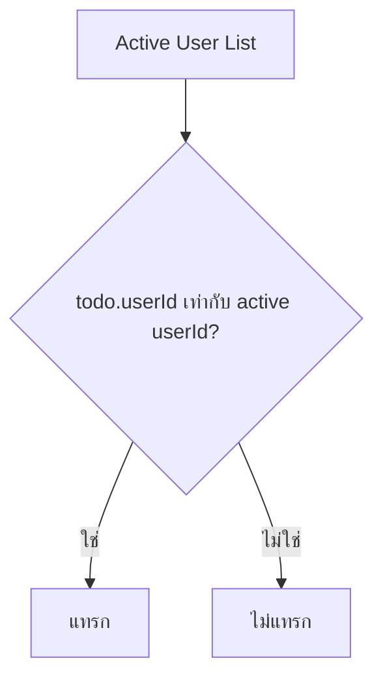

---

## 5.2 กรณี All Scope

```ts
return input.page === 1;
```

ถ้า List เรียงรายการใหม่ไว้ด้านหน้า Todo ที่เพิ่งสร้างควรปรากฏที่หน้าแรกเท่านั้น

ตัวอย่าง:

```text
หน้า 1
[ล่าสุด, ..., เก่าสุดในหน้านี้]

หน้า 2
[รายการลำดับถัดไป]
```

ถ้าผู้ใช้อยู่หน้า 3 แล้วแทรก Todo ใหม่ที่ด้านบนของหน้า 3 จะทำให้ Pagination Semantics ผิด เพราะ Todo ใหม่ควรอยู่หน้า 1

ดังนั้น:

```text
All Scope + page 1 → Insert
All Scope + page > 1 → ไม่ Insert
```

นี่เป็นตัวอย่างของ Cache Update ที่ต้องเข้าใจ Business Semantics ไม่ใช่เพียงใส่ข้อมูลลงทุก Cache

---

# 6. `prependTodo`

```ts
function prependTodo(
  current: TodosListResponse,
  todo: Todo,
): TodosListResponse {
```

Function นี้สร้าง List State ใหม่ โดยนำ Todo ใหม่ไปไว้ด้านหน้า

---

## 6.1 ป้องกัน Duplicate

```ts
if (current.todos.some((item) => item.id === todo.id)) {
  return current;
}
```

ตรวจว่า Todo เดิมมีอยู่แล้วหรือไม่

ถ้ามีอยู่แล้วให้คืน Object เดิม ไม่ต้องเพิ่มซ้ำ

เหตุการณ์ Duplicate อาจเกิดได้จาก:

* Callback ทำงานซ้ำ
* Cache ถูก Seed ไว้ก่อน
* Component หลายจุดประสานผลลัพธ์เดียวกัน
* Retry หรือ Workflow อื่นเพิ่ม Resource เดียวกัน

นี่ทำให้ Helper มีลักษณะ Idempotent บางส่วน:

```text
เพิ่ม Todo เดิมซ้ำ
→ State ไม่เปลี่ยน
```

---

## 6.2 นำรายการใหม่ไว้ด้านหน้า

```ts
const nextTodos = [todo, ...current.todos];
```

ผลลัพธ์:

```text
ก่อน:
[A, B, C]

หลัง:
[NEW, A, B, C]
```

นี่สมมติว่า List แสดงรายการใหม่ก่อนรายการเก่า

---

## 6.3 รักษาขนาดหน้า

```ts
const visibleTodos =
  current.limit > 0
    ? nextTodos.slice(0, current.limit)
    : nextTodos;
```

ถ้า `limit = 10` และ List เดิมมี 10 รายการ หลังเพิ่มจะมี 11 รายการ

จึง Slice ให้เหลือ 10:

```text
ก่อน:
[A, B, C, D]

เพิ่ม NEW และ limit = 4:
[NEW, A, B, C, D]

หลัง Slice:
[NEW, A, B, C]
```

รายการท้ายสุดถูกเลื่อนไปยังหน้าถัดไปตาม Pagination Semantics

กรณี `limit = 0` ไม่ Slice เพราะใน DummyJSON `limit=0` มีความหมายพิเศษตาม Contract ที่กำหนดไว้ก่อนหน้า

---

## 6.4 เพิ่ม `total`

```ts
return {
  ...current,
  todos: visibleTodos,
  total: current.total + 1,
};
```

แม้ Array ที่มองเห็นจะยังมีจำนวนเท่าเดิมเพราะถูก Slice แต่จำนวนทั้งหมดต้องเพิ่มขึ้นหนึ่ง

ตัวอย่าง:

```text
ก่อน:
todos.length = 10
total = 100

หลัง Add:
todos.length = 10
total = 101
```

นี่แสดงความต่างระหว่าง:

```text
จำนวนรายการในหน้าปัจจุบัน
กับ
จำนวนรายการทั้งหมดใน Dataset
```

---

# 7. `randomTodosMutationOptions`

```ts
export function randomTodosMutationOptions() {
  return mutationOptions({
    mutationKey: todosMutationKeys.random(),
    mutationFn: (count: number) =>
      getRandomTodos({ count }),
  });
}
```

ตรงนี้น่าสนใจ เพราะ API Endpoint เป็น HTTP GET แต่ใช้ Mutation

เอกสารให้เหตุผลว่า Random GET มีพฤติกรรมเป็น Command: ผู้ใช้กดปุ่มเพื่อขอผลลัพธ์ใหม่ทุกครั้ง, ไม่ต้องการ Cache ตาม Key เดิม และไม่ต้องการ Background Refetch จึงเหมาะกับ Mutation มากกว่า Query

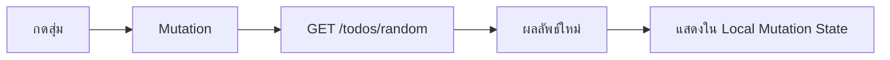

หลักสำคัญคือ:

```text
เลือก Query หรือ Mutation จาก State Semantics
ไม่ใช่ดู HTTP Method เพียงอย่างเดียว
```

Random Result ไม่มี Stable Identity เช่น:

```text
["todos", "random", count]
```

เพราะแม้ Count เดิม ผลลัพธ์แต่ละครั้งก็คาดว่าจะเปลี่ยน

ถ้าใช้ Query ด้วย Key เดิม TanStack Query อาจคืน Cache เดิมแทนการสุ่มใหม่

---

# 8. ทำไม Random ไม่เขียน Cache Policy

Mutation นี้ไม่มี `onSuccess` ที่นำข้อมูลไปใส่ Query Cache

Result จะอยู่ใน Mutation State เช่น:

```ts
const mutation = useMutation(randomTodosMutationOptions());

mutation.data
mutation.isPending
mutation.error
```

เพราะข้อมูลสุ่ม:

* ไม่ใช่ Canonical Todos List
* ไม่ใช่ Todo Detail Cache
* ไม่ควรแทนที่ข้อมูลหลัก
* มีอายุเฉพาะ Interaction นั้น

---

# 9. `addTodoMutationOptions`

```ts
export function addTodoMutationOptions(
  queryClient: QueryClient,
  activeListInput: TodosListQueryInput,
)
```

Function นี้ต้องรับ:

* `queryClient` สำหรับเขียน Cache
* `activeListInput` เพื่อรู้ว่าผู้ใช้กำลังดู List แบบใด

นี่คือ Context ที่ Cache Policy ต้องใช้

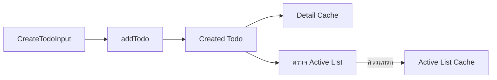

---

## 9.1 Mutation Function

```ts
mutationFn: (input: CreateTodoInput) =>
  addTodo({ input }),
```

เมื่อ Component เรียก:

```ts
mutation.mutate({
  todo: "Write documentation",
  completed: false,
  userId: 5,
});
```

Mutation Layer ส่งต่อไปยัง API Client

Input Type และ Result Type ถูก Infer จาก Function:

```text
Variables → CreateTodoInput
Result → Todo
```

---

## 9.2 Seed Detail Cache

```ts
queryClient.setQueryData(
  todosKeys.detail(createdTodo.id),
  createdTodo,
);
```

หลัง Create สำเร็จ Server คืน Todo ที่มี ID แล้ว

ตัวอย่าง:

```ts
{
  id: 255,
  todo: "Write documentation",
  completed: false,
  userId: 5
}
```

ข้อมูลนี้เพียงพอที่จะสร้าง Detail Cache ทันที:

```ts
["todos", "detail", 255]
```

ถ้าผู้ใช้ไปหน้า Detail ต่อ ระบบสามารถแสดงข้อมูลจาก Cache ได้โดยไม่ต้อง Fetch ซ้ำทันที

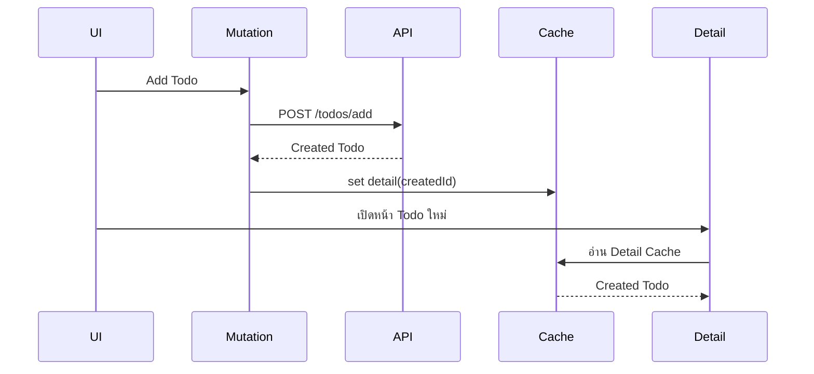

---

## 9.3 ตรวจว่าควรแทรก Active List หรือไม่

```ts
if (
  !shouldInsertIntoActiveList(
    activeListInput,
    createdTodo,
  )
) {
  return;
}
```

ถ้า Todo ใหม่ไม่ควรอยู่ใน List ปัจจุบัน จะหยุดหลังจาก Seed Detail Cache

ตัวอย่าง:

* อยู่ All Scope หน้า 2
* อยู่ User 5 แต่ Todo ใหม่เป็นของ User 8

ในกรณีเหล่านี้ไม่ควรแก้ Active List

---

## 9.4 แก้เฉพาะ Active List Cache

```ts
queryClient.setQueryData<TodosListResponse>(
  todosKeys.list(activeListInput),
  (current) =>
    current
      ? prependTodo(current, createdTodo)
      : current,
);
```

ใช้ `setQueryData` เพราะกำลังระบุ Exact Query Key เพียงชุดเดียว

ต่างจาก `setQueriesData` ที่แก้หลาย Query ตาม Prefix

Updater รับ Cache ปัจจุบัน:

```ts
(current) => ...
```

ถ้ามี Cache:

```ts
prependTodo(current, createdTodo)
```

ถ้าไม่มี Cache:

```ts
return current
```

ซึ่งคือ `undefined`

โค้ดนี้จงใจไม่สร้าง List Cache ขึ้นมาใหม่จากข้อมูลไม่ครบ เพราะมีเพียง Todo ใหม่หนึ่งรายการ แต่ไม่มี Metadata และรายการเดิมทั้งหมด

---

# 10. ทำไม Add ไม่ Invalidate Lists ทั้งหมด

แนวทางง่ายอาจเป็น:

```ts
queryClient.invalidateQueries({
  queryKey: todosKeys.lists(),
});
```

แต่ DummyJSON ไม่ Persist Mutation

หลัง Add ถ้า Refetch `/todos` ใหม่ Server จะคืน Dataset เดิม และ Todo ที่เพิ่งสร้างจะหายทันที

ดังนั้น Tutorial เลือก Manual Cache Update เพื่อจำลองผลลัพธ์ให้คงอยู่ใน Browser Session

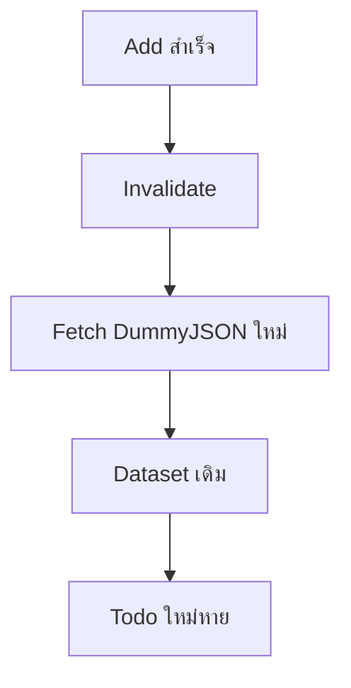

Cache Policy นี้ถูกออกแบบตามข้อจำกัดของ Backend จำลอง ไม่ใช่กฎสากลว่าทุกระบบควรหลีกเลี่ยง Invalidation

---

# 11. `updateTodoMutationOptions`

```ts
export function updateTodoMutationOptions(
  queryClient: QueryClient,
  todoId: number,
)
```

รับ Todo ID ตั้งแต่ตอนสร้าง Options

Mutation Key จึงเฉพาะเจาะจง:

```ts
todosMutationKeys.update(todoId)
```

Mutation Function รับเฉพาะ Update Payload:

```ts
mutationFn: (input: UpdateTodoInput) =>
  updateTodo({ todoId, input }),
```

แยก:

```text
todoId
→ ถูก Bind อยู่ใน Mutation Options

input
→ ส่งตอน mutate
```

Component จึงใช้ประมาณ:

```ts
const mutation = useMutation(
  updateTodoMutationOptions(queryClient, todoId),
);

mutation.mutate({
  completed: true,
});
```

---

# 12. Update Detail Cache

```ts
queryClient.setQueryData(
  todosKeys.detail(todoId),
  updatedTodo,
);
```

API คืน Todo หลังแก้ไขสำเร็จ จึงแทน Detail Cache ได้โดยตรง

นี่เป็น Authoritative Result จาก Server Response ดีกว่านำ Input มาผสมกับ Cache เอง เพราะ Server อาจ:

* Normalize ข้อมูล
* เปลี่ยน Field อื่น
* เพิ่ม Metadata
* ไม่ยอมรับบางค่า

ดังนั้นใช้ `updatedTodo` ที่ผ่าน Response Contract แล้วเป็น Source of Truth

---

# 13. Update ทุก List Cache

```ts
queryClient.setQueriesData<TodosListResponse>(
  { queryKey: todosKeys.lists() },
  (current) => {
    // ...
  },
);
```

ต่างจาก Add ที่แก้เฉพาะ Active List เพราะ Todo เดิมอาจปรากฏอยู่ใน Cache หลายชุด

ตัวอย่าง:

```text
All หน้า 1
All หน้า 2
User 5
```

Todo ID 10 อาจอยู่ใน All หน้า 1 และ User 5 พร้อมกัน

ถ้าแก้เฉพาะ Active List Cache ชุดอื่นจะยังมีข้อมูลเก่า

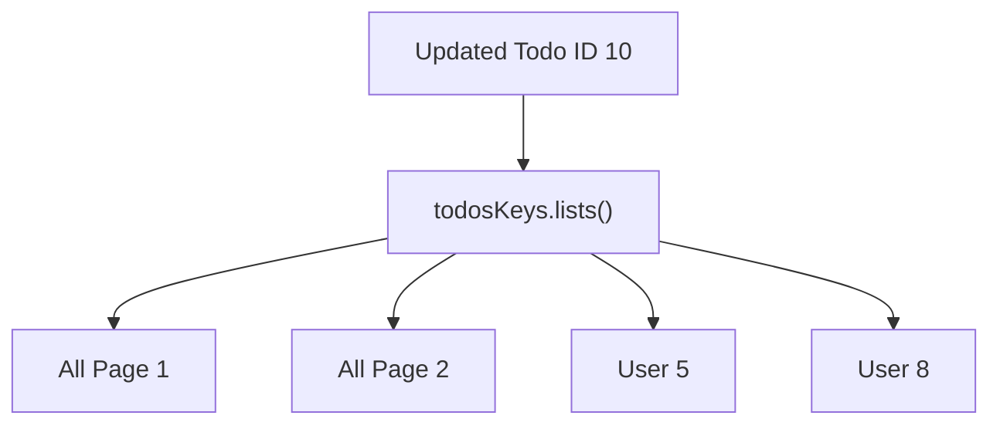

Updater จะเปลี่ยนเฉพาะ Cache ที่มี Todo นั้นจริง

---

## 13.1 Guard เมื่อไม่มี Cache

```ts
if (!current) {
  return current;
}
```

`setQueriesData` อาจพบ Query ที่ไม่มี Data หรือ Type ไม่ตรงกับสถานะที่คาด

จึงไม่ควรพยายามอ่าน:

```ts
current.todos
```

เมื่อ `current` เป็น `undefined`

---

## 13.2 ตรวจว่า List มี Todo หรือไม่

```ts
const containsTodo =
  current.todos.some(
    (todo) => todo.id === todoId,
  );
```

ถ้า List ไม่มี Todo นี้:

```ts
if (!containsTodo) {
  return current;
}
```

คืน Object เดิมเพื่อหลีกเลี่ยงการสร้าง Reference ใหม่โดยไม่จำเป็น

ข้อดีคือ:

* ลด Render ที่ไม่จำเป็น
* รักษา Structural Sharing
* ไม่แตะ Cache ที่ไม่เกี่ยวข้อง

---

## 13.3 แทนที่ Todo ใน Array

```ts
return {
  ...current,
  todos: current.todos.map((todo) =>
    todo.id === todoId
      ? updatedTodo
      : todo,
  ),
};
```

นี่เป็น Immutable Update

```text
ก่อน:
[A, TODO_OLD, C]

หลัง:
[A, TODO_UPDATED, C]
```

Object ของ List ถูกสร้างใหม่ และ Array ถูกสร้างใหม่ แต่ Item ที่ไม่เกี่ยวข้องยังใช้ Reference เดิม

---

# 14. ทำไม Update ไม่เปลี่ยน `total`

Update ไม่ได้เพิ่มหรือลบ Resource

ดังนั้น:

```text
total ก่อน = total หลัง
```

จึงแก้เฉพาะสมาชิกใน `todos`

---

# 15. ความเสี่ยงเชิง Domain ของ Update

โค้ดนี้แทน `updatedTodo` ในทุก List ที่มี ID ตรงกัน แต่ไม่ได้ย้าย Todo ระหว่าง User-scoped Lists

สมมติระบบอนุญาตแก้ `userId`:

```text
ก่อน: userId = 5
หลัง: userId = 8
```

Todo ควรถูกนำออกจาก User 5 List และเพิ่มเข้า User 8 List

แต่ Tutorial ป้องกันปัญหานี้ตั้งแต่ Contract:

```ts
updateTodoInputSchema
  .pick({
    todo: true,
    completed: true,
  })
```

Update ไม่อนุญาต `userId`

ดังนั้น Membership ของ List ไม่เปลี่ยน และ Policy ปัจจุบันยังถูกต้อง

นี่แสดงความสัมพันธ์ระหว่าง:

```text
Mutation Input Contract
และ
Cache Update Algorithm
```

ถ้า Business Capability เปลี่ยน Cache Policy ต้องเปลี่ยนตาม

---

# 16. `deleteTodoMutationOptions`

```ts
export function deleteTodoMutationOptions(
  queryClient: QueryClient,
  todoId: number,
)
```

Mutation Function ไม่ต้องรับ Variable เพิ่ม:

```ts
mutationFn: () =>
  deleteTodo({ todoId }),
```

เพราะ `todoId` ถูก Bind เข้า Options แล้ว

Component จึงเรียก:

```ts
mutation.mutate()
```

ไม่ต้องส่ง Payload

---

# 17. ลบ Detail Cache

```ts
queryClient.removeQueries({
  queryKey: todosKeys.detail(todoId),
});
```

หลัง Delete สำเร็จ Todo นั้นไม่ควรถูกถือเป็น Resource ที่ยังมีอยู่

จึงใช้ `removeQueries` แทน:

```ts
setQueryData(key, undefined)
```

หรือ:

```ts
invalidateQueries(...)
```

ผลคือ Cache Entry ของ Detail ถูกลบออก

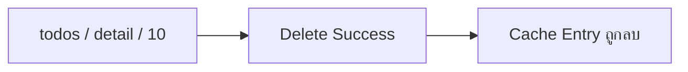

---

## 17.1 ทำไมไม่ใช้ Invalidate Detail

ถ้าใช้:

```ts
invalidateQueries({
  queryKey: todosKeys.detail(todoId),
});
```

Query จะถูก Mark Stale และอาจ Refetch

แต่ DummyJSON ไม่ Persist Delete ดังนั้น Refetch อาจทำให้ Todo กลับมา

แม้เป็น Backend จริง การ Refetch Detail ที่ถูกลบแล้วก็อาจได้ 404 ซึ่งไม่จำเป็น หากเรารู้แน่จาก Delete Response แล้วว่า Resource ถูกลบ

จึงลบ Cache Entry โดยตรง

---

# 18. ลบ Todo ออกจากทุก List Cache

```ts
queryClient.setQueriesData<TodosListResponse>(
  { queryKey: todosKeys.lists() },
  (current) => {
    // ...
  },
);
```

เช่นเดียวกับ Update ต้องแก้ทุก List ที่ Todo อาจปรากฏ

Guard เหมือนเดิม:

```ts
if (!current) {
  return current;
}
```

ตรวจ Membership:

```ts
const containsTodo =
  current.todos.some(
    (todo) => todo.id === todoId,
  );

if (!containsTodo) {
  return current;
}
```

จากนั้นลบด้วย `filter`:

```ts
todos: current.todos.filter(
  (todo) => todo.id !== todoId,
),
```

---

# 19. ลด `total` อย่างปลอดภัย

```ts
total: Math.max(
  0,
  current.total - 1,
),
```

เหตุผลที่ใช้ `Math.max(0, ...)` คือป้องกัน `total` ติดลบเมื่อ Cache อยู่ใน State ที่ไม่สมบูรณ์หรือเกิดการประมวลผลซ้ำ

ตัวอย่าง:

```text
current.total = 0
current.total - 1 = -1
Math.max(0, -1) = 0
```

แม้ตามปกติถ้า List มี Todo อยู่ `total` ควรมากกว่า 0 แต่ Defensive Guard นี้ช่วยรักษา Contract:

```ts
total: nonnegative integer
```

ซึ่งสอดคล้องกับ `todosListResponseSchema`

---

# 20. ทำไม Delete ไม่ดึงรายการถัดไปมาเติมหน้า

สมมติหน้าเดิมมี 10 รายการ หลัง Delete เหลือ 9 รายการ

โค้ดนี้ไม่ Fetch หรือเลื่อนรายการแรกจากหน้าถัดไปมาเติม

```text
ก่อน:
หน้า 1 = 10 รายการ

หลัง Delete:
หน้า 1 = 9 รายการ
```

นี่เป็น Trade-off ที่ตั้งใจให้ Cache Update เรียบง่าย

การเติมหน้าให้ครบจริงต้องมีข้อมูลของหน้าถัดไป หรือ Refetch Server Pagination

ในระบบจริงมีทางเลือก:

1. ยอมให้หน้าปัจจุบันมีรายการน้อยลงชั่วคราว
2. Invalidate แล้ว Refetch
3. ทำ Infinite/Paginated Cache Rebalancing
4. ใช้ Backend Response ที่คืน Page ใหม่
5. ลบแล้วดึงรายการชดเชยหนึ่งรายการ

Tutorial เลือกข้อแรก เพราะ DummyJSON ไม่ Persist Mutation และเป้าหมายคือสอน Cache Coordination ที่เข้าใจได้

---

# 21. `setQueryData` กับ `setQueriesData`

## `setQueryData`

ใช้กับ Exact Query Key หนึ่งชุด:

```ts
queryClient.setQueryData(
  todosKeys.detail(todoId),
  updatedTodo,
);
```

หรือ:

```ts
queryClient.setQueryData(
  todosKeys.list(activeListInput),
  updater,
);
```

## `setQueriesData`

ใช้กับ Query หลายชุดที่ตรงกับ Filter หรือ Prefix:

```ts
queryClient.setQueriesData(
  {
    queryKey: todosKeys.lists(),
  },
  updater,
);
```

สรุป:

| Method              | Scope                     |
| ------------------- | ------------------------- |
| `setQueryData`      | Cache Entry เดียว         |
| `setQueriesData`    | หลาย Cache Entries        |
| `removeQueries`     | ลบ Cache ตาม Filter       |
| `invalidateQueries` | Mark Stale และอาจ Refetch |

---

# 22. Direct Cache Update กับ Invalidation

มีสองแนวทางหลักหลัง Mutation

## Invalidation

```ts
await queryClient.invalidateQueries({
  queryKey: todosKeys.lists(),
});
```

ข้อดี:

* ง่าย
* ใช้ Server เป็น Source of Truth
* ลดความซับซ้อนของ Client Algorithm

ข้อเสีย:

* ต้อง Network Request เพิ่ม
* UI อาจรอ Refetch
* ใช้ไม่ได้ดีกับ Fake API ที่ไม่ Persist
* อาจ Refetch Data ปริมาณมาก

## Direct Cache Update

```ts
queryClient.setQueryData(...)
```

ข้อดี:

* UI Update ทันที
* ไม่ต้อง Network เพิ่ม
* ใช้ Response จาก Mutation โดยตรง
* เหมาะเมื่อสามารถคำนวณ Cache State ได้แน่นอน

ข้อเสีย:

* Algorithm ซับซ้อนขึ้น
* ต้องอัปเดต Cache ทุก Representation
* เสี่ยง Cache Drift
* ต้องเข้าใจ Pagination, Filter และ Membership

Tutorial ใช้ Direct Update เพราะ DummyJSON จำลอง Mutation และไม่เก็บการเปลี่ยนแปลงถาวร

---

# 23. นี่ไม่ใช่ Optimistic Update

แม้ UI ถูกแก้ Cache โดยตรง แต่โค้ดนี้ไม่ใช่ Optimistic Update

เพราะ Cache ถูกเปลี่ยนใน:

```ts
onSuccess
```

หมายความว่า:

```text
ส่ง Request
→ รอ Server ตอบสำเร็จ
→ ค่อยแก้ Cache
```

Optimistic Update จะทำใน `onMutate` ก่อน Server ตอบ:

```text
ผู้ใช้กด
→ แก้ Cache ทันที
→ ส่ง Request
→ ถ้าล้มเหลว Rollback
```

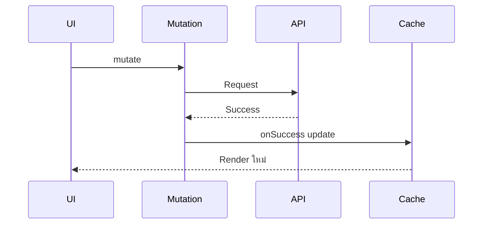

โค้ดนี้จึงเป็น Confirmed Cache Update หรือ Pessimistic Update มากกว่า

ข้อดีคือไม่ต้องจัดการ:

* Snapshot
* Rollback
* Concurrent Optimistic Updates
* Failed Mutation Reconciliation

---

# 24. ทำไม Cache Update อยู่ใน Mutation Options

ทางเลือกหนึ่งคือเขียนใน Component:

```ts
useMutation({
  mutationFn: addTodo,
  onSuccess: () => {
    // cache logic
  },
});
```

แต่จะทำให้ Component รู้รายละเอียด Cache มากเกินไป

เมื่อนำมาไว้ใน `mutations.ts`:

* UI เรียก Mutation ได้ง่าย
* Cache Policy รวมอยู่กับ Feature Data Layer
* Logic ใช้ซ้ำได้
* Test แยกได้
* ลดการเขียน Cache Update ไม่ตรงกันในหลาย Component

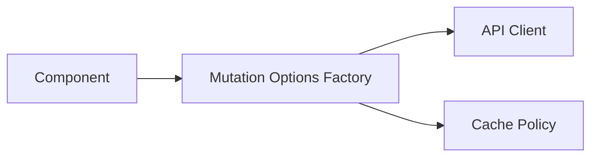

Component เหลือหน้าที่:

```text
รับ Input
เรียก mutate
แสดง Pending/Error/Success
```

---

# 25. Cache Policy ของแต่ละ Mutation

| Mutation | Detail Cache     | List Cache                       | Refetch |
| -------- | ---------------- | -------------------------------- | ------- |
| Random   | ไม่แตะ           | ไม่แตะ                           | ไม่มี   |
| Add      | Seed Detail ใหม่ | แทรกเฉพาะ Active List ที่เหมาะสม | ไม่มี   |
| Update   | แทน Detail       | แทนในทุก List ที่มี ID           | ไม่มี   |
| Delete   | ลบ Detail        | ลบจากทุก List ที่มี ID           | ไม่มี   |

---

# 26. Cache Flow ของ Add

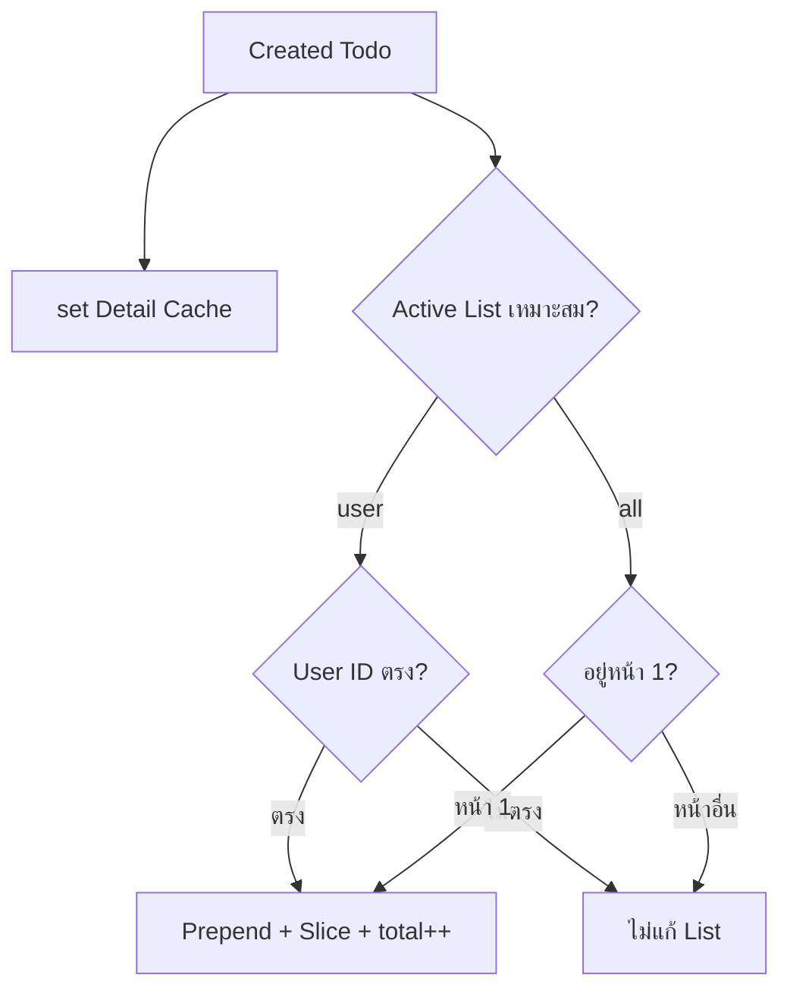

---

# 27. Cache Flow ของ Update

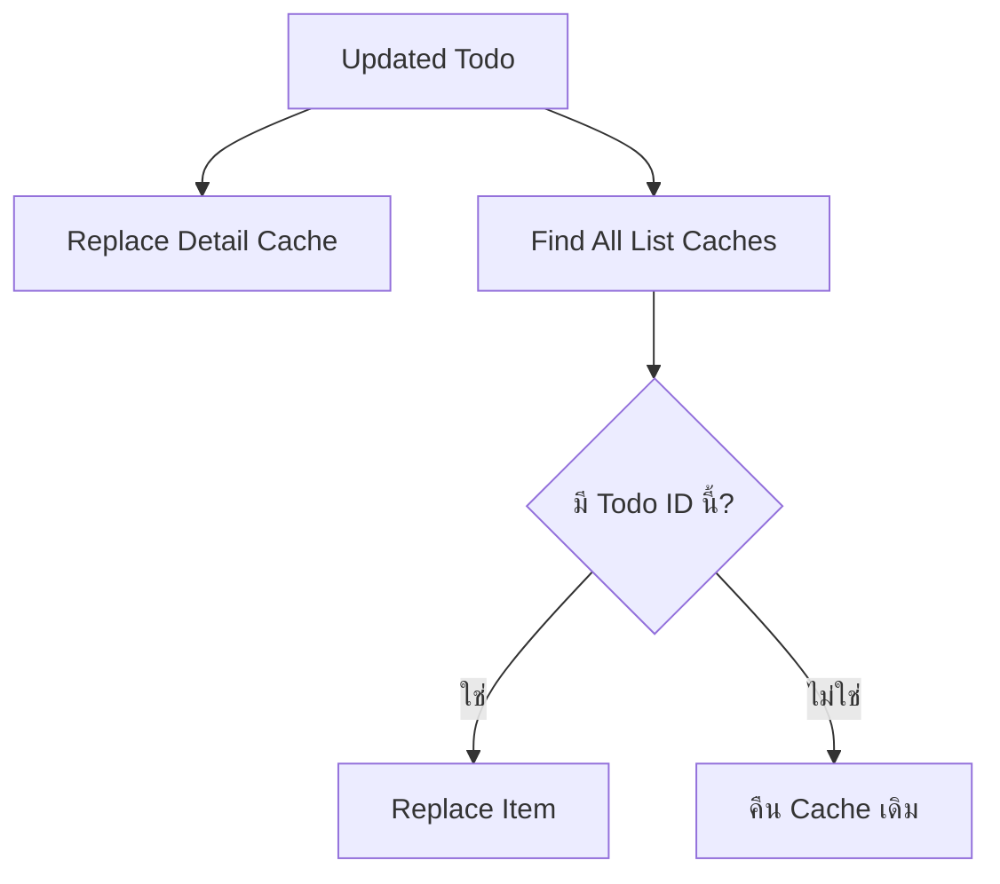

---

# 28. Cache Flow ของ Delete

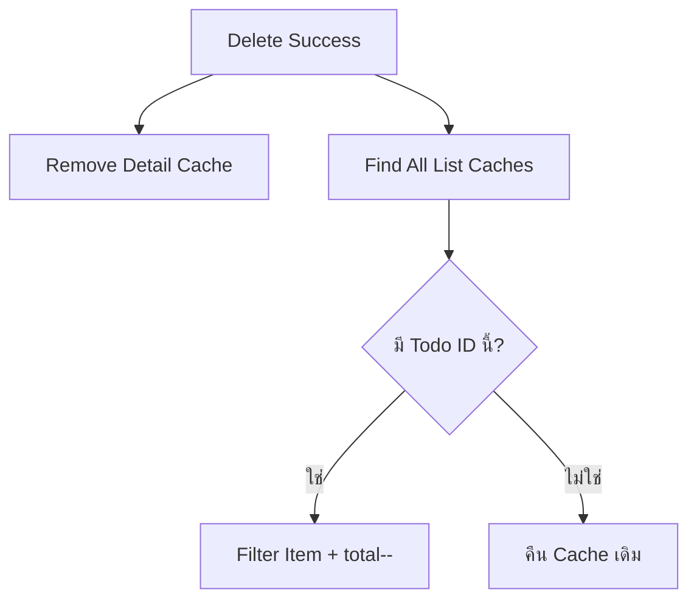

---

# 29. ความสัมพันธ์กับ Query Key Factory

Mutation Layer ไม่สร้าง Query Key เอง แต่ Import จาก:

```ts
import { todosKeys } from "./queries";
```

นี่สำคัญมาก เพราะ Query และ Mutation ต้องพูดภาษา Cache เดียวกัน

```text
queries.ts
→ สร้าง Cache Identity

mutations.ts
→ ใช้ Identity เดิมเพื่อแก้ Cache
```

ถ้า Mutation เขียน Key เองแบบ Hardcode:

```ts
["todo", "details", todoId]
```

แต่ Query ใช้:

```ts
["todos", "detail", todoId]
```

Mutation จะอัปเดตคนละ Cache Entry และ UI จะไม่เปลี่ยน

Query Key Factory จึงเป็น Single Source of Truth ของ Cache Address

---

# 30. ผลของ DummyJSON ที่ไม่ Persist Mutation

เอกสารระบุว่า Cache Update เหล่านี้มีผลเฉพาะ Browser Session เพราะ DummyJSON ไม่ Persist การเปลี่ยนแปลง

หมายความว่า:

```text
Add / Update / Delete
→ Browser Cache เปลี่ยน

Refresh Browser
→ Query Fetch ใหม่
→ Dataset เดิมกลับมา
```

ดังนั้นโค้ดนี้สอนหลัก Cache Policy ได้ แต่ไม่ควรเข้าใจว่า DummyJSON เป็น Backend จริงที่เก็บข้อมูล

---

# 31. ข้อจำกัดของ Policy นี้

Policy นี้เหมาะกับ Tutorial แต่ในระบบจริงต้องพิจารณาเพิ่ม:

### Sorting

`prependTodo` สมมติว่ารายการใหม่ต้องอยู่บนสุด

ถ้า List Sort ตามชื่อหรือวันที่อื่น ต้องหาตำแหน่งที่ถูกต้อง

### Filtering

Add ต้องตรวจ Filter ทุกตัว เช่น:

```text
status
search
category
owner
date range
```

ไม่ใช่แค่ User ID

### Pagination

Delete อาจต้องดึงรายการจากหน้าถัดไปมาเติม

### Server-generated changes

Update Response อาจทำให้ Todo ย้ายออกจาก Filter ปัจจุบัน

### Concurrent Mutations

Mutation หลายตัวพร้อมกันอาจเขียน Cache ทับกัน ต้องพิจารณา Ordering

### Persistence

ระบบจริงอาจเลือก Invalidate หลัง Direct Update เพื่อ Reconcile กับ Server

---

# 32. แนวทาง Production ที่พบได้บ่อย

ในระบบจริงอาจใช้ Hybrid Policy:

```text
Mutation Success
  → Direct Cache Update เพื่อ UI ทันที
  → Invalidate แบบ Background เพื่อ Reconcile
```

ตัวอย่างแนวคิด:

```ts
onSuccess: async (updatedTodo) => {
  queryClient.setQueryData(
    todosKeys.detail(updatedTodo.id),
    updatedTodo,
  );

  await queryClient.invalidateQueries({
    queryKey: todosKeys.lists(),
  });
}
```

ข้อดี:

* UI ตอบสนองทันที
* Server ยังเป็น Source of Truth
* แก้ Cache Drift ในภายหลัง

แต่แนวทางนี้ไม่เหมาะกับ DummyJSON Tutorial เพราะ Refetch จะล้าง Mutation จำลองทิ้ง

---

# 33. แก่นสำคัญของหัวข้อนี้

`mutations.ts` ไม่ได้มีหน้าที่เพียงเรียก POST, PATCH และ DELETE

หน้าที่จริงคือกำหนดว่า:

> เมื่อ Server ยืนยันว่าข้อมูลเปลี่ยนแล้ว Cache Representation ทุกจุดของ Resource นั้นต้องเปลี่ยนอย่างไร

Flow เต็ม:

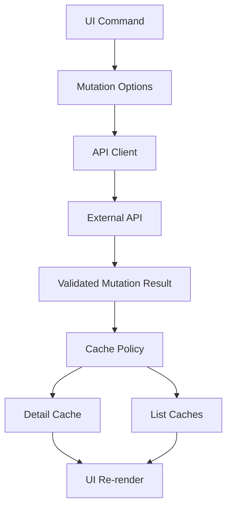

หลักที่ควรจำคือ:

```text
Mutation Result
ไม่ได้ทำให้ Query Cache เปลี่ยนอัตโนมัติ
```

และ:

```text
Cache Policy ต้องเข้าใจว่า Resource เดียวกัน
ปรากฏอยู่ใน Cache Representation ใดบ้าง
```

ในไฟล์นี้ Resource หนึ่งรายการอาจอยู่ทั้ง:

```text
Detail Cache
All Todos List
User-scoped List
Paginated List
```

Mutation Layer จึงเป็นจุดที่รักษา Cache Consistency ระหว่าง Representation เหล่านี้ให้ตรงกัน.
