## คำอธิบายเพิ่มเติมเกี่ยวกับหัวข้อที่ 6: สร้าง Query Key และ Query Options

ไฟล์: `src/features/todos/api/queries.ts`

หัวข้อนี้คือจุดที่ API Client จากหัวข้อก่อนหน้า ถูกนำมาเชื่อมเข้ากับ TanStack Query อย่างเป็นระบบ

หน้าที่หลักของไฟล์นี้มี 2 ส่วน:

1. กำหนด Query Key ว่าข้อมูลแต่ละชุดถูกระบุใน Cache ด้วยอะไร
2. กำหนด Query Options ว่าข้อมูลนั้น Fetch อย่างไร และมี Cache Policy แบบไหน

ภาพรวม:

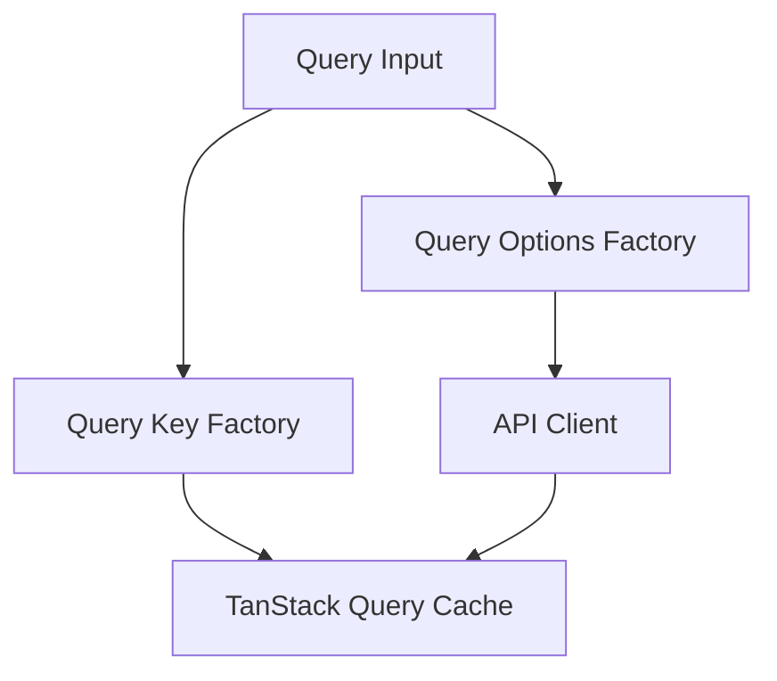

---

### Query Key คืออะไร?

TanStack Query ไม่ได้เก็บข้อมูลตามชื่อฟังก์ชัน เช่น `getTodos` หรือ URL เช่น `/todos` แต่จะเก็บข้อมูลตาม `queryKey`:

```tsx
["todos", "list", { source: "all", page: 1, pageSize: 10 }]
```

Query Key ทำหน้าที่คล้าย Primary Key ของ Cache

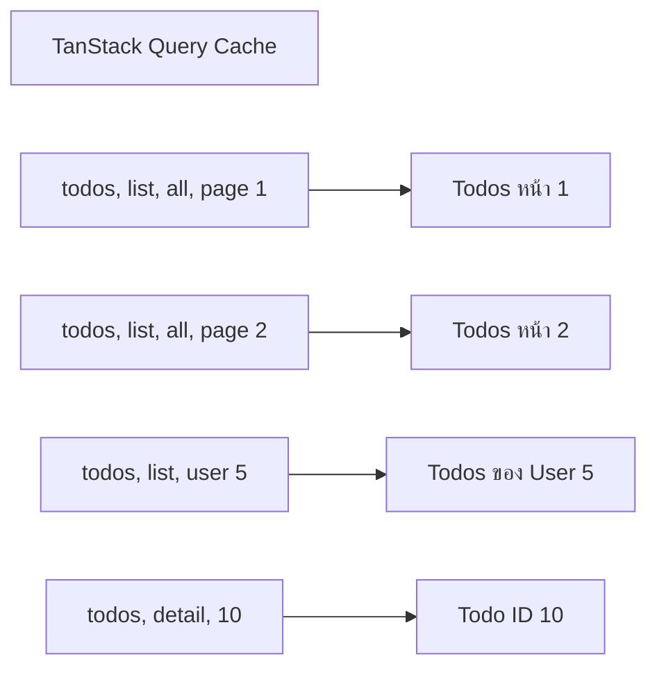

ถ้า Query Key ต่างกัน TanStack Query ถือว่าเป็นคนละข้อมูล แต่ถ้าเหมือนกันมันจะมองว่าเป็นข้อมูลชุดเดียวกัน แม้จะถูกเรียกจากคอมโพเนนต์หรือ Route คนละตำแหน่ง จึงเป็นเหตุผลว่าทำไม Query Key ต้องสะท้อนตัวแปรทุกตัวที่ส่งผลต่อผลลัพธ์จริง

อ่านเพิ่มเติม → Query Keys

---

### `queryOptions` คืออะไร

```tsx
import { queryOptions } from "@tanstack/react-query";
```

`queryOptions` เป็นตัวช่วยสำหรับสร้างอ็อบเจ็กต์ของ Query:

```tsx
queryOptions({
  queryKey,
  queryFn,
  staleTime,
})
```

ผลลัพธ์สามารถนำไปใช้ได้หลายจุด เช่น:

```tsx
useQuery(todosListQueryOptions(input))
```

```tsx
queryClient.ensureQueryData(todosListQueryOptions(input))
```

```tsx
queryClient.prefetchQuery(todosListQueryOptions(input))
```

สิ่งสำคัญคือตัวโหลดของ Router และคอมโพเนนต์สามารถใช้ Query Options ชุดเดียวกันได้

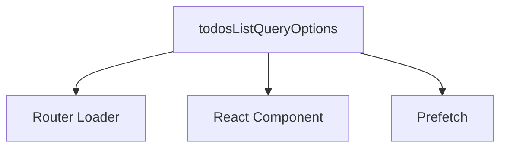

จึงไม่ต้องเขียน `queryKey`, `queryFn` และ Cache Policy ซ้ำหลายที่

อ่านเพิ่มเติม → Query Options

---

### Import API Client

```tsx
import { getTodo, getTodos, getTodosByUser } from "./client";
```

Query Layer ไม่เรียก Axios โดยตรง แต่เรียกผ่าน Feature API Client ดังนั้น Dependency Flow คือ:

```
queries.ts
  → client.ts
  → shared/http-client
  → API
```

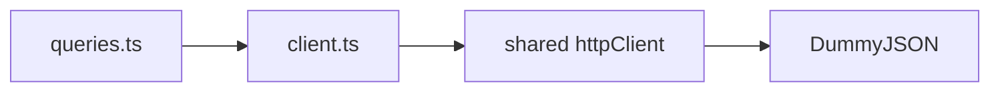

Query Layer จึงรับผิดชอบเรื่อง:

- Cache Identity
- Fetch Lifecycle
- Stale Policy
- Query Cancellation
- การเลือก API Function ตาม Query Input

ส่วน API Client รับผิดชอบ:

- Endpoint
- HTTP Method
- Request Mapping
- Runtime Validation
- Response Normalization

---

### `TodosListSource`

```tsx
export type TodosListSource = "all" | "user";
```

Type นี้ระบุว่า List Page มีแหล่งข้อมูลอยู่สองแบบ:

- `all`: รายการ Todos ทั้งหมด
- `user`: รายการ Todos ของ User หนึ่งคน

มันเป็น Discriminator หรือค่าที่ใช้บอกว่า Query ปัจจุบันอยู่ใน Mode ใด

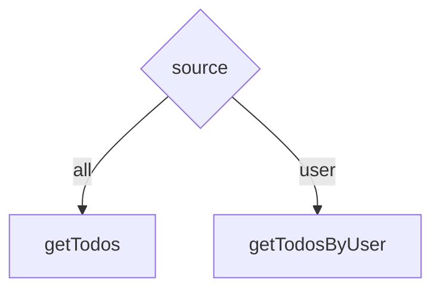

ข้อดีของ Union Type คือ TypeScript ป้องกันค่าที่ไม่รองรับ (เช่น `source: "random"`) เพราะ Type รองรับเฉพาะ `"all"` และ `"user"`

---

### `TodosListQueryInput`

```tsx
export interface TodosListQueryInput {
  page: number;
  pageSize: number;
  source: TodosListSource;
  userId: number | null;
}
```

ออบเจ็กต์นี้รวม State ทุกตัวที่ List Query อาจต้องใช้ ซึ่งประกอบด้วย:

- `page` — หน้าปัจจุบัน
- `pageSize` — จำนวนรายการต่อหน้า
- `source` — ทั้งหมดหรือเฉพาะ User
- `userId` — ID ของ User ใน User Scope

ตัวอย่าง `all` Scope:

```tsx
{
  page: 2,
  pageSize: 10,
  source: "all",
  userId: null
}
```

ตัวอย่าง `user` Scope:

```tsx
{
  page: 1,
  pageSize: 10,
  source: "user",
  userId: 5
}
```

แต่มีประเด็นสำคัญคือ Input ทั้งหมดนี้ ไม่ได้มีผลต่อผลลัพธ์ทุก Mode

---

### ปัญหา Query Key ที่ใส่ Input ทั้งหมดตรง ๆ

สมมติสร้าง Key แบบนี้:

```tsx
[
  "todos",
  "list",
  {
    page: input.page,
    pageSize: input.pageSize,
    source: input.source,
    userId: input.userId,
  },
]
```

ใน All Scope ถือว่าถูก เพราะ `page` และ `pageSize` ส่งผลต่อข้อมูล แต่ใน User Scope Endpoint นี้:

```
GET /todos/user/:userId
```

ไม่ได้ใช้ `page` และ `pageSize` ถ้า Input เป็น:

```tsx
{
  source: "user",
  userId: 5,
  page: 1,
  pageSize: 10,
}
```

กับ:

```tsx
{
  source: "user",
  userId: 5,
  page: 2,
  pageSize: 20,
}
```

API Request จริงยังเหมือนกัน:

```
GET /todos/user/5
```

แต่ถ้า Query Key ใส่ทุก Field จะกลายเป็นสอง Cache Entry ทั้งที่ข้อมูลเหมือนกัน

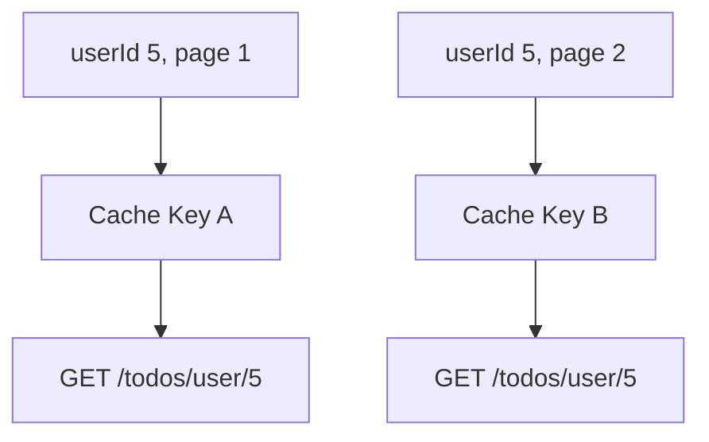

ผลคือ:

- Fetch ซ้ำโดยไม่จำเป็น
- Cache แตกเป็นหลายชุด
- Invalidation ยุ่งยากขึ้น
- Cache Identity ไม่ตรงกับ Data Identity

นี่คือเหตุผลที่ต้องมี `normalizeTodosListInput`

---

### `normalizeTodosListInput`

```tsx
function normalizeTodosListInput(input: TodosListQueryInput) {
  if (input.source === "user") {
    return {
      source: input.source,
      userId: input.userId,
    } as const;
  }

  return {
    source: input.source,
    page: input.page,
    pageSize: input.pageSize,
  } as const;
}
```

Function นี้เลือกเฉพาะ Field ที่มีผลต่อข้อมูลจริงในแต่ละ Mode

#### User Scope

```tsx
{
  source: "user",
  userId: input.userId,
}
```

ตัด `page` และ `pageSize` ออกจาก Key เพราะ API ไม่ได้ใช้

#### All Scope

```tsx
{
  source: "all",
  page: input.page,
  pageSize: input.pageSize,
}
```

ตัด `userId` ออก เพราะไม่มีผลต่อ All Scope

ภาพรวม:

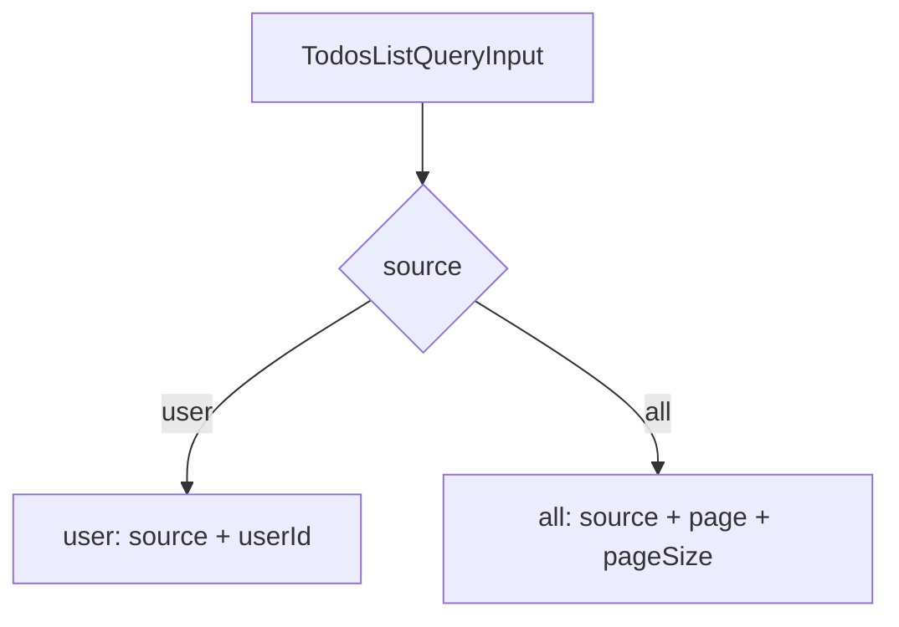

หลักการสำคัญคือ: Query Key ต้องเก็บเฉพาะตัวแปรที่ทำให้ผลลัพธ์เปลี่ยน ไม่ใช่ Query Key ต้องใส่ทุก Field ที่ฟังก์ชันรับเข้ามา

---

### ทำไมต้องเก็บ `source` ไว้ใน Key

อาจสงสัยว่าใน User Scope มี `userId` อยู่แล้ว ทำไมยังต้องเก็บ `source: "user"` เพราะ `source` ช่วยทำให้ Query Key แสดงความหมายชัดเจนและป้องกัน Collision:

```tsx
["todos", "list", { source: "user", userId: 5 }]
```

มีความหมายชัดเจนกว่า:

```tsx
["todos", "list", { userId: 5 }]
```

และ All Scope:

```tsx
["todos", "list", { source: "all", page: 1, pageSize: 10 }]
```

`source` ทำหน้าที่เป็น Discriminant ของ Cache Key

---

### `as const`

ในโค้ดมี `as const` หลายตำแหน่ง:

```tsx
return {
  source: input.source,
  userId: input.userId,
} as const;
```

และ:

```tsx
all: ["todos"] as const
```

`as const` ทำให้ TypeScript รักษาค่า Literal และ Tuple Shape ไว้

ตัวอย่างโดยไม่มี `as const`:

```tsx
const key = ["todos"];
```

Type อาจถูกมองกว้างเป็น:

```tsx
string[]
```

แต่เมื่อใช้:

```tsx
const key = ["todos"] as const;
```

Type จะเป็น:

```tsx
readonly ["todos"]
```

ข้อดีคือ:

- Query Key มี Type แม่นยำ
- Literal `"todos"` ไม่ถูกขยายเป็น `string`
- Tuple Composition ทำงานดีขึ้น
- TanStack Query Infer Type ได้ดีขึ้น

---

### Query Key Factory

```tsx
export const todosKeys = {
  all: ["todos"] as const,
  lists: () => [...todosKeys.all, "list"] as const,
  list: (input: TodosListQueryInput) =>
    [...todosKeys.lists(), normalizeTodosListInput(input)] as const,
  details: () => [...todosKeys.all, "detail"] as const,
  detail: (todoId: number) => [...todosKeys.details(), todoId] as const,
};
```

นี่เรียกว่า Query Key Factory แทนที่จะเขียน Array กระจัดกระจายทั่วโปรเจกต์:

```tsx
["todos"]
["todos", "list"]
["todos", "detail", todoId]
```

ทุก Key ถูกสร้างจากจุดเดียว Query Key Hierarchy คือ:

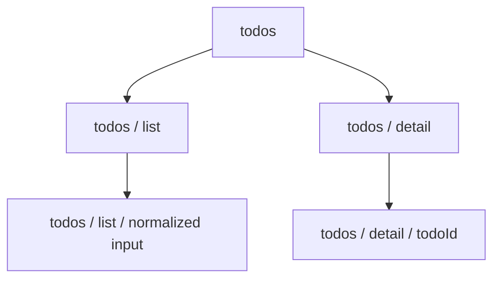

---

### `todosKeys.all`

```tsx
all: ["todos"] as const
```

เป็น Root Key ของ Todos Feature

ใช้แทนข้อมูลทั้งหมดที่เกี่ยวข้องกับ Todos

ตัวอย่างการ Invalidate ทั้ง Feature:

```tsx
queryClient.invalidateQueries({
  queryKey: todosKeys.all,
});
```

เนื่องจาก Query Keys อื่นขึ้นต้นด้วย `"todos"` ทั้งหมด การ Invalidate แบบ Prefix จะครอบคลุม:

```
todos/list/...
todos/detail/...
```

---

### `todosKeys.lists`

```tsx
lists: () => [...todosKeys.all, "list"] as const
```

ผลลัพธ์:

```tsx
["todos", "list"]
```

เป็น Namespace สำหรับ List Queries ทั้งหมด

ใช้ Invalidate เฉพาะรายการ:

```tsx
queryClient.invalidateQueries({
  queryKey: todosKeys.lists(),
});
```

จะกระทบ List Query เช่น:

```tsx
["todos", "list", { source: "all", page: 1, pageSize: 10 }]
["todos", "list", { source: "user", userId: 5 }]
```

แต่ไม่กระทบ Detail:

```tsx
["todos", "detail", 10]
```

---

### `todosKeys.list`

```tsx
list: (input: TodosListQueryInput) =>
  [...todosKeys.lists(), normalizeTodosListInput(input)] as const
```

ตัวอย่าง All Scope:

```tsx
todosKeys.list({
  source: "all",
  page: 2,
  pageSize: 10,
  userId: null,
});
```

ได้:

```tsx
[
  "todos",
  "list",
  {
    source: "all",
    page: 2,
    pageSize: 10,
  },
]
```

ตัวอย่าง User Scope:

```tsx
todosKeys.list({
  source: "user",
  page: 5,
  pageSize: 50,
  userId: 7,
});
```

ได้:

```tsx
[
  "todos",
  "list",
  {
    source: "user",
    userId: 7,
  },
]
```

สังเกตว่า `page` และ `pageSize` หายไปใน User Scope

---

### `todosKeys.details`

```tsx
details: () => [...todosKeys.all, "detail"] as const
```

ผลลัพธ์:

```tsx
["todos", "detail"]
```

ใช้เป็น Prefix สำหรับ Detail Query ทั้งหมด

ตัวอย่าง Invalidate Detail ทุกตัว:

```tsx
queryClient.invalidateQueries({
  queryKey: todosKeys.details(),
});
```

---

### `todosKeys.detail`

```tsx
detail: (todoId: number) =>
  [...todosKeys.details(), todoId] as const
```

ตัวอย่าง:

```tsx
todosKeys.detail(15)
```

ได้:

```tsx
["todos", "detail", 15]
```

Todo แต่ละ ID จึงมี Cache Entry ของตัวเอง

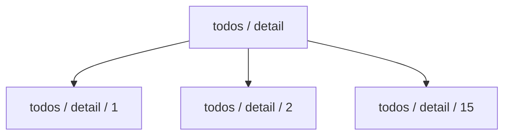

---

### ทำไม Key ใช้ `"list"` และ `"detail"` แบบเอกพจน์

ตรงนี้เป็น Naming Convention มากกว่ากฎของ TanStack Query

Factory นี้เลือก:

```tsx
["todos", "list"]
["todos", "detail"]
```

แทน:

```tsx
["todos", "lists"]
["todos", "details"]
```

ทั้งสองแบบใช้ได้ สิ่งสำคัญคือความสม่ำเสมอ

ฟังก์ชันชื่อ `lists()` และ `details()` หมายถึง Prefix ของหลาย Query ส่วน Segment ใน Key ใช้ `"list"` และ `"detail"` เพื่อบอกประเภทข้อมูล

---

### `todosListQueryOptions`

```tsx
export function todosListQueryOptions(input: TodosListQueryInput) {
  return queryOptions({
    queryKey: todosKeys.list(input),
    queryFn: ({ signal }) => {
      // ...
    },
    staleTime: 60_000,
  });
}
```

Function นี้เป็น Query Options Factory สำหรับ Todos List

รับ Input แล้วคืน Configuration ที่ครบทั้ง:

- Query Key
- Query Function
- Cache Freshness Policy

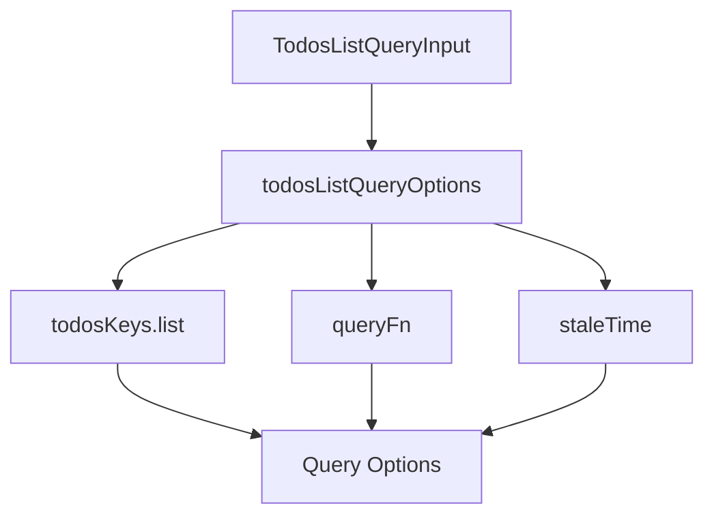

---

### `queryKey`

```tsx
queryKey: todosKeys.list(input)
```

Query Key ถูกสร้างจาก Input เดียวกับที่ `queryFn` ใช้

นี่เป็นหลักสำคัญมาก: ตัวแปรที่ `queryFn` ใช้และทำให้ผลลัพธ์เปลี่ยน ต้องถูกสะท้อนอยู่ใน `queryKey`

สำหรับ All Scope:

```
page
pageSize
source
```

สำหรับ User Scope:

```
source
userId
```

ถ้าลืมใส่ `page` ใน Query Key แต่ Query Function ใช้ `page` จะเกิด Cache Collision:

```tsx
page = 1 → key เดิม
page = 2 → key เดิม
```

TanStack Query อาจคิดว่าเป็นข้อมูลชุดเดียวกัน

---

### `queryFn` และการเลือก Endpoint

```tsx
queryFn: ({ signal }) => {
  if (input.source === "user") {
    if (input.userId === null) {
      throw new Error("User Scope ต้องมี userId");
    }

    return getTodosByUser({
      userId: input.userId,
      signal,
    });
  }

  return getTodos({
    page: input.page,
    pageSize: input.pageSize,
    signal,
  });
},
```

Query Function เลือก API Client Function ตาม `source`

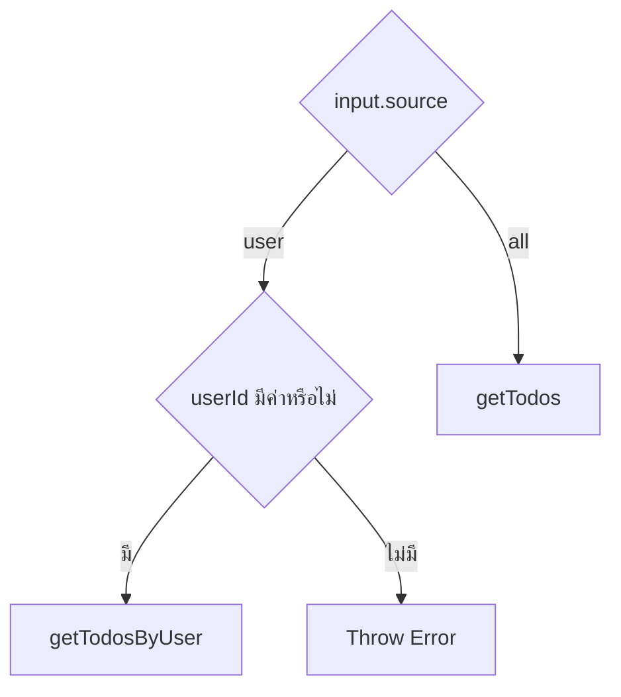

---

### ทำไมมี Guard `userId === null`

Type ของ Input ระบุ:

```tsx
userId: number | null
```

ดังนั้นแม้ `source === "user"` TypeScript ยังไม่สามารถรับรองโดยอัตโนมัติว่า `userId` ต้องเป็น Number

Object ที่ผิดยังสามารถเกิดขึ้นได้:

```tsx
{
  source: "user",
  userId: null,
  page: 1,
  pageSize: 10,
}
```

Query Function จึงมี Runtime Guard:

```tsx
if (input.userId === null) {
  throw new Error("User Scope ต้องมี userId");
}
```

นี่ช่วยป้องกันการส่ง URL ผิด เช่น:

```
/todos/user/null
```

อย่างไรก็ตาม Type ปัจจุบันยังอนุญาต State ที่ไม่ถูกต้องได้ ในระบบที่ต้องการ Type Safety เข้มขึ้น อาจออกแบบเป็น Discriminated Union:

```tsx
type TodosListQueryInput =
  | {
      source: "all";
      page: number;
      pageSize: number;
      userId: null;
    }
  | {
      source: "user";
      page: number;
      pageSize: number;
      userId: number;
    };
```

แต่ Tutorial เลือก Interface เดียวเพื่อให้เชื่อมกับ URL Search State ได้ตรงและอ่านง่ายกว่า แล้วใช้ Runtime Guard เพิ่ม

---

### ทำไม Query Options ตัดสินใจเลือก API Function

API Client มี Function แยก:

```tsx
getTodos()
getTodosByUser()
```

แต่หน้าจอ List ใช้ Concept เดียวกันคือ Todos List

Query Options จึงทำหน้าที่เป็น Orchestration เล็กน้อย:

```
List Source = all
  → getTodos

List Source = user
  → getTodosByUser
```

API Client ไม่ควรรับผิดชอบเรื่องนี้ เพราะมันควรเป็น Function Mapping ต่อ Endpoint

ส่วน UI ก็ไม่ควรต้องรู้รายละเอียดว่า Mode ไหนเรียก Function ใด

Query Layer จึงเป็นจุดเหมาะสมในการรวม Cache Semantics กับ Fetch Strategy

---

### การส่ง `AbortSignal`

```tsx
queryFn: ({ signal }) => {
```

TanStack Query ส่ง Signal เข้ามาใน Query Function Context

จากนั้นส่งต่อให้ API Client:

```tsx
getTodos({
  page: input.page,
  pageSize: input.pageSize,
  signal,
});
```

Flow:

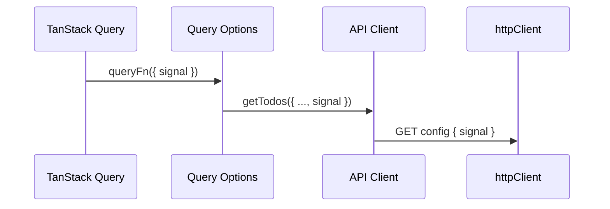

ถ้า Query ถูกยกเลิก Signal จะไปถึง Axios ตามที่หัวข้อก่อนหน้ารองรับไว้แล้ว

---

### `staleTime: 60_000`

```tsx
staleTime: 60_000
```

หมายถึงข้อมูลถือว่า Fresh เป็นเวลา 60,000 มิลลิวินาที หรือ 1 นาที

```
60,000 ms = 60 seconds
```

ในช่วง Fresh:

- Component Mount ใหม่ไม่จำเป็นต้อง Refetch โดยอัตโนมัติ
- Loader เรียก Query เดิมอาจใช้ Cache ได้
- ลด Network Request ที่ไม่จำเป็น

Timeline:

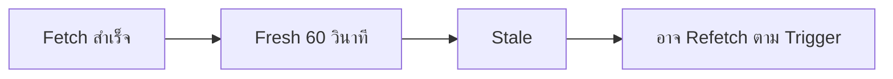

คำว่า Stale ไม่ได้แปลว่าข้อมูลถูกลบทันที แต่มันหมายถึง ข้อมูลยังอยู่ใน Cache แต่มีสิทธิ์ถูก Refetch เมื่อมี Trigger ที่เหมาะสม

---

### `staleTime` ต่างจาก Garbage Collection

`staleTime` ควบคุมความสดของข้อมูล

ไม่ได้ควบคุมว่าข้อมูลจะถูกลบออกจาก Cache เมื่อไร

แยก Concept:

- `staleTime`: เมื่อไรข้อมูลถือว่าเก่า
- `gcTime`: เมื่อไรข้อมูลที่ไม่มี Observer จะถูกลบจาก Cache

ไฟล์นี้กำหนดเฉพาะ `staleTime` ส่วน `gcTime` ใช้ Default หรือ Global Query Client Policy

---

### `todoDetailQueryOptions`

```tsx
export function todoDetailQueryOptions(todoId: number) {
  return queryOptions({
    queryKey: todosKeys.detail(todoId),
    queryFn: ({ signal }) => getTodo({ todoId, signal }),
    staleTime: 60_000,
  });
}
```

เป็น Query Options Factory สำหรับ Todo Detail

Input คือ:

```tsx
todoId: number
```

Query Key:

```tsx
["todos", "detail", todoId]
```

Query Function:

```tsx
getTodo({ todoId, signal })
```

Return Data ถูก Infer เป็น `Todo` จาก API Client Function

ภาพรวม:

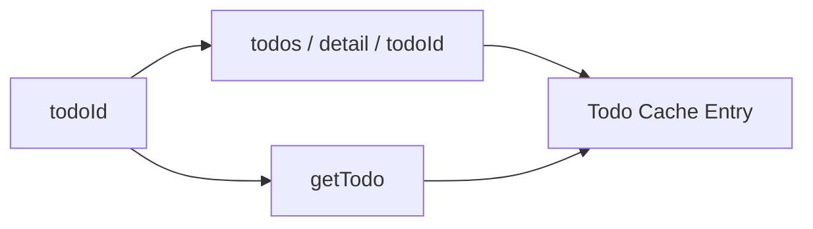

---

### Query Options เชื่อม Router Loader กับ Component อย่างไร

สมมติ Route Loader ใช้:

```tsx
loader: ({ context, params }) =>
  context.queryClient.ensureQueryData(
    todoDetailQueryOptions(params.todoId),
  )
```

และ Page Component ใช้:

```tsx
useSuspenseQuery(todoDetailQueryOptions(todoId))
```

ทั้งสองจุดใช้:

- Query Key เดียวกัน
- Query Function เดียวกัน
- `staleTime` เดียวกัน
- Return Type เดียวกัน

Flow:

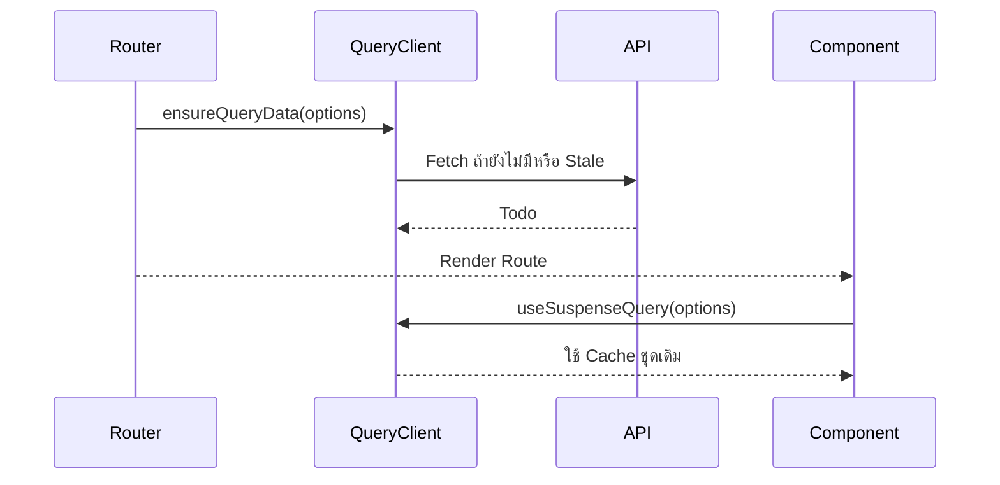

นี่คือเหตุผลหลักที่ Query Options Factory มีคุณค่ามากกว่าเขียน `useQuery` ตรง ๆ ใน Component

---

### ทำไมไม่เขียน `useQuery` ในไฟล์นี้

ไฟล์นี้คืน Query Options:

```tsx
return queryOptions(...)
```

ไม่ได้สร้าง Custom Hook เช่น:

```tsx
export function useTodos(...) {
  return useQuery(...)
}
```

เหตุผลคือ Query Options สามารถใช้ซ้ำได้กว้างมากกว่า Hook เพราะ Hook ใช้ได้เฉพาะในคอมโพเนนต์แต่ Query Options ใช้ได้กับ:

- Router Loader
- React Component
- Prefetch
- Test
- Query Client Utility
- Mutation Cache Coordination

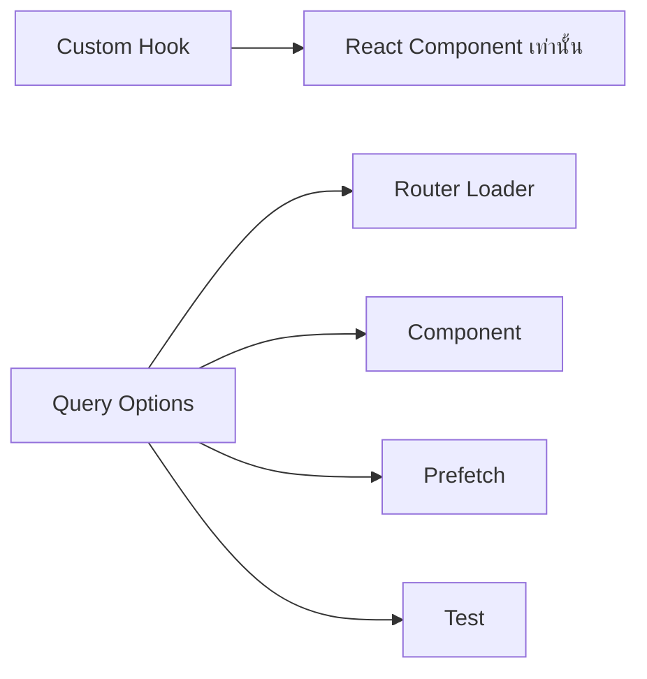

ไม่ได้หมายความว่า Custom Hook ไม่ดี แต่ใน Architecture ที่ผูก TanStack Router กับ TanStack Query การมี Query Options เป็น Primitive กลางมีความยืดหยุ่นกว่า

---

### Query Key Hierarchy ช่วย Mutation อย่างไร

แม้หัวข้อนี้ยังไม่ได้เขียน Mutation แต่โครงสร้าง Key ถูกเตรียมไว้แล้ว

ตัวอย่างหลัง Add Todo:

```tsx
queryClient.invalidateQueries({
  queryKey: todosKeys.lists(),
});
```

หลัง Update Todo ID 10:

```tsx
queryClient.setQueryData(
  todosKeys.detail(10),
  updatedTodo,
);
```

และอาจ Invalidate Lists:

```tsx
queryClient.invalidateQueries({
  queryKey: todosKeys.lists(),
});
```

หลัง Delete:

```tsx
queryClient.removeQueries({
  queryKey: todosKeys.detail(todoId),
});
```

Query Key Factory จึงไม่ได้มีไว้แค่ Fetch แต่เป็นภาษากลางสำหรับ Cache Coordination

---

### Exact Key กับ Prefix Key

Factory นี้รองรับทั้งสองแบบ

#### Exact Key

```tsx
todosKeys.detail(10)
```

ระบุ Todo ID 10 โดยเฉพาะ

#### Prefix Key

```tsx
todosKeys.details()
```

ระบุ Detail ทุกตัว

#### Feature Prefix

```tsx
todosKeys.all
```

ระบุ Query ทั้งหมดของ Todos Feature

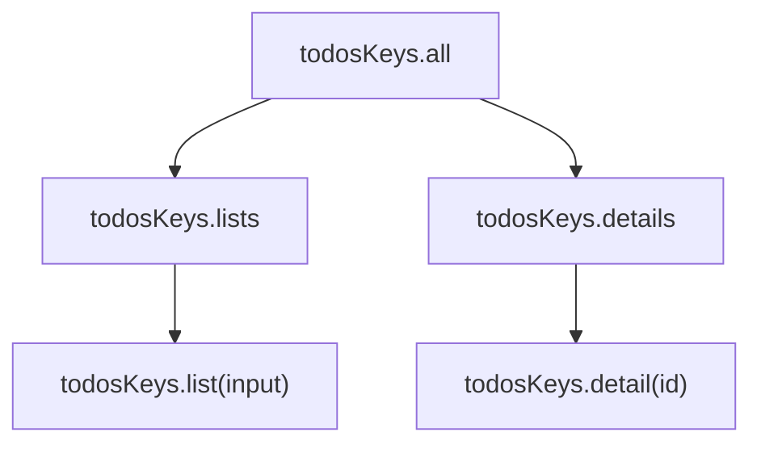

Hierarchy นี้ทำให้ Invalidation เลือกระดับความกว้างได้

---

### ข้อสังเกตเรื่อง User Scope และ Pagination

ใน `normalizeTodosListInput` เมื่อ Source เป็น `"user"` จะไม่ใช้ Pagination:

```tsx
{
  source: input.source,
  userId: input.userId,
}
```

และ `queryFn` เรียก:

```tsx
getTodosByUser({ userId, signal })
```

โดยไม่ส่ง `page` หรือ `pageSize` หมายความว่าใน Tutorial นี้ User Scope โหลด Todos ของ User ทั้งหมดเป็นชุดเดียว ไม่ใช่ Server Pagination ดังนั้นแม้ URL หรือ Page State อาจยังมี `page` และ `pageSize` แต่ค่าเหล่านี้ไม่เปลี่ยนผลลัพธ์ของ User Query จึงเป็นเหตุผลเชิงข้อมูลของการ Normalize Key ไม่ใช่เพียง Optimization

---

### Data Identity ต้องตรงกับ Fetch Identity

หลักสำคัญของไฟล์นี้คือ:

- ถ้า Request จริงต่างกัน → Query Key ต้องต่างกัน
- ถ้า Request จริงเหมือนกัน → Query Key ควรเหมือนกัน

ตัวอย่าง All Scope: `page 1, size 10` ≠ `page 2, size 10` จึงต้องมี Key ต่างกัน

ตัวอย่าง User Scope: `user 5, page 1` = `user 5, page 2` 

เพราะ Request จริงคือ `/todos/user/5` เหมือนกัน จึงควรมี Key เดียวกัน

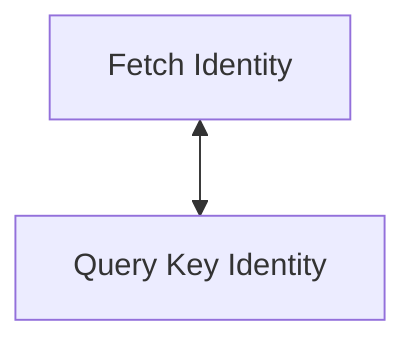

ถ้าสองอย่างนี้ไม่ตรงกัน Cache จะผิดพฤติกรรม

---

### Query Options Factory เป็น Single Source of Truth

ก่อนมี Factory อาจเกิดโค้ดซ้ำแบบนี้:

```tsx
// Loader
ensureQueryData({
  queryKey: ["todos", "detail", todoId],
  queryFn: () => getTodo({ todoId }),
  staleTime: 60_000,
});
```

```tsx
// Component
useQuery({
  queryKey: ["todos", "detail", todoId],
  queryFn: () => getTodo({ todoId }),
  staleTime: 30_000,
});
```

ปัญหาคือ Loader กับ Component ใช้ Policy ไม่ตรงกัน

เมื่อใช้ Factory:

```tsx
todoDetailQueryOptions(todoId)
```

ทั้งระบบใช้ Definition เดียวกัน

```
Query Key
Query Function
Stale Policy
Return Type
```

รวมอยู่ในจุดเดียว

---

### สิ่งที่ไฟล์นี้ไม่รับผิดชอบ

`queries.ts` ไม่ควร:

- Parse API Response เอง
- สร้าง Axios Request
- อ่าน Route Search โดยตรง
- Render Loading UI
- แสดง Toast
- Navigate Route
- จัดการ Mutation Side Effect

มันควรรับ Input ที่ Route หรือ Page เตรียมมาแล้ว แล้วแปลงเป็น Query Definition

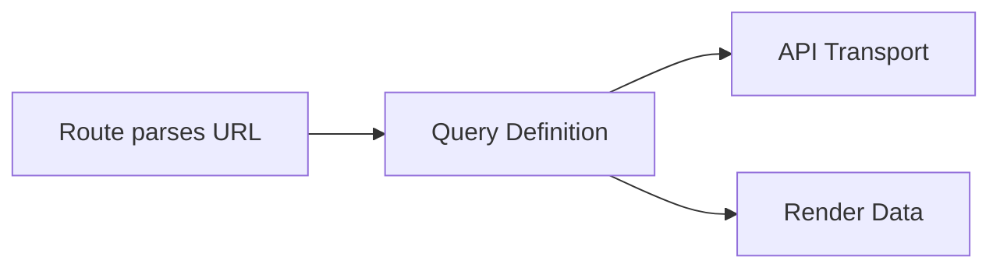

---

### สรุปโครงสร้าง Query Key

| Factory | Result โดยประมาณ | ใช้สำหรับ |
| --- | --- | --- |
| `todosKeys.all` | `["todos"]` | Todos Query ทั้งหมด |
| `todosKeys.lists()` | `["todos", "list"]` | List Queries ทั้งหมด |
| `todosKeys.list(input)` | `["todos", "list", normalizedInput]` | List เฉพาะชุด |
| `todosKeys.details()` | `["todos", "detail"]` | Detail Queries ทั้งหมด |
| `todosKeys.detail(id)` | `["todos", "detail", id]` | Todo Detail เฉพาะ ID |

---

### สรุป Query Options

| Factory | Query Key | API Function | Fresh Time |
| --- | --- | --- | --- |
| `todosListQueryOptions(input)` | `todosKeys.list(input)` | `getTodos` หรือ `getTodosByUser` | 60 วินาที |
| `todoDetailQueryOptions(todoId)` | `todosKeys.detail(todoId)` | `getTodo` | 60 วินาที |

---

### แก่นสำคัญของหัวข้อนี้

ไฟล์ `queries.ts` ทำหน้าที่แปลง Feature Query Intent ให้กลายเป็น:

```
Stable Cache Identity
+
Reusable Fetch Definition
+
Cache Freshness Policy
```

Flow เต็มคือ:

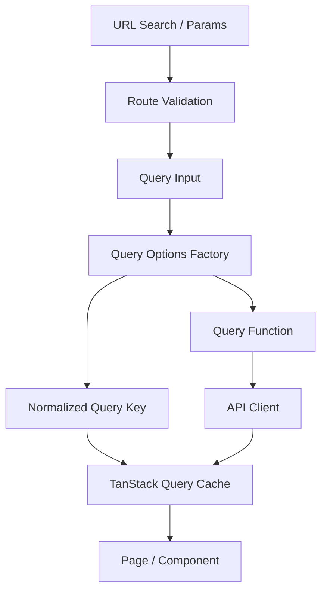

หลักที่ควรจำคือ: Query Key ไม่ใช่แค่ชื่อ Query แต่เป็นตัวแทน Identity ของข้อมูลใน Cache และ Query Options Factory ทำให้ Router Loader, Component และ Cache Operation ใช้ Definition เดียวกัน

ดังนั้นไฟล์นี้คือจุดที่ Fetch Logic จาก API Client ถูกยกระดับให้เป็น Server State ที่มี Identity, Lifecycle และ Cache Policy ชัดเจน.