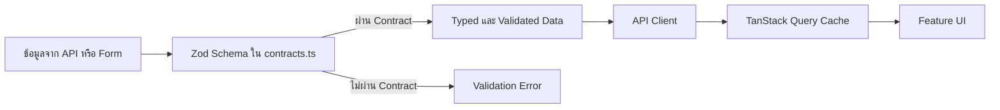
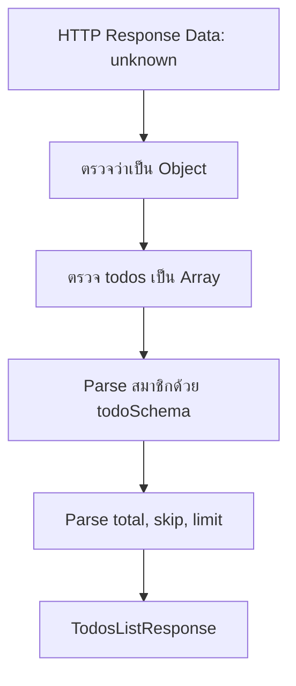
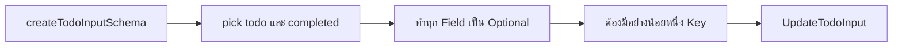
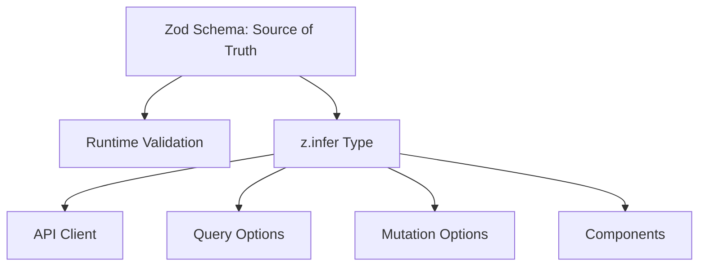
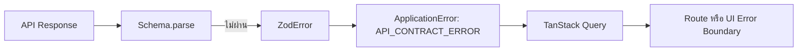

# คำอธิบายเพิ่มเติมเกี่ยวกับ API Contract

ไฟล์: `src/features/todos/api/contracts.ts`

## Overview

ไฟล์ `contracts.ts` เป็น Boundary Contract ของโมดูล Todos มีหน้าที่กำหนดว่า
ข้อมูลที่เข้าหรือออกจาก Feature ต้องมีโครงสร้างแบบใด ก่อนที่ข้อมูลนั้นจะถูกนำไปใช้ใน
API Client, TanStack Query Cache, Mutation หรือ UI

TypeScript ช่วยตรวจ Type ได้เฉพาะตอน Compile แต่ไม่สามารถรับประกันได้ว่า Response จาก API
หรือค่าที่สร้างขึ้นตอน Runtime จะตรงกับ Type ที่ประกาศไว้จริง ไฟล์นี้จึงใช้ Zod เป็น Runtime
Validator เพื่อ Parse, Validate และ Normalize ข้อมูลก่อนปล่อยให้เข้าสู่ส่วนอื่นของระบบ



Contract ในไฟล์นี้แบ่งได้เป็นสามกลุ่มหลัก

1. Response Contract สำหรับข้อมูลที่รับจาก API
2. Request Input Contract สำหรับข้อมูลที่กำลังจะส่งไปยัง API
3. TypeScript Type ที่ Infer จาก Schema เพื่อให้ Runtime Contract และ Compile-time Type ใช้แหล่งข้อมูลเดียวกัน

หลักสำคัญคือ **Schema เป็น Source of Truth ส่วน Type ถูกสร้างจาก Schema** ไม่เขียน Interface
ซ้ำอีกชุดหนึ่ง เพราะอาจทำให้ TypeScript Type กับ Runtime Validation ไม่ตรงกันในอนาคต

---

## `todoSchema`

```ts
export const todoSchema = z.object({
  id: z.coerce.number().int().positive(),
  todo: z.string().trim().min(1),
  completed: z.boolean(),
  userId: z.coerce.number().int().positive(),
});
```

### Overview

`todoSchema` เป็น Contract หลักของ Todo หนึ่งรายการ Schema อื่นที่ต้องใช้โครงสร้าง Todo
จะอ้างอิงหรือ Extend จาก Schema นี้ เพื่อลดการประกาศ Field ซ้ำและลดโอกาสที่แต่ละ Endpoint
จะตีความ Todo ไม่เหมือนกัน

### Logic Breakdown

#### `id`

```ts
z.coerce.number().int().positive()
```

Input ที่ยอมรับในทางปฏิบัติอาจเป็น `number` หรือค่าที่ Zod สามารถแปลงเป็น Number ได้ เช่น
String ที่มีรูปแบบเป็นตัวเลข

ลำดับการทำงานคือ

```text
unknown
→ แปลงด้วย Number
→ ต้องเป็น number ที่ผ่านการตรวจ
→ ต้องเป็นจำนวนเต็ม
→ ต้องมากกว่า 0
```

ตัวอย่าง

```ts
"12" // ผ่านและถูก Normalize เป็น 12
12 // ผ่าน
12.5 // ไม่ผ่าน เพราะไม่ใช่จำนวนเต็ม
0 // ไม่ผ่าน เพราะต้องเป็นจำนวนบวก
"abc" // ไม่ผ่าน เพราะแปลงเป็น Number ที่ใช้งานไม่ได้
```

Output คือ `number` ที่เป็นจำนวนเต็มบวก

#### `todo`

```ts
z.string().trim().min(1)
```

ลำดับการทำงานคือ

1. ค่าต้องเป็น String
2. ตัดช่องว่างด้านหน้าและด้านหลัง
3. หลังตัดช่องว่างแล้วต้องเหลืออย่างน้อยหนึ่งตัวอักษร

ตัวอย่าง

```ts
"  Buy milk  " // ผ่านและได้ "Buy milk"
" " // ไม่ผ่าน หลัง trim แล้วเป็น String ว่าง
123 // ไม่ผ่าน เพราะไม่ใช่ String
```

Output คือ String ที่ผ่านการ Trim และไม่ว่างเปล่า

#### `completed`

```ts
z.boolean()
```

Input ต้องเป็น Boolean จริงเท่านั้น คือ `true` หรือ `false`

ค่าอย่าง `"true"`, `1` หรือ `0` จะไม่ผ่าน เพราะ Schema นี้ไม่ได้ใช้ Coercion การเลือกใช้
Strict Boolean ช่วยป้องกันข้อมูลกำกวมที่อาจทำให้สถานะ Todo ผิดพลาด

#### `userId`

ใช้กฎเดียวกับ `id` คือ Normalize เป็น Number แล้วต้องเป็นจำนวนเต็มบวก

### Input และ Output

Input ของ `todoSchema.parse(...)` คือ `unknown`

Output เมื่อสำเร็จมีโครงสร้างดังนี้

```ts
{
  id: number;
  todo: string;
  completed: boolean;
  userId: number;
}
```

หากข้อมูลไม่ตรง Contract จะ Throw `ZodError`

### Edge Cases

- API ส่ง `id: null` อาจถูก Coerce เป็น `0` แล้วถูกปฏิเสธด้วย `positive()`
- API ส่ง `id: true` อาจถูก JavaScript แปลงเป็น `1` และผ่านได้ เนื่องจาก `z.coerce.number()` ใช้ Number coercion
- API ส่งข้อความ Todo ที่มีเฉพาะช่องว่างจะไม่ผ่านหลัง `trim()`
- API ส่ง `completed: "false"` จะไม่ผ่าน แม้ค่าจะดูเหมือน Boolean
- Schema ไม่ใช้ `.strict()` ดังนั้น Object ที่มี Field เกินมาจะถูก Strip ตามพฤติกรรมปกติของ Zod Object แทนที่จะ Throw Error

---

## `todosListResponseSchema`

```ts
export const todosListResponseSchema = z.object({
  todos: z.array(todoSchema),
  total: z.coerce.number().int().nonnegative(),
  skip: z.coerce.number().int().nonnegative(),
  limit: z.coerce.number().int().nonnegative(),
});
```

### Overview

Schema นี้กำหนด Contract สำหรับ Response รายการ Todos พร้อม Metadata ที่ใช้กับ Server-side
Pagination

### Logic Breakdown

#### `todos`

```ts
z.array(todoSchema)
```

ค่าต้องเป็น Array และสมาชิกทุกตัวต้องผ่าน `todoSchema`

ถ้ามี Todo เพียงรายการเดียวที่ผิด Contract การ Parse Response ทั้งก้อนจะล้มเหลว ซึ่งเป็นพฤติกรรม
แบบ Fail Fast เพื่อไม่ให้ข้อมูลบางส่วนที่ไม่น่าเชื่อถือเข้าสู่ Query Cache

Array ว่างสามารถผ่านได้ เพราะ Schema ไม่ได้กำหนด `.min(1)` รายการว่างถือเป็น Response ที่ถูกต้อง
สำหรับหน้าที่ไม่มีข้อมูล

#### `total`

จำนวนรายการทั้งหมดของ Dataset ต้องเป็นจำนวนเต็มตั้งแต่ `0` ขึ้นไป

#### `skip`

จำนวนรายการที่ API ข้ามไปก่อนเริ่ม Response ต้องเป็นจำนวนเต็มตั้งแต่ `0` ขึ้นไป

#### `limit`

จำนวนรายการสูงสุดที่ Endpoint ขอหรือคืนกลับมา ต้องเป็นจำนวนเต็มตั้งแต่ `0` ขึ้นไป

ใช้ `nonnegative()` แทน `positive()` เพราะ DummyJSON รองรับ `limit=0` และ Response ที่มีค่า `0`
จึงยังถือว่าถูกต้องตาม Contract

### Data Flow



### Input และ Output

Input คือ `unknown`

Output คือ

```ts
{
  todos: Todo[];
  total: number;
  skip: number;
  limit: number;
}
```

### Edge Cases

- `todos` ไม่ใช่ Array จะไม่ผ่าน
- สมาชิกตัวใดตัวหนึ่งไม่ผ่าน `todoSchema` จะทำให้ Response ทั้งก้อนล้มเหลว
- `total`, `skip` หรือ `limit` เป็นค่าติดลบหรือทศนิยมจะไม่ผ่าน
- Metadata อาจถูกต้องตาม Type แต่ไม่สอดคล้องเชิงธุรกิจ เช่น `skip > total`; Schema ปัจจุบันไม่ได้ตรวจ Cross-field Constraint นี้
- Schema ไม่ตรวจว่า `todos.length <= limit`

---

## `randomTodosSchema`

```ts
export const randomTodosSchema = z.array(todoSchema).min(1).max(10);
```

### Overview

ใช้ตรวจ Response ของ Endpoint ที่สุ่ม Todo หลายรายการ โดยกำหนดจำนวนสมาชิกที่รองรับตั้งแต่
1 ถึง 10 รายการตามข้อกำหนดของ Tutorial

### Logic Breakdown

1. Input ต้องเป็น Array
2. สมาชิกทุกตัวต้องผ่าน `todoSchema`
3. Array ต้องมีอย่างน้อย 1 รายการ
4. Array ต้องมีไม่เกิน 10 รายการ

### Input และ Output

Input คือ `unknown`

Output คือ `Todo[]` ที่มีจำนวนสมาชิก 1–10 รายการ

### Edge Cases

- Array ว่างจะไม่ผ่าน แม้ Response List ปกติจะอนุญาต Array ว่าง
- API ส่งเกิน 10 รายการจะไม่ผ่าน Contract
- Schema ตรวจจำนวนสมาชิก แต่ไม่ได้ตรวจว่ารายการ Todo ซ้ำกันหรือไม่

---

## `createTodoInputSchema`

```ts
export const createTodoInputSchema = z.object({
  todo: z.string().trim().min(3).max(300),
  completed: z.boolean(),
  userId: z.number().int().positive(),
});
```

### Overview

Schema นี้เป็น Request Input Contract สำหรับการสร้าง Todo ใหม่ แตกต่างจาก `todoSchema`
ตรงที่ยังไม่มี `id` เพราะ ID เป็นข้อมูลที่ Server ต้องสร้างและส่งกลับมา

Input Contract ถูกแยกจาก Response Contract เพื่อให้แต่ละ Boundary กำหนดกฎตามหน้าที่จริง
ไม่ใช้ Type เดียวครอบทั้ง Create, Update และ Response

### Logic Breakdown

#### `todo`

ข้อความจะถูก Trim และต้องมีความยาว 3–300 ตัวอักษรหลัง Trim

- `.min(3)` ป้องกันข้อความสั้นเกินไป เช่น `"a"`
- `.max(300)` จำกัด Payload และป้องกันข้อมูลที่ยาวเกิน Requirement

#### `completed`

ต้องเป็น Boolean จริง โดย Form ต้องส่งค่าอย่างชัดเจน

#### `userId`

ต้องเป็น `number` อยู่แล้ว ไม่ใช้ `z.coerce.number()` เพราะข้อมูลนี้มาจาก Boundary ภายใน เช่น Form
หรือ Application Logic ซึ่งควรส่ง Type ให้ถูกต้องก่อนถึง API Client

ความต่างนี้มีนัยสำคัญ:

```text
Response จากภายนอก
→ อาจ Normalize ด้วย Coercion

Request ที่ระบบกำลังจะส่งออก
→ ควร Strict และไม่ซ่อน Bug ของ Caller
```

### Input และ Output

Input ที่ถูกต้อง

```ts
{
  todo: string;
  completed: boolean;
  userId: number;
}
```

Output มี Shape เดิม แต่ `todo` จะถูก Trim แล้ว

### Edge Cases

- ข้อความก่อน Trim ยาว 3 ตัว แต่หลัง Trim เหลือน้อยกว่า 3 ตัวจะไม่ผ่าน
- `userId: "1"` จะไม่ผ่าน เพราะไม่เปิดใช้ Coercion
- Unicode ความยาวบางชนิดอาจถูกนับตาม JavaScript String length ไม่ตรงกับจำนวน Grapheme ที่ผู้ใช้มองเห็น
- Schema ไม่ได้ตรวจคำต้องห้ามหรือ Business Rule เฉพาะโดเมน

---

## `updateTodoInputSchema`

```ts
export const updateTodoInputSchema = createTodoInputSchema
  .pick({ todo: true, completed: true })
  .partial()
  .refine((value) => Object.keys(value).length > 0, {
    message: "ต้องมีข้อมูลอย่างน้อยหนึ่ง Field สำหรับการแก้ไข",
  });
```

### Overview

Schema นี้ใช้กับ `PATCH` ซึ่งส่งเฉพาะ Field ที่ต้องการเปลี่ยน ไม่ได้ Replace Resource ทั้งก้อน

Schema ถูกสร้างต่อจาก `createTodoInputSchema` เพื่อ reuse กฎ Validation เดิมของ `todo` และ
`completed` แทนการประกาศใหม่

### Logic Breakdown

#### ขั้นที่ 1: `.pick(...)`

```ts
.pick({ todo: true, completed: true })
```

เลือกเฉพาะ Field ที่ Endpoint อนุญาตให้แก้ไข

`userId` ถูกตัดออก หมายความว่า Contract ปัจจุบันไม่อนุญาตให้ Mutation นี้ย้าย Todo ไปยัง User อื่น

ผลลัพธ์ชั่วคราวคือ

```ts
{
  todo: string;
  completed: boolean;
}
```

#### ขั้นที่ 2: `.partial()`

ทำให้ทุก Field เป็น Optional เพื่อรองรับ Partial Update

```ts
{
  todo?: string;
  completed?: boolean;
}
```

ตัวอย่างที่ผ่านในขั้นนี้

```ts
{ todo: "Updated todo" }
{ completed: true }
{ todo: "Updated todo", completed: false }
{}
```

#### ขั้นที่ 3: `.refine(...)`

Object ว่าง `{}` ผ่าน `.partial()` ได้ จึงต้องเพิ่ม Cross-field Validation ว่าต้องมีอย่างน้อยหนึ่ง Field

```ts
.refine((value) => Object.keys(value).length > 0)
```

Input คือ Object หลังผ่าน Base Validation

Output คือ Object เดิมเมื่อมี Key อย่างน้อยหนึ่งรายการ

หากไม่มี Key จะเกิด Validation Error พร้อมข้อความ

```text
ต้องมีข้อมูลอย่างน้อยหนึ่ง Field สำหรับการแก้ไข
```

### Flow



### Edge Cases

- `{}` จะไม่ผ่าน
- `{ todo: undefined }` อาจมี Key อยู่ใน Object และผ่าน `Object.keys()` แต่ค่าจะถูกจัดการตาม Optional Schema ควรหลีกเลี่ยงการส่ง Explicit `undefined`
- Unknown Field อาจถูก Strip ก่อน Refine; Payload ที่มีเฉพาะ Field ที่ไม่รู้จักอาจกลายเป็น `{}` และไม่ผ่าน
- การใช้ `Object.keys()` ตรวจเพียงว่ามี Field ไม่ได้ตรวจว่าค่าใหม่ต่างจากค่าเดิมจริงหรือไม่
- Schema ไม่รองรับการตั้งค่า `todo` เป็น `null`

---

## `deletedTodoSchema`

```ts
export const deletedTodoSchema = todoSchema.extend({
  isDeleted: z.literal(true),
  deletedOn: z.iso.datetime(),
});
```

### Overview

Schema นี้ใช้ตรวจ Response หลัง Delete โดยนำ Shape ของ Todo เดิมมา Extend ด้วย Metadata
การลบ

### Logic Breakdown

#### `.extend(...)`

Reuse ทุก Field จาก `todoSchema` แล้วเพิ่มสอง Field

#### `isDeleted`

```ts
z.literal(true)
```

ต้องเป็นค่า `true` เท่านั้น ไม่ใช่ Boolean ทั่วไป หาก API ตอบ `false` จะไม่ผ่าน Contract
เพราะ Response นี้มีความหมายว่าการลบเสร็จสมบูรณ์แล้ว

#### `deletedOn`

```ts
z.iso.datetime()
```

ต้องเป็น String ที่มีรูปแบบ ISO Date-time ที่ Zod ยอมรับ

Schema นี้ตรวจรูปแบบ แต่ยังคืนค่าเป็น String ไม่ได้แปลงเป็น JavaScript `Date`

### Input และ Output

Output คือ

```ts
{
  id: number;
  todo: string;
  completed: boolean;
  userId: number;
  isDeleted: true;
  deletedOn: string;
}
```

### Edge Cases

- `isDeleted: 1` หรือ `"true"` จะไม่ผ่าน
- Date String ที่ดูคล้ายวันที่แต่ไม่ใช่ ISO Date-time จะไม่ผ่าน
- ISO String อาจถูกต้องตามรูปแบบ แต่เป็นเวลาที่ไม่สมเหตุผลเชิงธุรกิจ เช่นอยู่ในอนาคต; Schema ปัจจุบันไม่ได้ตรวจ
- API บางระบบตอบ Delete ด้วย HTTP 204 และไม่มี Body ซึ่ง Contract นี้จะใช้ไม่ได้ ต้องออกแบบ Client ตาม API จริง

---

## `randomTodoCountSchema`

```ts
export const randomTodoCountSchema = z.number().int().min(1).max(10);
```

### Overview

ใช้ตรวจจำนวน Todo ที่ Caller ต้องการสุ่มก่อนนำค่าไปประกอบ URL ของ Endpoint

### Logic Breakdown

Input ต้องเป็น

1. Number
2. จำนวนเต็ม
3. ไม่น้อยกว่า 1
4. ไม่มากกว่า 10

Output คือ `number` ในช่วง 1–10

### Edge Cases

- String เช่น `"3"` ไม่ผ่าน เพราะไม่ใช้ Coercion
- `NaN`, `Infinity` และ `-Infinity` ไม่ผ่าน Number Validation
- `1.5` ไม่ผ่านเพราะไม่ใช่จำนวนเต็ม
- ค่า `0`, ค่าติดลบ และค่ามากกว่า 10 ไม่ผ่าน

---

## Type Inference

```ts
export type CreateTodoInput = z.infer<typeof createTodoInputSchema>;
export type DeletedTodo = z.infer<typeof deletedTodoSchema>;
export type Todo = z.infer<typeof todoSchema>;
export type TodosListResponse = z.infer<typeof todosListResponseSchema>;
export type UpdateTodoInput = z.infer<typeof updateTodoInputSchema>;
```

### Overview

`z.infer<typeof schema>` สร้าง TypeScript Type จาก Output Type ของ Schema โดยตรง

ตัวอย่าง

```ts
export type Todo = z.infer<typeof todoSchema>;
```

มีผลเทียบเท่ากับ Type ต่อไปนี้ในเชิงแนวคิด

```ts
type Todo = {
  id: number;
  todo: string;
  completed: boolean;
  userId: number;
};
```

แต่ไม่ควรเขียน Type ซ้ำด้วยมือ เพราะเมื่อ Schema เปลี่ยน Type จะไม่เปลี่ยนตามและเกิด Contract Drift

### เหตุผลที่สำคัญ



Schema ชุดเดียวจึงรับผิดชอบทั้ง

- ตรวจข้อมูลจริงตอน Runtime
- สร้าง Type สำหรับ Compile-time
- Normalize Output เช่น Trim String หรือ Coerce Number

### Input Type และ Output Type

ใน Schema ที่มี Coercion Input Type และ Output Type อาจไม่เหมือนกัน ตัวอย่าง `id` สามารถรับ
ค่าที่กว้างกว่า Number ก่อน Parse แต่ Output หลัง Parse ถูก Normalize เป็น `number`

หากต้องใช้งาน Type ก่อนและหลัง Parse แยกกัน Zod รองรับ

```ts
type TodoInput = z.input<typeof todoSchema>;
type TodoOutput = z.output<typeof todoSchema>;
```

Tutorial ใช้ `z.infer` ซึ่งหมายถึง Output Type เพราะส่วนอื่นของ Feature ควรทำงานกับข้อมูลที่ผ่าน
Validation และ Normalization แล้ว

---

## Production-Ready Analysis

### Performance Optimization

Zod Parsing มี Runtime Cost ตามจำนวน Object และจำนวน Field ที่ตรวจ แต่สำหรับ Todo Payload ขนาดเล็ก
ต้นทุนนี้มักน้อยกว่าความเสี่ยงจากข้อมูลผิด Contract

จุดที่ควรพิจารณาเมื่อ Dataset ใหญ่มาก

- Parse ที่ Boundary เพียงครั้งเดียวก่อนข้อมูลเข้า Query Cache
- อย่า Parse Response เดิมซ้ำใน Component ทุกครั้งที่ Render
- หลีกเลี่ยงการสร้าง Schema ภายใน Function หรือ Component ให้ประกาศที่ Module Scope เหมือนใน Tutorial
- ใช้ Pagination เพื่อจำกัดจำนวน Entity ต่อ Response
- วัดผลด้วย Profiling ก่อนลด Validation เพราะ Performance Bottleneck มักอยู่ที่ Network, Rendering หรือ Payload Size มากกว่า Schema นี้

การใช้ Schema Reference ซ้ำ เช่น `z.array(todoSchema)` และ `todoSchema.extend(...)` ช่วยให้กฎสอดคล้องกัน
แต่ไม่ได้หมายความว่า Parse Result จะถูก Cache โดยอัตโนมัติ ทุกการเรียก `.parse()` ยังคงตรวจข้อมูลใหม่

### Security First

Runtime Validation เป็นส่วนหนึ่งของ Security Boundary เพราะข้อมูลจาก API และ User Input ต้องถือว่า
ไม่น่าเชื่อถือจนกว่าจะผ่านการตรวจ

Schema นี้ช่วยลดความเสี่ยงดังต่อไปนี้

- Type Confusion เช่น ID กลายเป็น Object หรือ Array
- Payload ที่ยาวเกิน Requirement ผ่าน `max(300)`
- Empty Update ผ่าน Refinement
- Response Delete ที่ไม่ได้ยืนยัน `isDeleted: true`
- Invalid Date-time Metadata

อย่างไรก็ตาม Zod ไม่แทนที่มาตรการฝั่ง Server

- Server ต้องตรวจ Authentication และ Authorization เอง
- Server ต้อง Validate Request ซ้ำ
- Client Validation ป้องกัน UX Error และ Contract Drift แต่ไม่ใช่ Trust Boundary สุดท้าย
- Schema ไม่ได้ทำ HTML Sanitization หากนำข้อความไป Render ผ่าน `dangerouslySetInnerHTML` ต้องมี Sanitization เพิ่มเติม
- หลีกเลี่ยงการ Log Payload ที่อาจมีข้อมูลส่วนบุคคลใน Validation Error

ควรระวัง Coercion เป็นพิเศษ เพราะ `z.coerce.number()` ใช้ JavaScript Number Conversion ซึ่งยอมรับค่าบางชนิด
ที่อาจไม่ตรงเจตนา เช่น Boolean ดังนั้นในระบบที่มี Security Sensitivity สูงควรใช้ `z.preprocess()`
หรือ Union ที่ระบุ Input Format อย่างชัดเจนกว่า

### Scalability และ Maintainability

โครงสร้างนี้รองรับการขยาย Feature เพราะ Contract ถูกแยกตาม Use Case

- `todoSchema` เป็น Entity Response Contract
- `todosListResponseSchema` เป็น Collection Response Contract
- `createTodoInputSchema` เป็น Create Command Contract
- `updateTodoInputSchema` เป็น Partial Update Contract
- `deletedTodoSchema` เป็น Delete Response Contract

เมื่อ Backend เปลี่ยน แต่ละ Contract สามารถเปลี่ยนตาม Boundary ของตัวเองโดยไม่บังคับให้ทุก Use Case ใช้
Shape เดียวกัน

แนวทางเมื่อระบบขยาย

- แยก Domain Model ออกจาก Transport DTO เมื่อ Backend Shape ไม่เหมาะกับ UI หรือ Business Logic
- เพิ่ม Transform Layer หากต้องแปลง `snake_case` เป็น `camelCase`
- ใช้ Discriminated Union เมื่อ Response มีหลายสถานะ
- ใช้ Schema Versioning เมื่อรองรับ API หลาย Version พร้อมกัน
- เพิ่ม Cross-field Refinement เฉพาะเมื่อเป็น Invariant ที่ Boundary นี้ต้องรับผิดชอบ
- อย่า Export Schema ภายในที่ไม่จำเป็นผ่าน Feature Public API

### Error Handling

Schema ในไฟล์นี้ Throw `ZodError` โดยตรงเมื่อใช้ `.parse()` ใน API Client ของ Tutorial Error นี้จะถูก
แปลงเป็น `ApplicationError` ที่ Boundary ของ Client เพื่อให้ส่วนอื่นของระบบไม่ต้องผูกกับรายละเอียด Zod

แนวทางดังกล่าวทำให้ Error Flow เป็น



หากต้องการตรวจข้อมูลโดยไม่ Throw สามารถใช้ `.safeParse()` แต่ Caller ต้องจัดการ Success และ Error
อย่างชัดเจน ไม่ควรละเลย Validation Failure แล้วคืนข้อมูลเดิมออกไป

---

## Edge Cases ระดับไฟล์

1. Backend เปลี่ยนชื่อ Field เช่น `userId` เป็น `user_id` ทำให้ Parse ล้มเหลวทันที
2. Backend เพิ่ม Field ใหม่จะไม่ทำให้ Parse ล้มเหลวโดยค่าเริ่มต้น แต่ Field นั้นจะไม่อยู่ใน Parsed Output
3. Backend ลบ Field ที่ Required จะทำให้ Parse ล้มเหลว
4. Coercion อาจยอมรับ Input ที่กว้างกว่าที่คาด ต้องพิจารณาตาม Trust Level ของ Boundary
5. Validation ถูกต้องเชิงโครงสร้างแต่ยังผิด Business Rule ได้ เช่น `skip > total`
6. Delete API จริงอาจตอบ `204 No Content` แทน Object
7. Create และ Update Schema ไม่ได้ป้องกันการส่งข้อความซ้ำกับ Todo เดิม
8. Contract ปัจจุบันไม่รองรับ Nullable Field
9. Error Message เริ่มต้นของ Zod อาจไม่เหมาะกับผู้ใช้ปลายทาง ควร Map เป็นข้อความระดับ Application
10. การเปลี่ยน Schema อาจกระทบ Query Cache ที่ Persist ไว้จาก Version ก่อน หากระบบเพิ่ม Persisted Cache ต้องมี Migration หรือ Versioned Cache Key

---

## สรุปสาระสำคัญ

`contracts.ts` ไม่ได้เป็นเพียงไฟล์รวม Type แต่เป็น Runtime Boundary ของ Feature Todos

หลักการที่ต้องรักษาคือ

- ข้อมูลภายนอกเริ่มต้นเป็น `unknown`
- Parse และ Validate ก่อนเข้าสู่ Query Cache หรือ UI
- ใช้ Coercion เฉพาะ Boundary ที่ต้องการ Normalize ข้อมูลภายนอกจริง
- ใช้ Strict Input สำหรับข้อมูลที่ Application เป็นผู้สร้าง
- แยก Create, Update และ Response Contract ตาม Use Case
- Infer Type จาก Schema เพื่อป้องกัน Contract Drift
- Fail Fast เมื่อข้อมูลผิดรูปแบบ แทนการปล่อยข้อมูลที่ไม่น่าเชื่อถือไหลเข้าสู่ระบบ

Mental Model ของไฟล์นี้คือ

```text
Unknown Data
→ Zod Contract
→ Validated and Normalized Domain Data
→ API Client
→ TanStack Query Cache
→ Feature UI
```
