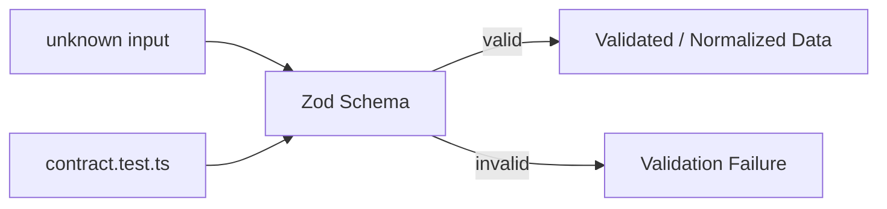
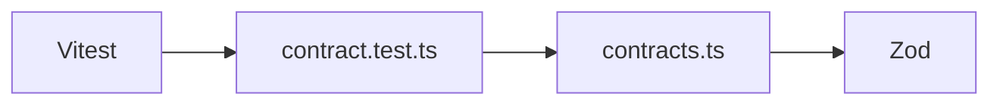
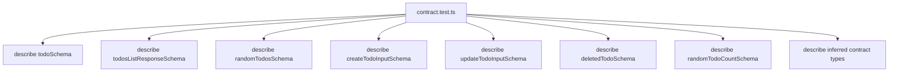
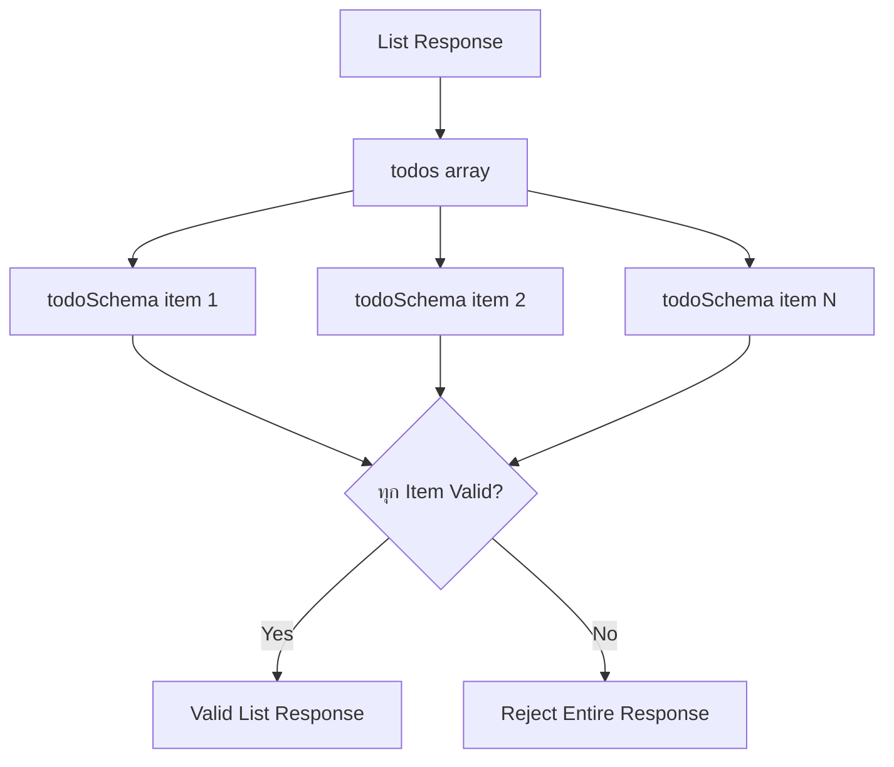
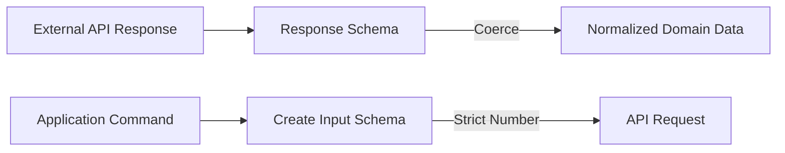
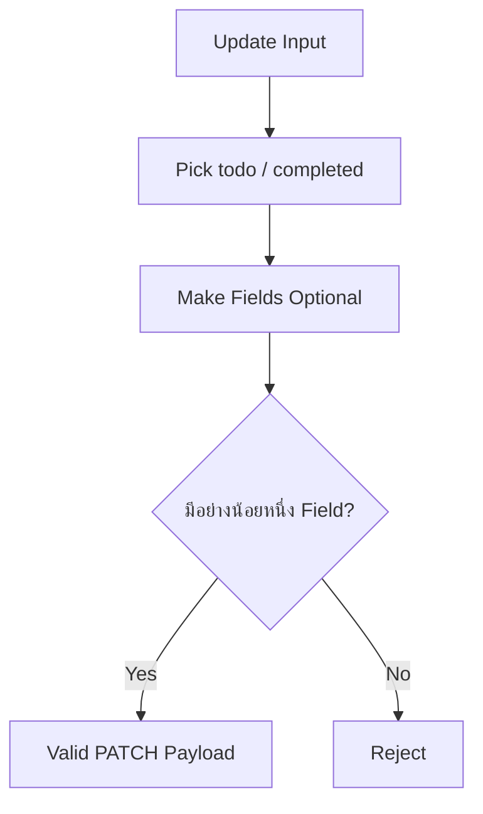
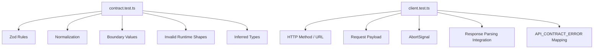
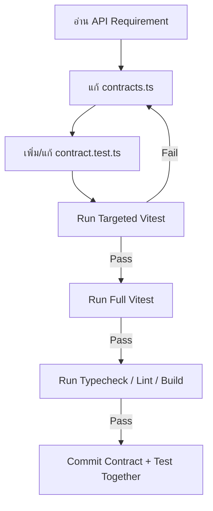

# แนวทางการเขียน Test สำหรับ Todos API Contract

ไฟล์ Test: `src/features/todos/api/contract.test.ts`

ไฟล์ Production ที่ทดสอบ: `src/features/todos/api/contracts.ts`

เอกสารนี้อธิบายวิธีเขียน Unit Test สำหรับ API Contract ของโมดูล Todos ด้วย Vitest ตั้งแต่การติดตั้ง การออกแบบ Test Case การเขียน Test ฉบับเต็ม การรัน Test ไปจนถึงการวิเคราะห์ Coverage และข้อควรระวังสำหรับ Production

> Naming note: ไฟล์ Production ใช้ชื่อ `contracts.ts` แบบพหูพจน์ แต่เอกสารนี้ใช้ชื่อ Test `contract.test.ts` ตามชื่อที่กำหนดไว้ หากทีมต้องการให้ชื่อ Test mirror กับ Production file แบบ 1:1 สามารถเปลี่ยนชื่อเป็น `contracts.test.ts` ได้โดยไม่กระทบเนื้อหา Test เพราะยัง Import จาก `./contracts` เหมือนเดิม

เอกสาร Contract หลักอยู่ที่ [API Contract](./api-contract.md)

---

## 1. เป้าหมายของ Contract Test

`contracts.ts` เป็น Runtime Boundary ของ Feature ทำหน้าที่ตรวจและ Normalize ข้อมูลก่อนที่ข้อมูลจะผ่านเข้าออกโมดูล Todos

Contract Test จึงไม่ได้ตรวจ HTTP, Axios, TanStack Query หรือ React แต่ตรวจว่า Zod Schema ทำงานตามกฎที่ออกแบบไว้จริง



สิ่งที่ Test Suite ต้องพิสูจน์มี 4 กลุ่มหลัก

1. **Happy Path** — ข้อมูลที่ถูกต้องต้องผ่าน
2. **Normalization** — ค่าที่ Schema ตั้งใจแปลง เช่น Numeric String และ `.trim()` ต้องได้ Output ที่ถูกต้อง
3. **Boundary Value** — ค่าต่ำสุด สูงสุด ศูนย์ จำนวนติดลบ จำนวนทศนิยม และค่าที่อยู่เลยขอบเขตต้องมีพฤติกรรมตรง Contract
4. **Invalid Shape / Type** — Missing Field, Wrong Type, Invalid Nested Data และ Invalid Collection ต้องถูกปฏิเสธ

Contract Test ควรเป็น Pure Unit Test และมี Dependency ให้น้อยที่สุด



ไม่จำเป็นต้องใช้

- MSW
- Axios Mock
- React Testing Library
- DOM / jsdom
- TanStack Query `QueryClient`
- Network Request

สิ่งเหล่านี้ควรไปอยู่ใน Integration Test ของ Layer ที่เกี่ยวข้อง เช่น `client.test.ts`

---

## 2. Contract ที่ต้องครอบคลุม

`src/features/todos/api/contracts.ts` ประกอบด้วย Schema หลัก 7 ตัว

```ts
export const todoSchema = z.object({
  id: z.coerce.number().int().positive(),
  todo: z.string().trim().min(1),
  completed: z.boolean(),
  userId: z.coerce.number().int().positive(),
});

export const todosListResponseSchema = z.object({
  todos: z.array(todoSchema),
  total: z.coerce.number().int().nonnegative(),
  skip: z.coerce.number().int().nonnegative(),
  limit: z.coerce.number().int().nonnegative(),
});

export const randomTodosSchema = z.array(todoSchema).min(1).max(10);

export const createTodoInputSchema = z.object({
  todo: z.string().trim().min(3).max(300),
  completed: z.boolean(),
  userId: z.number().int().positive(),
});

export const updateTodoInputSchema = createTodoInputSchema
  .pick({ todo: true, completed: true })
  .partial()
  .refine((value) => Object.keys(value).length > 0, {
    message: "ต้องมีข้อมูลอย่างน้อยหนึ่ง Field สำหรับการแก้ไข",
  });

export const deletedTodoSchema = todoSchema.extend({
  isDeleted: z.literal(true),
  deletedOn: z.iso.datetime(),
});

export const randomTodoCountSchema = z.number().int().min(1).max(10);
```

ดังนั้น Test Suite จะจัดโครงสร้างแบบ 1 Schema ต่อ 1 `describe()`



---

## 3. ติดตั้ง Vitest

หากโปรเจ็กต์ที่สร้างจาก Boilerplate ยังไม่ได้ติดตั้ง Vitest ให้ติดตั้งก่อน

```bash
bun add -D vitest @vitest/coverage-v8
```

สำหรับ Contract Test นี้ไม่จำเป็นต้องติดตั้ง `jsdom` เพราะไม่มี DOM

เพิ่ม Script ใน `package.json`

```json
{
  "scripts": {
    "test": "vitest run",
    "test:watch": "vitest",
    "test:coverage": "vitest run --coverage"
  }
}
```

ให้นำ Script ทั้งสามรายการไปรวมกับ `scripts` เดิมของโปรเจ็กต์ ไม่ใช่แทนที่ Script เดิมทั้งหมด

คำสั่งหลักจะมีความหมายดังนี้

| คำสั่ง | หน้าที่ |
| --- | --- |
| `bun run test` | รัน Test ทั้งหมดหนึ่งครั้ง เหมาะกับ CI |
| `bun run test:watch` | เปิด Vitest Watch Mode ระหว่าง Development |
| `bun run test:coverage` | รัน Test พร้อม Coverage |

---

## 4. สร้างไฟล์ Test

สร้างไฟล์

```text
src/features/todos/api/contract.test.ts
```

โครงสร้างจะเป็น

```text
src/
└── features/
    └── todos/
        └── api/
            ├── client.ts
            ├── contracts.ts
            ├── contract.test.ts
            ├── mutations.ts
            └── queries.ts
```

การวาง Test ข้าง Production Code เรียกว่า **Colocated Test** ทำให้ Ownership ชัดเจนและค้นหา Test ของแต่ละโมดูลได้ง่าย

---

## 5. Test Case Matrix

ก่อนเขียน Test ควรแปลง Schema เป็นรายการพฤติกรรมที่ต้องพิสูจน์ก่อน

| Schema | Happy Path | Normalization | Boundary | Invalid |
| --- | --- | --- | --- | --- |
| `todoSchema` | Todo ครบทุก Field | Numeric String, Trim | Positive Integer | Missing/Wrong Type/Empty Text |
| `todosListResponseSchema` | List ปกติ | Pagination String → Number | `0` สำหรับ nonnegative | Invalid Nested Todo/Negative/Decimal |
| `randomTodosSchema` | Array 1–10 | Nested Todo Normalize | 1 และ 10 | 0, 11, Invalid Todo |
| `createTodoInputSchema` | Create Payload | Trim | 3 และ 300 chars | Too Short/Long, Invalid User ID |
| `updateTodoInputSchema` | Partial Update | Trim | อย่างน้อย 1 Field | `{}`, Invalid Field Value |
| `deletedTodoSchema` | Deleted Todo | Base Todo Normalize | `isDeleted === true` | Invalid ISO Date/False/Missing |
| `randomTodoCountSchema` | 1–10 | ไม่มี Coercion | 1 และ 10 | 0, 11, Decimal, String |

แนวคิดสำคัญคือไม่ต้องสุ่ม Test ทุกตัวเลขที่เป็นไปได้ แต่ต้องครอบคลุม **Equivalence Classes** และ **Boundary Values** ของทุกกฎ

ตัวอย่างสำหรับ `randomTodoCountSchema`

```text
< 1       → Invalid Class
1         → Minimum Boundary
2..9      → Valid Class
10        → Maximum Boundary
> 10      → Invalid Class
Decimal   → Invalid Class
String    → Invalid Type Class
```

---

## 6. โค้ดฉบับเต็ม: `contract.test.ts`

```ts
import { describe, expect, expectTypeOf, it } from "vitest";

import {
  createTodoInputSchema,
  deletedTodoSchema,
  randomTodoCountSchema,
  randomTodosSchema,
  todoSchema,
  todosListResponseSchema,
  updateTodoInputSchema,
} from "./contracts";
import type {
  CreateTodoInput,
  DeletedTodo,
  Todo,
  TodosListResponse,
  UpdateTodoInput,
} from "./contracts";

const validTodo = {
  id: 1,
  todo: "Buy milk",
  completed: false,
  userId: 10,
};

function createTodos(count: number) {
  return Array.from({ length: count }, (_, index) => ({
    ...validTodo,
    id: index + 1,
  }));
}

describe("todoSchema", () => {
  it("accepts a valid todo", () => {
    const result = todoSchema.parse(validTodo);

    expect(result).toEqual(validTodo);
  });

  it("accepts completed=true", () => {
    const result = todoSchema.parse({
      ...validTodo,
      completed: true,
    });

    expect(result.completed).toBe(true);
  });

  it("coerces numeric string id and userId to numbers", () => {
    const result = todoSchema.parse({
      id: "1",
      todo: "Buy milk",
      completed: false,
      userId: "10",
    });

    expect(result).toEqual({
      id: 1,
      todo: "Buy milk",
      completed: false,
      userId: 10,
    });
    expect(result.id).toBeTypeOf("number");
    expect(result.userId).toBeTypeOf("number");
  });

  it("trims surrounding whitespace from todo text", () => {
    const result = todoSchema.parse({
      ...validTodo,
      todo: "  Buy milk  ",
    });

    expect(result.todo).toBe("Buy milk");
  });

  it("strips unknown fields from the parsed object", () => {
    const result = todoSchema.parse({
      ...validTodo,
      unexpected: "ignored",
    });

    expect(result).toEqual(validTodo);
    expect(result).not.toHaveProperty("unexpected");
  });

  it.each([
    ["zero", 0],
    ["negative integer", -1],
    ["decimal number", 1.5],
    ["decimal numeric string", "1.5"],
    ["non-numeric string", "abc"],
    ["empty string", ""],
    ["null", null],
    ["undefined", undefined],
    ["false", false],
  ])("rejects invalid id: %s", (_, id) => {
    const result = todoSchema.safeParse({
      ...validTodo,
      id,
    });

    expect(result.success).toBe(false);
  });

  it.each([
    ["zero", 0],
    ["negative integer", -1],
    ["decimal number", 1.5],
    ["decimal numeric string", "1.5"],
    ["non-numeric string", "abc"],
    ["empty string", ""],
    ["null", null],
    ["undefined", undefined],
    ["false", false],
  ])("rejects invalid userId: %s", (_, userId) => {
    const result = todoSchema.safeParse({
      ...validTodo,
      userId,
    });

    expect(result.success).toBe(false);
  });

  it.each(["", " ", "   ", "\n\t"])("rejects blank todo text: %j", (todo) => {
    const result = todoSchema.safeParse({
      ...validTodo,
      todo,
    });

    expect(result.success).toBe(false);
  });

  it.each([123, null, undefined, true, false, {}, []])(
    "rejects non-string todo value: %j",
    (todo) => {
      const result = todoSchema.safeParse({
        ...validTodo,
        todo,
      });

      expect(result.success).toBe(false);
    },
  );

  it.each(["true", "false", 0, 1, null, undefined, {}, []])(
    "rejects non-boolean completed value: %j",
    (completed) => {
      const result = todoSchema.safeParse({
        ...validTodo,
        completed,
      });

      expect(result.success).toBe(false);
    },
  );

  it.each(["id", "todo", "completed", "userId"] as const)(
    "rejects todo when required field %s is missing",
    (field) => {
      const input: Record<string, unknown> = { ...validTodo };
      delete input[field];

      const result = todoSchema.safeParse(input);

      expect(result.success).toBe(false);
    },
  );

  it("documents that z.coerce.number currently converts true to 1", () => {
    const result = todoSchema.parse({
      ...validTodo,
      id: true,
      userId: true,
    });

    expect(result.id).toBe(1);
    expect(result.userId).toBe(1);
  });
});

describe("todosListResponseSchema", () => {
  const validListResponse = {
    todos: [validTodo],
    total: 1,
    skip: 0,
    limit: 30,
  };

  it("accepts a valid todos list response", () => {
    const result = todosListResponseSchema.parse(validListResponse);

    expect(result).toEqual(validListResponse);
  });

  it("accepts an empty todos array", () => {
    const result = todosListResponseSchema.parse({
      todos: [],
      total: 0,
      skip: 0,
      limit: 30,
    });

    expect(result.todos).toEqual([]);
    expect(result.total).toBe(0);
  });

  it("coerces pagination metadata from numeric strings to numbers", () => {
    const result = todosListResponseSchema.parse({
      todos: [validTodo],
      total: "100",
      skip: "30",
      limit: "30",
    });

    expect(result.total).toBe(100);
    expect(result.skip).toBe(30);
    expect(result.limit).toBe(30);
  });

  it("normalizes nested todos through todoSchema", () => {
    const result = todosListResponseSchema.parse({
      todos: [
        {
          id: "1",
          todo: "  Buy milk  ",
          completed: false,
          userId: "10",
        },
      ],
      total: 1,
      skip: 0,
      limit: 30,
    });

    expect(result.todos[0]).toEqual(validTodo);
  });

  it.each([
    ["total", 0],
    ["skip", 0],
    ["limit", 0],
  ] as const)("accepts zero for nonnegative field %s", (field, value) => {
    const result = todosListResponseSchema.safeParse({
      ...validListResponse,
      [field]: value,
    });

    expect(result.success).toBe(true);
  });

  it.each([
    ["total", -1],
    ["skip", -1],
    ["limit", -1],
  ] as const)("rejects negative %s", (field, value) => {
    const result = todosListResponseSchema.safeParse({
      ...validListResponse,
      [field]: value,
    });

    expect(result.success).toBe(false);
  });

  it.each([
    ["total", 1.5],
    ["skip", 1.5],
    ["limit", 1.5],
  ] as const)("rejects decimal %s", (field, value) => {
    const result = todosListResponseSchema.safeParse({
      ...validListResponse,
      [field]: value,
    });

    expect(result.success).toBe(false);
  });

  it.each([
    ["total", "abc"],
    ["skip", "abc"],
    ["limit", "abc"],
  ] as const)("rejects non-numeric %s", (field, value) => {
    const result = todosListResponseSchema.safeParse({
      ...validListResponse,
      [field]: value,
    });

    expect(result.success).toBe(false);
  });

  it("rejects todos when it is not an array", () => {
    const result = todosListResponseSchema.safeParse({
      ...validListResponse,
      todos: validTodo,
    });

    expect(result.success).toBe(false);
  });

  it("rejects the entire response when one nested todo is invalid", () => {
    const result = todosListResponseSchema.safeParse({
      ...validListResponse,
      todos: [
        validTodo,
        {
          ...validTodo,
          id: 2,
          todo: "   ",
        },
      ],
      total: 2,
    });

    expect(result.success).toBe(false);
  });

  it.each(["todos", "total", "skip", "limit"] as const)(
    "rejects response when required field %s is missing",
    (field) => {
      const input: Record<string, unknown> = { ...validListResponse };
      delete input[field];

      const result = todosListResponseSchema.safeParse(input);

      expect(result.success).toBe(false);
    },
  );

  it("strips unknown response fields", () => {
    const result = todosListResponseSchema.parse({
      ...validListResponse,
      serverDebug: "ignored",
    });

    expect(result).not.toHaveProperty("serverDebug");
  });

  it("documents that cross-field pagination consistency is not enforced", () => {
    const result = todosListResponseSchema.safeParse({
      todos: createTodos(2),
      total: 1,
      skip: 100,
      limit: 0,
    });

    expect(result.success).toBe(true);
  });
});

describe("randomTodosSchema", () => {
  it("accepts one todo at the minimum array boundary", () => {
    const result = randomTodosSchema.parse(createTodos(1));

    expect(result).toHaveLength(1);
  });

  it("accepts ten todos at the maximum array boundary", () => {
    const result = randomTodosSchema.parse(createTodos(10));

    expect(result).toHaveLength(10);
  });

  it("accepts a representative count inside the valid range", () => {
    const result = randomTodosSchema.parse(createTodos(5));

    expect(result).toHaveLength(5);
  });

  it("normalizes nested todos", () => {
    const result = randomTodosSchema.parse([
      {
        id: "1",
        todo: "  Buy milk  ",
        completed: false,
        userId: "10",
      },
    ]);

    expect(result[0]).toEqual(validTodo);
  });

  it("rejects an empty array", () => {
    const result = randomTodosSchema.safeParse([]);

    expect(result.success).toBe(false);
  });

  it("rejects more than ten todos", () => {
    const result = randomTodosSchema.safeParse(createTodos(11));

    expect(result.success).toBe(false);
  });

  it("rejects a non-array value", () => {
    const result = randomTodosSchema.safeParse(validTodo);

    expect(result.success).toBe(false);
  });

  it("rejects the collection when one todo is invalid", () => {
    const result = randomTodosSchema.safeParse([
      validTodo,
      {
        ...validTodo,
        id: 2,
        todo: "",
      },
    ]);

    expect(result.success).toBe(false);
  });
});

describe("createTodoInputSchema", () => {
  const validCreateInput = {
    todo: "Buy milk",
    completed: false,
    userId: 10,
  };

  it("accepts valid create input", () => {
    const result = createTodoInputSchema.parse(validCreateInput);

    expect(result).toEqual(validCreateInput);
  });

  it("accepts completed=true", () => {
    const result = createTodoInputSchema.parse({
      ...validCreateInput,
      completed: true,
    });

    expect(result.completed).toBe(true);
  });

  it("trims todo text before returning the parsed input", () => {
    const result = createTodoInputSchema.parse({
      ...validCreateInput,
      todo: "  Buy milk  ",
    });

    expect(result.todo).toBe("Buy milk");
  });

  it("accepts todo text at the minimum length of three characters", () => {
    const result = createTodoInputSchema.parse({
      ...validCreateInput,
      todo: "abc",
    });

    expect(result.todo).toBe("abc");
  });

  it("accepts todo text at the maximum length of 300 characters", () => {
    const todo = "a".repeat(300);

    const result = createTodoInputSchema.parse({
      ...validCreateInput,
      todo,
    });

    expect(result.todo).toHaveLength(300);
  });

  it.each(["", "a", "ab", "  ab  "])(
    "rejects todo text shorter than three characters after trimming: %j",
    (todo) => {
      const result = createTodoInputSchema.safeParse({
        ...validCreateInput,
        todo,
      });

      expect(result.success).toBe(false);
    },
  );

  it("rejects todo text longer than 300 characters", () => {
    const result = createTodoInputSchema.safeParse({
      ...validCreateInput,
      todo: "a".repeat(301),
    });

    expect(result.success).toBe(false);
  });

  it.each([123, null, undefined, true, {}, []])(
    "rejects non-string todo value: %j",
    (todo) => {
      const result = createTodoInputSchema.safeParse({
        ...validCreateInput,
        todo,
      });

      expect(result.success).toBe(false);
    },
  );

  it.each([0, -1, 1.5])("rejects invalid userId: %j", (userId) => {
    const result = createTodoInputSchema.safeParse({
      ...validCreateInput,
      userId,
    });

    expect(result.success).toBe(false);
  });

  it("does not coerce a string userId to number", () => {
    const result = createTodoInputSchema.safeParse({
      ...validCreateInput,
      userId: "10",
    });

    expect(result.success).toBe(false);
  });

  it.each(["true", "false", 0, 1, null, undefined])(
    "rejects non-boolean completed value: %j",
    (completed) => {
      const result = createTodoInputSchema.safeParse({
        ...validCreateInput,
        completed,
      });

      expect(result.success).toBe(false);
    },
  );

  it.each(["todo", "completed", "userId"] as const)(
    "rejects create input when required field %s is missing",
    (field) => {
      const input: Record<string, unknown> = { ...validCreateInput };
      delete input[field];

      const result = createTodoInputSchema.safeParse(input);

      expect(result.success).toBe(false);
    },
  );

  it("strips fields that are not part of the create contract", () => {
    const result = createTodoInputSchema.parse({
      ...validCreateInput,
      id: 999,
      isDeleted: true,
    });

    expect(result).toEqual(validCreateInput);
    expect(result).not.toHaveProperty("id");
    expect(result).not.toHaveProperty("isDeleted");
  });
});

describe("updateTodoInputSchema", () => {
  it("accepts todo-only update", () => {
    const result = updateTodoInputSchema.parse({
      todo: "Updated todo",
    });

    expect(result).toEqual({
      todo: "Updated todo",
    });
  });

  it("accepts completed-only update", () => {
    const result = updateTodoInputSchema.parse({
      completed: true,
    });

    expect(result).toEqual({
      completed: true,
    });
  });

  it("accepts todo and completed together", () => {
    const result = updateTodoInputSchema.parse({
      todo: "Updated todo",
      completed: true,
    });

    expect(result).toEqual({
      todo: "Updated todo",
      completed: true,
    });
  });

  it("trims todo text", () => {
    const result = updateTodoInputSchema.parse({
      todo: "  Updated todo  ",
    });

    expect(result.todo).toBe("Updated todo");
  });

  it("accepts todo text at the minimum length", () => {
    const result = updateTodoInputSchema.parse({
      todo: "abc",
    });

    expect(result.todo).toBe("abc");
  });

  it("accepts todo text at the maximum length", () => {
    const todo = "a".repeat(300);

    const result = updateTodoInputSchema.parse({ todo });

    expect(result.todo).toHaveLength(300);
  });

  it("rejects an empty update object", () => {
    const result = updateTodoInputSchema.safeParse({});

    expect(result.success).toBe(false);
  });

  it("rejects an object containing only fields outside the update contract", () => {
    const result = updateTodoInputSchema.safeParse({
      userId: 20,
      id: 10,
    });

    expect(result.success).toBe(false);
  });

  it("strips unknown fields when at least one valid update field exists", () => {
    const result = updateTodoInputSchema.parse({
      todo: "Updated todo",
      userId: 20,
      id: 10,
    });

    expect(result).toEqual({
      todo: "Updated todo",
    });
    expect(result).not.toHaveProperty("userId");
    expect(result).not.toHaveProperty("id");
  });

  it.each(["", "a", "ab", "  ab  "])(
    "rejects todo shorter than three characters after trimming: %j",
    (todo) => {
      const result = updateTodoInputSchema.safeParse({ todo });

      expect(result.success).toBe(false);
    },
  );

  it("rejects todo longer than 300 characters", () => {
    const result = updateTodoInputSchema.safeParse({
      todo: "a".repeat(301),
    });

    expect(result.success).toBe(false);
  });

  it.each([123, null, true, {}, []])(
    "rejects non-string todo value: %j",
    (todo) => {
      const result = updateTodoInputSchema.safeParse({ todo });

      expect(result.success).toBe(false);
    },
  );

  it.each(["true", "false", 0, 1, null, {}])(
    "rejects non-boolean completed value: %j",
    (completed) => {
      const result = updateTodoInputSchema.safeParse({ completed });

      expect(result.success).toBe(false);
    },
  );
});

describe("deletedTodoSchema", () => {
  const validDeletedTodo = {
    ...validTodo,
    isDeleted: true,
    deletedOn: "2026-08-08T00:00:00.000Z",
  };

  it("accepts a valid deleted todo", () => {
    const result = deletedTodoSchema.parse(validDeletedTodo);

    expect(result).toEqual(validDeletedTodo);
  });

  it("normalizes fields inherited from todoSchema", () => {
    const result = deletedTodoSchema.parse({
      ...validDeletedTodo,
      id: "1",
      todo: "  Buy milk  ",
      userId: "10",
    });

    expect(result).toEqual(validDeletedTodo);
  });

  it("requires isDeleted to be exactly true", () => {
    const result = deletedTodoSchema.safeParse({
      ...validDeletedTodo,
      isDeleted: false,
    });

    expect(result.success).toBe(false);
  });

  it.each(["true", 1, 0, null, undefined])(
    "rejects invalid isDeleted value: %j",
    (isDeleted) => {
      const result = deletedTodoSchema.safeParse({
        ...validDeletedTodo,
        isDeleted,
      });

      expect(result.success).toBe(false);
    },
  );

  it.each([
    "not-a-datetime",
    "2026-08-08",
    "08/08/2026",
    "",
  ])("rejects invalid deletedOn datetime: %j", (deletedOn) => {
    const result = deletedTodoSchema.safeParse({
      ...validDeletedTodo,
      deletedOn,
    });

    expect(result.success).toBe(false);
  });

  it.each([null, undefined, 123, {}, []])(
    "rejects non-string deletedOn value: %j",
    (deletedOn) => {
      const result = deletedTodoSchema.safeParse({
        ...validDeletedTodo,
        deletedOn,
      });

      expect(result.success).toBe(false);
    },
  );

  it("still rejects invalid base todo fields", () => {
    const result = deletedTodoSchema.safeParse({
      ...validDeletedTodo,
      todo: "   ",
    });

    expect(result.success).toBe(false);
  });

  it.each(["isDeleted", "deletedOn"] as const)(
    "rejects deleted todo when required field %s is missing",
    (field) => {
      const input: Record<string, unknown> = { ...validDeletedTodo };
      delete input[field];

      const result = deletedTodoSchema.safeParse(input);

      expect(result.success).toBe(false);
    },
  );

  it("strips unknown fields", () => {
    const result = deletedTodoSchema.parse({
      ...validDeletedTodo,
      unexpected: "ignored",
    });

    expect(result).not.toHaveProperty("unexpected");
  });
});

describe("randomTodoCountSchema", () => {
  it.each([1, 2, 5, 9, 10])("accepts valid count %i", (count) => {
    const result = randomTodoCountSchema.parse(count);

    expect(result).toBe(count);
  });

  it.each([0, -1, -10, 11, 100])(
    "rejects out-of-range count %i",
    (count) => {
      const result = randomTodoCountSchema.safeParse(count);

      expect(result.success).toBe(false);
    },
  );

  it.each([1.1, 1.5, 9.9, 10.1])("rejects decimal count %f", (count) => {
    const result = randomTodoCountSchema.safeParse(count);

    expect(result.success).toBe(false);
  });

  it.each(["1", "5", "10"])(
    "does not coerce numeric string count %j",
    (count) => {
      const result = randomTodoCountSchema.safeParse(count);

      expect(result.success).toBe(false);
    },
  );

  it.each([NaN, Infinity, -Infinity])(
    "rejects non-finite number %s",
    (count) => {
      const result = randomTodoCountSchema.safeParse(count);

      expect(result.success).toBe(false);
    },
  );

  it.each([null, undefined, true, false, {}, []])(
    "rejects non-number count: %j",
    (count) => {
      const result = randomTodoCountSchema.safeParse(count);

      expect(result.success).toBe(false);
    },
  );
});

describe("inferred contract types", () => {
  it("infers Todo from todoSchema output", () => {
    expectTypeOf<Todo>().toEqualTypeOf<{
      id: number;
      todo: string;
      completed: boolean;
      userId: number;
    }>();
  });

  it("infers TodosListResponse from the list response schema", () => {
    expectTypeOf<TodosListResponse>().toEqualTypeOf<{
      todos: Array<Todo>;
      total: number;
      skip: number;
      limit: number;
    }>();
  });

  it("infers CreateTodoInput without server-owned fields", () => {
    expectTypeOf<CreateTodoInput>().toEqualTypeOf<{
      todo: string;
      completed: boolean;
      userId: number;
    }>();
  });

  it("infers UpdateTodoInput as a partial command contract", () => {
    expectTypeOf<UpdateTodoInput>().toEqualTypeOf<{
      todo?: string | undefined;
      completed?: boolean | undefined;
    }>();
  });

  it("infers DeletedTodo with deletion metadata", () => {
    expectTypeOf<DeletedTodo>().toEqualTypeOf<{
      id: number;
      todo: string;
      completed: boolean;
      userId: number;
      isDeleted: true;
      deletedOn: string;
    }>();
  });
});
```

---

## 7. ทำไมใช้ทั้ง `parse()` และ `safeParse()`

ทั้งสอง API ใช้ Schema เดียวกัน แต่เหมาะกับ Test คนละประเภท

### Happy Path ใช้ `parse()`

```ts
const result = todoSchema.parse(input);

expect(result).toEqual(expected);
```

เหตุผลคือ Happy Path ต้องตรวจ **Output** ที่ Schema คืนกลับ ไม่ใช่แค่ตรวจว่า Input ผ่านหรือไม่

ตัวอย่างเช่น

```text
Input
{
  id: "1",
  todo: "  Buy milk  ",
  userId: "10"
}

        ↓ todoSchema.parse()

Output
{
  id: 1,
  todo: "Buy milk",
  userId: 10
}
```

ถ้า Test ตรวจเพียงว่าไม่ Throw จะไม่สามารถจับ Regression ของ Normalization ได้

### Invalid Path ใช้ `safeParse()`

```ts
const result = todoSchema.safeParse(input);

expect(result.success).toBe(false);
```

ข้อดีคือ Test สื่อ Intent ตรงไปตรงมาว่า

> Input Class นี้ต้องไม่ผ่าน Contract

โดยไม่ผูก Test กับรายละเอียดการ Throw Error มากเกินไป

---

## 8. `todoSchema`: สิ่งที่ Test กำลังพิสูจน์

### 8.1 Positive Integer

```ts
id: z.coerce.number().int().positive()
userId: z.coerce.number().int().positive()
```

จึงต้องครอบคลุม

```text
1       → ผ่าน
"1"     → ผ่านและ Normalize เป็น 1
0       → ไม่ผ่าน
-1      → ไม่ผ่าน
1.5     → ไม่ผ่าน
"1.5"   → ไม่ผ่านหลัง Coerce เพราะไม่เป็น Integer
"abc"   → ไม่ผ่าน
```

### 8.2 String Normalization

```ts
todo: z.string().trim().min(1)
```

จึงต้องพิสูจน์ทั้ง Transformation และ Validation

```text
"  Buy milk  " → "Buy milk" → ผ่าน
"   "          → ""         → ไม่ผ่าน
```

### 8.3 Strict Boolean

```ts
completed: z.boolean()
```

`z.boolean()` ไม่ได้ Coerce ค่า

```text
true      → ผ่าน
false     → ผ่าน
"false"   → ไม่ผ่าน
1         → ไม่ผ่าน
0         → ไม่ผ่าน
```

### 8.4 Missing Required Field

ทุก Field ใน `todoSchema` เป็น Required ดังนั้น Test ใช้ Table-driven Testing ลบ Field ทีละตัวและพิสูจน์ว่า Schema ปฏิเสธทั้งหมด

---

## 9. ข้อควรระวังสำคัญของ `z.coerce.number()`

`z.coerce.number()` ใช้แนวคิดการแปลงค่าเป็น Number ก่อน Validation ดังนั้น Input บางชนิดที่ไม่ใช่ Numeric String อาจถูกแปลงได้

ตัวอย่างสำคัญ

```ts
Number(true); // 1
```

ด้วย Contract ปัจจุบัน

```ts
z.coerce.number().int().positive()
```

`true` จึงสามารถกลายเป็น `1` และผ่าน Positive Integer Rule ได้

Test Suite จึงมี Characterization Test นี้

```ts
it("documents that z.coerce.number currently converts true to 1", () => {
  // ...
});
```

Test นี้ไม่ได้หมายความว่า Boolean เป็น Input ที่ระบบต้องการสนับสนุน แต่ทำหน้าที่ **บันทึกพฤติกรรมจริงของ Contract ปัจจุบัน** เพื่อไม่ให้ทีมเข้าใจผิดว่า `z.coerce.number()` ยอมรับเฉพาะ Number และ Numeric String

หาก Production Requirement ต้องการรับเฉพาะ

```text
number | numeric string
```

ควร Harden Schema แทนการพึ่ง `z.coerce.number()` แบบกว้าง แล้วปรับ Test ให้ Boolean ถูก Reject

---

## 10. `todosListResponseSchema`: Fail Fast ของ Nested Data

```ts
todos: z.array(todoSchema)
```

หมายความว่า Todo ทุกตัวต้องผ่าน `todoSchema`



นี่เป็น Fail-fast Boundary ที่สำคัญ เพราะไม่ควรปล่อย Partial Invalid Data เข้า TanStack Query Cache

Test จึงต้องมีกรณีที่ Todo เพียงหนึ่งตัว Invalid แล้ว Response ทั้งก้อน Fail

---

## 11. `nonnegative()` และ Boundary ของ Pagination

```ts
total: z.coerce.number().int().nonnegative()
skip: z.coerce.number().int().nonnegative()
limit: z.coerce.number().int().nonnegative()
```

คำว่า `nonnegative()` หมายถึง

```text
value >= 0
```

ดังนั้น `0` ต้องผ่าน ซึ่งแตกต่างจาก `.positive()`

```text
0  → ผ่าน
1  → ผ่าน
-1 → ไม่ผ่าน
```

โดยเฉพาะ `limit=0` เป็น Case ที่ต้อง Lock ไว้ด้วย Test เพราะ DummyJSON รองรับค่าดังกล่าว

---

## 12. Cross-field Validation ที่ Contract ปัจจุบันไม่ได้ตรวจ

Schema ปัจจุบัน Validate Pagination Metadata แบบ Field-by-field แต่ไม่ได้ตรวจความสัมพันธ์ระหว่าง Field

ตัวอย่างนี้ยังผ่าน

```ts
{
  todos: [todo1, todo2],
  total: 1,
  skip: 100,
  limit: 0,
}
```

แม้ในเชิง Business Logic จะดูไม่สอดคล้องกัน

Test Suite จึงมี Characterization Test เพื่อบันทึก Scope ของ Contract ปัจจุบัน

```ts
it("documents that cross-field pagination consistency is not enforced", ...)
```

หากระบบ Production ต้องการ Constraint เช่น

```text
todos.length <= limit
total >= todos.length
```

ควรเพิ่ม `.refine()` หรือ `.superRefine()` ใน Production Schema แล้วเปลี่ยน Characterization Test ตาม Requirement ใหม่

---

## 13. `randomTodosSchema`: Boundary Value Analysis

```ts
z.array(todoSchema).min(1).max(10)
```

ช่วงสำคัญคือ

```text
0     → Invalid
1     → Valid Minimum Boundary
2–9   → Valid Range
10    → Valid Maximum Boundary
11    → Invalid
```

ไม่จำเป็นต้องสร้าง Test แยกสำหรับทุกจำนวน 1 ถึง 10 เพราะ 2–9 อยู่ใน Equivalence Class เดียวกัน จึงเลือกค่า Representative เช่น `5`

นี่ทำให้ Test Suite ครอบคลุมกฎโดยไม่สร้าง Test ที่ซ้ำซ้อนโดยไม่มีประโยชน์

---

## 14. `createTodoInputSchema`: Input Contract ต้อง Strict กว่า Response

Response Contract ใช้

```ts
z.coerce.number()
```

แต่ Create Input ใช้

```ts
userId: z.number().int().positive()
```

จึงมีพฤติกรรมต่างกันโดยตั้งใจ



ดังนั้น

```text
Response userId = "10" → ผ่านและ Normalize
Create userId = "10"   → ไม่ผ่าน
```

Test ที่ตรวจว่า Create Input ไม่ Coerce String จึงเป็น Architectural Test ไม่ใช่เพียง Edge Case เล็ก ๆ

---

## 15. String Boundary ของ Create และ Update

กฎคือ

```ts
z.string().trim().min(3).max(300)
```

Boundary ที่ต้องตรวจคือ

```text
2 chars   → Invalid
3 chars   → Valid
300 chars → Valid
301 chars → Invalid
```

และต้องจำว่า `.trim()` ทำงานก่อน `.min()`

```text
"  ab  "
   ↓ trim
"ab"
   ↓ min(3)
Invalid
```

ดังนั้น Test Case `"  ab  "` มีคุณค่ามากกว่า Test แค่ `"ab"` เพราะพิสูจน์ทั้ง Transformation และ Boundary Rule ใน Case เดียว

---

## 16. `updateTodoInputSchema`: Partial แต่ห้าม Empty

Schema ถูกสร้างจาก

```ts
createTodoInputSchema
  .pick({ todo: true, completed: true })
  .partial()
  .refine((value) => Object.keys(value).length > 0)
```

Flow คือ



ดังนั้น

```ts
{ todo: "Updated todo" }       // ผ่าน
{ completed: true }            // ผ่าน
{ todo: "Updated", completed: true } // ผ่าน
{}                              // ไม่ผ่าน
{ userId: 20 }                  // ถูก Strip จนเหลือ {} แล้วไม่ผ่าน Refine
```

แต่กรณี

```ts
{
  todo: "Updated todo",
  userId: 20,
}
```

จะผ่าน เพราะ `todo` เป็น Valid Field และ `userId` ถูก Strip ออกจาก Output ตามพฤติกรรม Default ของ `z.object()`

Test Suite จึงครอบคลุมทั้งสองกรณี

---

## 17. `deletedTodoSchema`: Composition Contract

```ts
export const deletedTodoSchema = todoSchema.extend({
  isDeleted: z.literal(true),
  deletedOn: z.iso.datetime(),
});
```

Schema นี้ประกอบจากสองส่วน

```text
Valid Todo
+
isDeleted === true
+
Valid ISO Datetime
```

`z.literal(true)` แตกต่างจาก `z.boolean()`

```text
z.boolean()
true  → ผ่าน
false → ผ่าน

z.literal(true)
true  → ผ่าน
false → ไม่ผ่าน
```

จึงต้อง Test `false` โดยเฉพาะ เพื่อพิสูจน์ว่า Delete Response อยู่ใน State ที่ Server ยืนยันว่าลบแล้วจริง

---

## 18. `randomTodoCountSchema`: ไม่มี Coercion

```ts
z.number().int().min(1).max(10)
```

Schema นี้รับ Number จริงเท่านั้น

```text
5   → ผ่าน
"5" → ไม่ผ่าน
```

นอกจากนี้ Test ยังครอบคลุม

- `NaN`
- `Infinity`
- `-Infinity`
- Decimal
- Boolean
- `null`
- `undefined`
- Object
- Array

เพื่อให้ Parameter Boundary มีพฤติกรรมชัดเจน

---

## 19. Type-level Contract Test ด้วย `expectTypeOf`

Zod Schema ในโมดูลนี้ทำหน้าที่สองอย่าง

```text
Runtime Schema
      ↓
z.infer
      ↓
TypeScript Type
```

ดังนั้นนอกจาก Runtime Behavior แล้ว ควร Lock รูปร่างของ Type ที่ Public Contract ใช้ด้วย

```ts
expectTypeOf<Todo>().toEqualTypeOf<{
  id: number;
  todo: string;
  completed: boolean;
  userId: number;
}>();
```

ข้อดีคือถ้ามีคนแก้ Schema แล้ว Type เปลี่ยนโดยไม่ตั้งใจ Type-level Test จะ Fail ตอน Type Checking/Test Compilation

### ข้อสังเกตของ `UpdateTodoInput`

Runtime Schema บังคับว่า Object ต้องมีอย่างน้อยหนึ่ง Field ด้วย `.refine()` แต่ TypeScript Type ที่ Infer ออกมาจะยังเป็น

```ts
{
  todo?: string;
  completed?: boolean;
}
```

Type System จึงยัง Represent `{}` ได้ในระดับ Compile-time

กฎ "อย่างน้อยหนึ่ง Field" เป็น Runtime Invariant ที่ Schema รับผิดชอบ ไม่ได้ถูก Encode เป็น Non-empty Type

---

## 20. ทำไมใช้ `it.each()`

Validation Test มักมี Test Logic เดียวกันแต่ Input หลายค่า

แทนการเขียน

```ts
it("rejects zero", ...);
it("rejects negative", ...);
it("rejects decimal", ...);
it("rejects string", ...);
```

ใช้ Table-driven Testing

```ts
it.each([
  ["zero", 0],
  ["negative integer", -1],
  ["decimal", 1.5],
  ["invalid string", "abc"],
])("rejects invalid id: %s", (_, id) => {
  // assertion เดียวกัน
});
```

ข้อดี

- ลด Duplicate Test Code
- เพิ่ม Case ใหม่ได้ง่าย
- เห็น Input Class ทั้งหมดในตำแหน่งเดียว
- Test Report ยังแสดงแต่ละ Case แยกกัน

---

## 21. Unknown Fields และ `.strict()`

`z.object()` โดย Default จะ Strip Unknown Keys ออกจาก Parsed Output แทนการ Reject

ตัวอย่าง

```ts
todoSchema.parse({
  id: 1,
  todo: "Buy milk",
  completed: false,
  userId: 10,
  unexpected: "ignored",
});
```

Output จะไม่มี `unexpected`

Test Suite จึง Lock พฤติกรรมนี้ไว้

หาก Production Requirement ต้องการ Reject Unknown Fields ให้เปลี่ยน Production Schema ไปใช้ Strict Object Policy แล้วปรับ Test ให้คาดหวัง Failure แทน

การตัดสินใจระหว่าง Strip และ Reject ควรเป็น Explicit Contract Decision ไม่ควรปล่อยให้ทีมตีความต่างกัน

---

## 22. สิ่งที่ไม่ควร Test ซ้ำใน `client.test.ts`

Responsibility ควรแยกดังนี้



`client.test.ts` ควรมี Invalid Response Representative Case เพื่อพิสูจน์ว่า Client ใช้ Contract จริง แต่ไม่ต้อง Copy Edge Case ของ Schema ทั้งหมดไป Test ซ้ำ

ตัวอย่าง

```text
contract.test.ts
  → พิสูจน์ว่า todo="" ถูก todoSchema Reject

client.test.ts
  → จำลอง API ส่ง todo="" เพียงหนึ่ง Case
  → พิสูจน์ว่า Client แปลง ZodError เป็น API_CONTRACT_ERROR
```

นี่ช่วยให้ Test Suite เร็วและลด Maintenance Cost

---

## 23. รัน Test

รัน Test ทั้งโปรเจ็กต์

```bash
bun run test
```

รันเฉพาะ Contract Test

```bash
bunx vitest run src/features/todos/api/contract.test.ts
```

เปิด Watch Mode เฉพาะไฟล์

```bash
bunx vitest src/features/todos/api/contract.test.ts
```

รันพร้อม Coverage

```bash
bunx vitest run src/features/todos/api/contract.test.ts --coverage
```

---

## 24. อ่านผล Test

เมื่อ Test ผ่านทั้งหมด ผลลัพธ์โดยหลักควรมีลักษณะ

```text
✓ src/features/todos/api/contract.test.ts

Test Files  1 passed
Tests       ... passed
```

จำนวน Test จริงอาจเปลี่ยนได้เมื่อมีการเพิ่ม/ลด Case ผ่าน `it.each()`

สิ่งสำคัญไม่ใช่จำนวน Test แต่คือทุก Rule และ Boundary ของ Contract ถูก Represent อยู่ใน Test Suite

---

## 25. Coverage ที่ควรสนใจ

สำหรับ Schema file ขนาดเล็ก Statement Coverage 100% มักทำได้ไม่ยาก แต่ Coverage Percentage ไม่ควรเป็นเป้าหมายเพียงอย่างเดียว

ตัวอย่าง Test Suite ที่มี Coverage 100% แต่ตรวจเพียง Happy Path อาจไม่สามารถจับ Regression ของ Boundary ได้

ควรประเมินสองมิติพร้อมกัน

```text
Code Coverage
+
Behavioral Coverage
```

Behavioral Coverage ของ Contract นี้ควรครอบคลุมอย่างน้อย

- Valid Data
- Normalized Data
- Minimum Boundary
- Maximum Boundary
- Just-below Boundary
- Just-above Boundary
- Wrong Primitive Type
- Missing Required Field
- Invalid Nested Item
- Empty Collection
- Oversized Collection
- Unknown Field Policy
- Runtime Refinement
- Type Inference

---

## 26. Regression ที่ Test Suite นี้ช่วยจับ

ตัวอย่างการเปลี่ยน Production Code ที่ Test ควรตรวจพบ

### เปลี่ยน `positive()` เป็น `nonnegative()` โดยไม่ตั้งใจ

```diff
- id: z.coerce.number().int().positive()
+ id: z.coerce.number().int().nonnegative()
```

Test `id=0` จะ Fail และแจ้งทันทีว่า Contract เปลี่ยน

### ลบ `.trim()`

```diff
- todo: z.string().trim().min(1)
+ todo: z.string().min(1)
```

Normalization Test และ Blank-whitespace Test จะจับ Regression

### เปลี่ยน Random Count สูงสุด

```diff
- .max(10)
+ .max(20)
```

Test ที่คาดว่า `11` ต้อง Fail จะเปิดเผย Contract Change

### ลบ Runtime Refine ของ Update

```diff
- .refine((value) => Object.keys(value).length > 0, ...)
```

Test `{}` จะ Fail ทันที

### เปลี่ยน Create `userId` เป็น Coercion

```diff
- userId: z.number().int().positive()
+ userId: z.coerce.number().int().positive()
```

Test `userId="10"` ที่ต้อง Reject จะจับ Architectural Change

---

## 27. Production Hardening ที่ควรพิจารณาในอนาคต

Test ในเอกสารนี้ยึด Contract ปัจจุบันเป็น Source of Truth แต่มีจุดที่ Production System อาจต้อง Harden เพิ่ม

### 27.1 จำกัด Coercion Input ให้แคบลง

ถ้า API Contract อนุญาตเพียง Number และ Numeric String ควรป้องกัน Input เช่น Boolean ไม่ให้ถูก Number Coercion

### 27.2 กำหนด Maximum Length ของ Response Todo

ปัจจุบัน `todoSchema` ตรวจเพียง `.min(1)` ฝั่ง Response หากต้องป้องกัน Payload ผิดปกติอาจเพิ่ม Upper Bound

### 27.3 Cross-field Pagination Validation

หาก API Guarantee ความสัมพันธ์ระหว่าง `total`, `limit`, `skip` และ `todos.length` ควร Encode Invariant นี้ใน Schema

### 27.4 Unknown Field Policy

พิจารณาว่าระบบต้องการ

```text
Strip Unknown Keys
```

หรือ

```text
Reject Unknown Keys
```

ให้ชัดเจนตาม Compatibility Policy ของ Backend

### 27.5 Date-time Policy

ควรกำหนดว่า `deletedOn` ยอมรับเฉพาะ UTC หรือรองรับ Offset Timezone และเขียน Boundary Test ให้ตรงกับ API Contract จริง

เมื่อ Requirement เหล่านี้เปลี่ยน ต้องเปลี่ยน Production Schema และ Test พร้อมกัน ไม่ควรแก้ Test เพียงเพื่อให้ Pipeline ผ่าน

---

## 28. Test Maintenance Rule

เมื่อแก้ `contracts.ts` ให้ใช้ Checklist นี้

```text
[ ] เพิ่ม/แก้ Happy Path Test
[ ] เพิ่ม/แก้ Normalization Test
[ ] ตรวจ Minimum Boundary
[ ] ตรวจ Maximum Boundary
[ ] ตรวจ Invalid Type
[ ] ตรวจ Missing Required Field
[ ] ตรวจ Nested Contract ถ้ามี
[ ] ตรวจ Unknown Field Policy
[ ] ตรวจ Refinement / Cross-field Rule
[ ] ตรวจ z.infer Type ด้วย expectTypeOf
[ ] รัน Contract Test
[ ] รัน Full Test Suite
[ ] รัน Typecheck / Quality Gate
```

Contract และ Test ต้องเปลี่ยนเป็น Atomic Change เดียวกัน เพื่อป้องกันสถานการณ์ที่ Runtime Contract เปลี่ยนแต่ Test Suite ยังบันทึก Behavior เก่า

---

## 29. Recommended Development Flow



ระหว่างพัฒนาให้เริ่มจาก Targeted Test เพื่อ Feedback ที่เร็ว

```bash
bunx vitest src/features/todos/api/contract.test.ts
```

ก่อน Merge ให้รันอย่างน้อย

```bash
bun run test
bun run check
```

หาก Repository เพิ่ม Test เข้า `check` หรือ CI Quality Gate แล้ว ให้ใช้คำสั่งมาตรฐานของ Repository เป็น Source of Truth

---

## 30. สรุป

`contract.test.ts` เป็น Unit Test ที่ป้องกัน Runtime Boundary ของ Todos Feature โดยตรง

หน้าที่หลักคือพิสูจน์ว่า

```text
Unknown Data
   ↓
Zod Contract
   ↓
Validation + Normalization
   ↓
Stable Typed Data
```

Test Suite ที่ดีต้องไม่ได้ตรวจเพียงว่า Schema "รับข้อมูลปกติได้" แต่ต้อง Lock Rules ที่สำคัญทั้งหมด ได้แก่

- Type
- Required Fields
- Coercion
- Transformation
- Minimum / Maximum
- Integer / Positive / Nonnegative
- Nested Validation
- Array Cardinality
- Partial Update Invariant
- Literal State
- ISO Datetime
- Unknown Field Policy
- Type Inference

เมื่อ Contract Test ทำหน้าที่ของตัวเองครบ `client.test.ts` จึงสามารถโฟกัสที่ HTTP Integration, Response Parsing และ Error Mapping โดยไม่ต้อง Duplicate Validation Matrix ทั้งชุด

โครงสร้างนี้ทำให้ Test Suite มีขอบเขตชัดเจน รันเร็ว ดูแลรักษาง่าย และช่วยให้ API Contract เป็น Executable Specification ที่เชื่อถือได้ในระดับ Production
