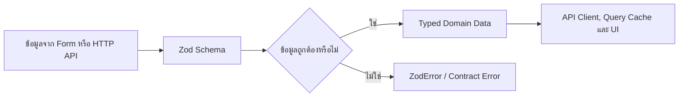
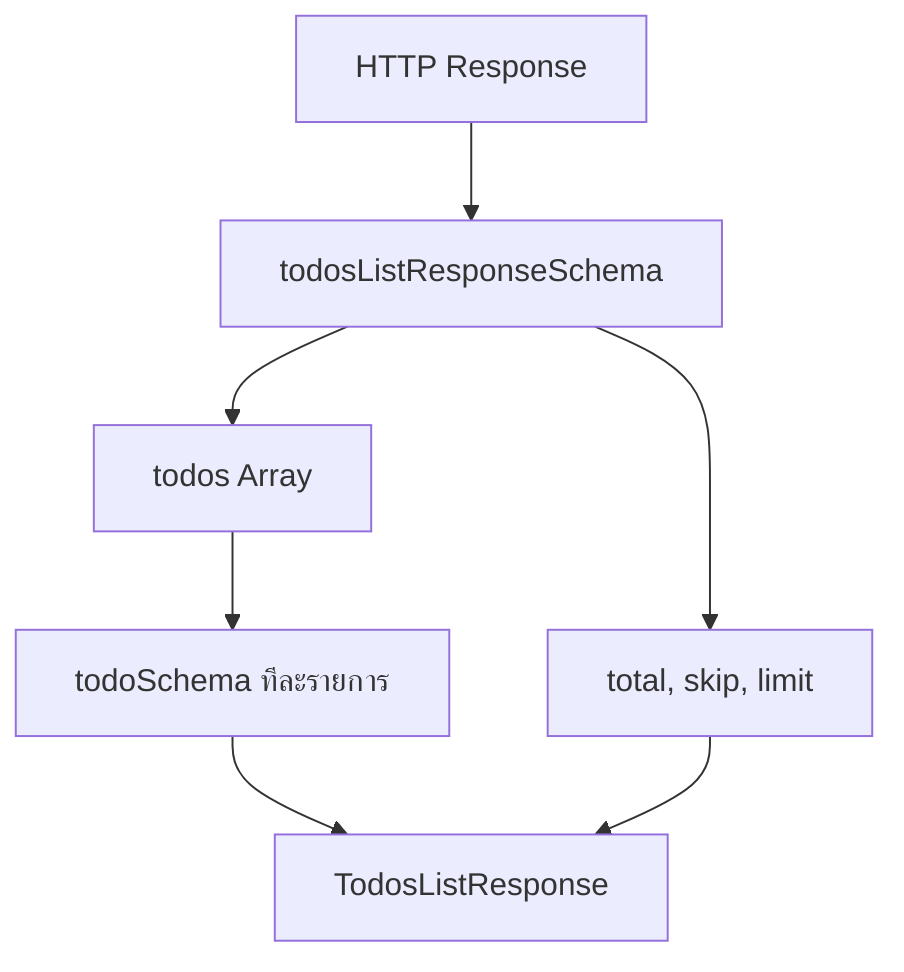
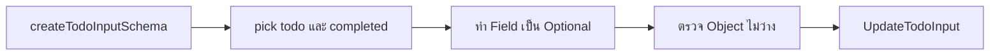
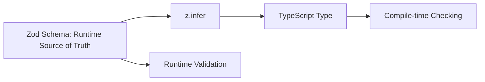
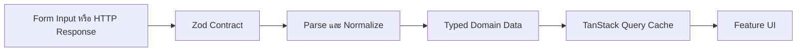

## คำอธิบายเพิ่มเติมเกี่ยวกับ API Contract

ไฟล์: `src/features/todos/api/contracts.ts`

ภาพรวม:

ไฟล์นี้เป็น Boundary Contract ของโมดูล Todos มีหน้าที่กำหนดว่า Input ที่ระบบยอมรับและข้อมูลที่ API ส่งกลับต้องมีรูปแบบอย่างไร ก่อนข้อมูลเหล่านั้นจะถูกนำไปใช้ใน API Client, TanStack Query Cache, Mutation และ UI

TypeScript ตรวจสอบ Type ได้เฉพาะตอน Compile เท่านั้น แต่ข้อมูลจาก HTTP API ยังคงเป็นข้อมูลภายนอกที่เชื่อถือไม่ได้ใน Runtime ดังนั้นไฟล์นี้จึงใช้ Zod ทำหน้าที่สองอย่างพร้อมกัน

1. ตรวจสอบและแปลงข้อมูลจริงใน Runtime ด้วย Schema
2. สร้าง TypeScript Type จาก Schema เดียวกันด้วย `z.infer`

แนวทางนี้ทำให้ Runtime Contract และ Compile-time Type อ้างอิง Source of Truth เดียวกัน ลดปัญหา Schema กับ Type เปลี่ยนไม่พร้อมกัน



ในเชิงสถาปัตยกรรม ไฟล์นี้อยู่ใน Feature Boundary ของ Todos ไม่ใช่ Shared Layer เพราะ Contract เหล่านี้อธิบายรูปแบบข้อมูลเฉพาะของ Business Capability นี้

## Schema

แก่นสำคัญ:

Schema คือกฎที่ถูกใช้งานจริงใน Runtime แต่ละ Schema ในไฟล์นี้มีบทบาทต่างกัน ได้แก่ Response Contract, Mutation Input Contract และ Parameter Contract

หลักที่ควรรักษาคือแยก Contract ตามทิศทางของข้อมูล ไม่ควรใช้ Schema เดียวครอบทุกกรณีเพียงเพราะ Field ดูคล้ายกัน ตัวอย่างเช่น Response ของ Todo มี `id` ที่ Server สร้างให้ แต่ Create Input ไม่ควรอนุญาตให้ Client ส่ง `id` เข้าไปเอง

---

### todoSchema

```ts
export const todoSchema = z.object({
  id: z.coerce.number().int().positive(),
  todo: z.string().trim().min(1),
  completed: z.boolean(),
  userId: z.coerce.number().int().positive(),
});
```

#### Overview

`todoSchema` คือ Contract หลักของ Todo หนึ่งรายการ ใช้ตรวจ Response จาก Endpoint ที่คืน Todo เดี่ยว รวมถึงใช้เป็น Schema ย่อยในรายการ Todos และ Deleted Todo

Input ของ Schema เป็น `unknown` ส่วน Output หลัง Parse สำเร็จจะมีโครงสร้างดังนี้

```ts
{
  id: number;
  todo: string;
  completed: boolean;
  userId: number;
}
```

#### Logic Breakdown

`id`

```ts
z.coerce.number().int().positive()
```

ทำงานตามลำดับดังนี้

1. `coerce.number()` พยายาม Normalize ค่าให้เป็น `number`
2. `int()` บังคับให้เป็นจำนวนเต็ม
3. `positive()` บังคับให้มากกว่า `0`

ตัวอย่างค่าที่ผ่าน

```ts
1
"1" // ถูกแปลงเป็น 1
```

ตัวอย่างค่าที่ไม่ผ่าน

```ts
0
-1
1.5
"abc"
```

`todo`

```ts
z.string().trim().min(1)
```

1. ต้องเป็น String
2. `trim()` ตัด Whitespace ที่ต้นและท้าย
3. `min(1)` บังคับให้เหลือข้อความอย่างน้อยหนึ่งตัวอักษรหลัง Trim

ดังนั้นค่า `"   "` จะไม่ผ่าน แม้ก่อน Trim จะมีความยาวมากกว่า 0

`completed`

```ts
z.boolean()
```

รับเฉพาะ Boolean จริง คือ `true` หรือ `false` โดยไม่ Coerce ค่าอย่าง `"true"`, `1` หรือ `0`

`userId`

ใช้กฎเดียวกับ `id` คือ Normalize เป็นจำนวนเต็มบวก

#### Production-Ready Analysis

การ Coerce Numeric Field ที่ Response Boundary ช่วยให้ข้อมูลใน Query Cache มีรูปแบบเดียว UI และ Query Key ไม่ต้องรองรับทั้ง `number` และ `string`

อย่างไรก็ตาม `z.coerce.number()` มีพฤติกรรมตาม JavaScript `Number(...)` เช่น String ว่างบางรูปแบบอาจถูกแปลงเป็น `0` ก่อนถูก `positive()` ปฏิเสธ จึงยังปลอดภัยสำหรับ Field นี้ แต่หาก Field ยอมรับ `0` ต้องประเมิน Empty String เพิ่มเติม

`z.object()` ของ Zod จะ Strip Unknown Keys ตามพฤติกรรมปกติ ซึ่งช่วยไม่ให้ Field ส่วนเกินจาก API ไหลต่อเข้า Domain Data หากระบบต้องการตรวจพบ Contract Drift แบบเข้มงวด ควรพิจารณาใช้ `.strict()` แล้วรองรับ Error ที่อาจเกิดจาก Field ใหม่ของ API

#### Edge Cases

- API ส่ง `id: null` หรือ `userId: null`
- API ส่งเลขทศนิยม
- API ส่ง `completed: "false"` ซึ่งเป็น String ไม่ใช่ Boolean
- API ส่งข้อความ Todo ที่มีแต่ช่องว่าง
- API ส่ง Todo ยาวผิดปกติ เพราะ Response Schema นี้ยังไม่ได้กำหนด Maximum Length
- API เพิ่ม Field ใหม่ ซึ่งจะถูก Strip ออกโดย Default แทนที่จะทำให้ Parse ล้มเหลว

---

### todosListResponseSchema

```ts
export const todosListResponseSchema = z.object({
  todos: z.array(todoSchema),
  total: z.coerce.number().int().nonnegative(),
  skip: z.coerce.number().int().nonnegative(),
  limit: z.coerce.number().int().nonnegative(),
});
```

#### Overview

Schema นี้ตรวจ Response ของ Endpoint รายการ Todos โดยประกอบด้วยรายการ Todo และ Metadata สำหรับ Server Pagination

Output:

```ts
{
  todos: Array<Todo>;
  total: number;
  skip: number;
  limit: number;
}
```

#### Logic Breakdown

`todos`

```ts
z.array(todoSchema)
```

ตรวจว่าเป็น Array และ Parse สมาชิกทุกตัวด้วย `todoSchema` หากสมาชิกเพียงหนึ่งตัวผิด Contract การ Parse ของ Response ทั้งก้อนจะล้มเหลว

`total`

จำนวนข้อมูลทั้งหมดที่ Dataset หรือ Endpoint รายงาน ต้องเป็นจำนวนเต็มตั้งแต่ `0` ขึ้นไป

`skip`

จำนวนรายการที่ Endpoint ข้ามไปก่อนคืนผลลัพธ์ ต้องเป็นจำนวนเต็มตั้งแต่ `0` ขึ้นไป

`limit`

จำนวนสูงสุดที่ Endpoint ถูกขอหรือคืนในหนึ่งหน้า ใช้ `nonnegative()` แทน `positive()` เพราะ DummyJSON รองรับ `limit=0`



#### Production-Ready Analysis

การ Parse Array มี Time Complexity โดยประมาณ `O(n)` ตามจำนวน Todo ใน Response จึงควรควบคุม Page Size ไม่ให้ใหญ่เกินไป แม้ Zod จะเร็วพอสำหรับรายการทั่วไป แต่การ Parse Payload หลายหมื่นรายการบน Main Thread สามารถกระทบ UI Responsiveness ได้

Schema นี้ตรวจ Shape และชนิดข้อมูล แต่ยังไม่ได้ตรวจ Invariant ระหว่าง Metadata เช่น

- `skip` ไม่ควรมากกว่า `total` ในบางกรณี
- จำนวนสมาชิกใน `todos` ไม่ควรมากกว่า `limit`

ระบบจริงสามารถเพิ่ม `.superRefine()` หาก API Contract รับประกันความสัมพันธ์เหล่านี้แน่นอน แต่ไม่ควรเพิ่มกฎที่ API จริงไม่ได้รับประกัน เพราะจะทำให้ Client เปราะบางเกินไป

#### Edge Cases

- `todos` ไม่ใช่ Array
- Todo เพียงหนึ่งรายการผิด Contract ทำให้ Response ทั้งก้อนถูกปฏิเสธ
- `total`, `skip` หรือ `limit` เป็นเลขติดลบ
- `limit=0` และ `todos=[]` ซึ่งเป็นกรณีที่ถูกต้องสำหรับ DummyJSON
- API ส่ง `todos=[]` ขณะที่ `total>0`; อาจถูกต้องเมื่อ Page อยู่เกินช่วงข้อมูล
- Payload มีรายการจำนวนมากจน Runtime Validation ใช้เวลาสูง

---

### randomTodosSchema

```ts
export const randomTodosSchema = z.array(todoSchema).min(1).max(10);
```

#### Overview

Schema นี้ตรวจ Response ของ Endpoint ที่สุ่ม Todo หลายรายการ โดยกำหนดจำนวนสมาชิกขั้นต่ำ 1 และสูงสุด 10 ตามขอบเขตของ Tutorial

Input เป็น `unknown` และ Output คือ `Array<Todo>` ที่มีสมาชิก 1–10 รายการ

#### Logic Breakdown

1. `z.array(todoSchema)` ตรวจว่า Response เป็น Array และสมาชิกทุกตัวเป็น Todo ที่ถูกต้อง
2. `min(1)` ไม่ยอมรับ Array ว่าง
3. `max(10)` ป้องกัน Response ที่เกินขอบเขตซึ่ง UI และ Endpoint นี้ออกแบบไว้

#### Production-Ready Analysis

การกำหนด Cardinality เป็นส่วนหนึ่งของ Contract ช่วยป้องกัน UI รับข้อมูลมากกว่าที่ออกแบบ และช่วยตรวจพบ API ที่ทำงานผิดจาก Request

แต่ Schema นี้ไม่ได้รับประกันว่า Todo ทุกตัวไม่ซ้ำกัน หาก Requirement ต้องการ Unique Todo จริง ควรตรวจ `id` ซ้ำด้วย `.superRefine()` หรือ Normalize หลัง Parse ตามนโยบายของระบบ

#### Edge Cases

- API คืน Array ว่าง
- API คืนมากกว่า 10 รายการ
- API คืน Object เดี่ยวแทน Array เมื่อ `count=1`
- API คืน Todo ซ้ำกันหลายรายการ
- Todo ตัวใดตัวหนึ่งผิด Contract

ใน Tutorial กรณี `count=1` ถูกจัดการใน API Client โดยเรียก Endpoint Todo เดี่ยว แล้วห่อผลลัพธ์เป็น Array ไม่ได้ใช้ Schema นี้ Parse Object เดี่ยวโดยตรง

---

### createTodoInputSchema

```ts
export const createTodoInputSchema = z.object({
  todo: z.string().trim().min(3).max(300),
  completed: z.boolean(),
  userId: z.number().int().positive(),
});
```

#### Overview

Schema นี้เป็น Mutation Input Contract สำหรับสร้าง Todo ใหม่ ใช้ Validate ข้อมูลฝั่ง Client ก่อนส่ง HTTP Request

Output:

```ts
{
  todo: string;
  completed: boolean;
  userId: number;
}
```

จุดสำคัญคือ Schema นี้ไม่มี `id` เพราะ ID เป็นหน้าที่ของ Server และไม่มี Field ที่เกี่ยวข้องกับ Delete Response

#### Logic Breakdown

`todo`

- ต้องเป็น String
- Trim ช่องว่างต้นและท้าย
- ต้องยาวอย่างน้อย 3 ตัวอักษร
- ยาวสูงสุด 300 ตัวอักษร

`completed`

ต้องเป็น Boolean จริง

`userId`

ต้องเป็น Number, จำนวนเต็ม และมากกว่า 0 โดยตั้งใจไม่ใช้ `coerce` เพราะข้อมูลนี้มาจาก Application Input ซึ่งควรถูก Normalize ก่อนเข้าสู่ Mutation Boundary

#### Production-Ready Analysis

การแยก Input Schema ออกจาก Response Schema เป็นหลัก Mass Assignment Prevention ในระดับหนึ่ง เพราะ Client ส่งได้เฉพาะ Field ที่อนุญาต แทนการส่ง Object Todo ทั้งก้อนกลับไปยัง Server

อย่างไรก็ตาม Client-side Validation ไม่ใช่ Security Boundary ที่แท้จริง ผู้โจมตีสามารถข้าม Frontend และเรียก API โดยตรง Backend ต้อง Validate และ Authorize ข้อมูลซ้ำเสมอ โดยเฉพาะ `userId` ซึ่งไม่ควรถูกเชื่อถือว่าเป็นเจ้าของข้อมูลเพียงเพราะ Client ส่งมา

Maximum Length ช่วยลด Payload ผิดปกติและทำให้ Constraint ระหว่าง Form, API และ Database ชัดเจน แต่ค่าจริงควรตรงกับ Backend Contract

#### Edge Cases

- `todo` มี Emoji หรือ Unicode หลาย Code Point ซึ่ง `.max(300)` วัดตาม JavaScript String Length ไม่ใช่จำนวน Grapheme ที่ผู้ใช้มองเห็น
- `todo` มี Whitespace ภายในจำนวนมาก ซึ่ง `trim()` ไม่ได้ Normalize
- Form ส่ง `userId` เป็น String จาก `<select>` แล้ว Parse ไม่ผ่าน
- Client ส่ง Unknown Field ซึ่งจะถูก Strip โดย Default
- ผู้ใช้ส่งข้อความที่ผ่าน Length Constraint แต่มีเนื้อหาไม่เหมาะสม; Schema นี้ไม่ได้ทำ Content Moderation

---

### updateTodoInputSchema

```ts
export const updateTodoInputSchema = createTodoInputSchema
  .pick({ todo: true, completed: true })
  .partial()
  .refine((value) => Object.keys(value).length > 0, {
    message: "ต้องมีข้อมูลอย่างน้อยหนึ่ง Field สำหรับการแก้ไข",
  });
```

#### Overview

Schema นี้กำหนด Payload สำหรับ `PATCH` Todo โดยอนุญาตให้แก้เฉพาะ `todo` และ `completed` และส่งเพียง Field ที่เปลี่ยน

Output ที่เป็นไปได้ เช่น

```ts
{ todo: "เขียนเอกสาร" }
{ completed: true }
{ todo: "เขียนเอกสาร", completed: true }
```

Payload ว่าง `{}` จะไม่ผ่าน

#### Logic Breakdown

ขั้นที่ 1: เลือก Field ที่แก้ไขได้

```ts
.pick({ todo: true, completed: true })
```

สร้าง Schema ใหม่จาก `createTodoInputSchema` โดยเก็บเฉพาะ `todo` และ `completed` จึงตัด `userId` ออกอย่างชัดเจน

ขั้นที่ 2: ทำทุก Field ให้เป็น Optional

```ts
.partial()
```

เหมาะกับ `PATCH` เพราะไม่ต้องส่ง Resource ทั้งก้อน

ขั้นที่ 3: ห้าม Payload ว่าง

```ts
.refine((value) => Object.keys(value).length > 0, ...)
```

หลัง Parse แล้ว ตรวจว่ามีอย่างน้อยหนึ่ง Field ที่จะอัปเดต



#### Production-Ready Analysis

การ Derive Schema จาก Create Schema ช่วย Reuse Validation Rule และลด Drift เช่น Constraint ของ `todo` จะเปลี่ยนพร้อมกันทั้ง Create และ Update

แต่การ Reuse ต้องสอดคล้องกับ Business Rule จริง หาก Create ต้องยาวขั้นต่ำ 3 ตัวอักษร แต่ Update อนุญาตข้อความสั้นกว่านั้น การ Derive แบบนี้จะไม่เหมาะและควรแยก Field Schema กลางแทน

การใช้ `.pick()` เป็น Allowlist ทำให้ Field อย่าง `userId`, `id` หรือ Field ที่อ่อนไหวไม่สามารถถูกแก้ผ่าน Payload นี้โดยตั้งใจ

`Object.keys(value).length` ตรวจ Object หลัง Zod Parse ดังนั้น Unknown Keys อาจถูก Strip ก่อน Refine ตัวอย่าง `{ id: 1 }` จะกลายเป็น `{}` แล้วถูกปฏิเสธ ซึ่งเป็นพฤติกรรมที่เหมาะสม

#### Edge Cases

- Payload `{}`
- Payload มีเฉพาะ Unknown Field เช่น `{ id: 10 }`
- Payload `{ todo: undefined }`; ต้องพิจารณาพฤติกรรม Serialization เพราะ JSON จะตัด `undefined` ออก
- Payload `{ completed: false }` ต้องผ่าน แม้ค่าเป็น Falsy
- Payload มี `todo` เหมือนค่าเดิม ระบบยังถือว่ามี Field สำหรับ Update
- Concurrent Update จากผู้ใช้หลายคน ซึ่ง Schema ไม่สามารถป้องกัน Lost Update ได้ ต้องใช้ Version, ETag หรือ Server-side Concurrency Control

---

### deletedTodoSchema

```ts
export const deletedTodoSchema = todoSchema.extend({
  isDeleted: z.literal(true),
  deletedOn: z.iso.datetime(),
});
```

#### Overview

Schema นี้ตรวจ Response หลัง Delete โดยต่อยอดจาก Todo ปกติ และเพิ่ม Metadata ยืนยันการลบ

Output:

```ts
{
  id: number;
  todo: string;
  completed: boolean;
  userId: number;
  isDeleted: true;
  deletedOn: string;
}
```

#### Logic Breakdown

`todoSchema.extend(...)`

Reuse ทุก Field ของ Todo เดิม และเพิ่ม Field ใหม่สองตัว

`isDeleted`

```ts
z.literal(true)
```

ต้องเป็น `true` เท่านั้น ไม่รับเพียง Boolean ทั่วไป เพราะ Response นี้ต้องยืนยันว่าการลบเกิดขึ้นแล้ว

`deletedOn`

```ts
z.iso.datetime()
```

ต้องเป็น String วันที่และเวลาตามรูปแบบ ISO datetime ที่ Zod ยอมรับ

#### Production-Ready Analysis

Literal Field ทำหน้าที่คล้าย Discriminator ช่วยให้ระบบแยก Deleted Response ออกจาก Todo ปกติได้ชัดเจน

`deletedOn` ยังคงเป็น String ไม่ได้ถูกแปลงเป็น `Date` ซึ่งเป็นทางเลือกที่เหมาะกับ Query Cache และ Serialization เพราะ Date Object อาจทำให้ Hydration, Persistence หรือ Equality ซับซ้อนขึ้น การแปลงเป็น Date ควรทำเฉพาะจุดที่ต้องคำนวณหรือแสดงผล

ระบบจริงต้องแยกว่า Endpoint ใช้ Hard Delete หรือ Soft Delete เพราะ Contract ลักษณะนี้เป็นเพียง Response ของ DummyJSON ไม่ได้ยืนยันว่า Record ถูกลบถาวรจาก Storage

#### Edge Cases

- API คืน `isDeleted: false`
- API ไม่คืน Todo เดิมหลัง Delete
- `deletedOn` เป็นวันที่ที่ Parse ได้แต่ไม่มี Timezone ตามนโยบายที่ระบบต้องการ
- Server คืน HTTP 204 No Content ซึ่งจะไม่สามารถ Parse ด้วย Schema นี้
- Delete ถูกเรียกซ้ำและ API คืน 404 หรือ State อื่น

---

### randomTodoCountSchema

```ts
export const randomTodoCountSchema = z.number().int().min(1).max(10);
```

#### Overview

Schema นี้ตรวจ Parameter `count` ก่อนนำไปสร้าง URL สำหรับ Endpoint Random Todos

Input และ Output เป็น `number` โดยต้องเป็นจำนวนเต็มตั้งแต่ 1 ถึง 10

#### Logic Breakdown

1. `z.number()` ไม่รับ String
2. `int()` ไม่รับเลขทศนิยม
3. `min(1)` ป้องกันจำนวนศูนย์หรือติดลบ
4. `max(10)` จำกัดตามขอบเขต Endpoint และ UI

#### Production-Ready Analysis

การ Validate ก่อนนำค่าไปประกอบ URL ช่วยให้ API Client ไม่สร้าง Request ที่ผิด Contract และลด Invalid Traffic ไปยัง Backend

การไม่ใช้ Coercion ทำให้ Caller ต้อง Normalize Input ก่อน เช่นค่าจาก `<input type="number">` ยังคงเป็น String หากอ่านจาก `event.target.value` โดยตรง แนวทางนี้ทำให้ Boundary ของ API Client เข้มงวดและ Predictable

#### Edge Cases

- `count` เป็น String เช่น `"5"`
- `count` เป็น `NaN` หรือ `Infinity`
- `count` เป็นเลขทศนิยม
- `count` น้อยกว่า 1 หรือมากกว่า 10
- UI Constraint กับ Schema Constraint ไม่ตรงกัน

---

## Type

แก่นสำคัญ:

Type ทุกตัวในไฟล์นี้ถูก Infer จาก Schema แทนการเขียน `interface` หรือ `type` ซ้ำอีกชุด

```ts
export type Todo = z.infer<typeof todoSchema>;
```

แนวทางนี้สร้างความสัมพันธ์ดังนี้



เมื่อเพิ่ม ลบ หรือเปลี่ยน Field ใน Schema TypeScript Type จะเปลี่ยนตามโดยอัตโนมัติ จึงลดโอกาสที่ Runtime Validation กับ Static Type จะขัดแย้งกัน

### CreateTodoInput

```ts
export type CreateTodoInput = z.infer<typeof createTodoInputSchema>;
```

แทน Payload ที่อนุญาตสำหรับ Create Mutation

```ts
{
  todo: string;
  completed: boolean;
  userId: number;
}
```

ใช้เป็น Type ของ Input ใน API Client, Mutation Function และ Form Submission Boundary

ไม่ควรใช้ `Todo` แทน Type นี้ เพราะ `Todo` มี `id` ซึ่งยังไม่ควรมีตอนสร้างข้อมูล

---

### DeletedTodo

```ts
export type DeletedTodo = z.infer<typeof deletedTodoSchema>;
```

แทน Response หลัง Delete ที่ผ่าน Runtime Validation แล้ว โดยมี Field ของ Todo เดิม พร้อม `isDeleted: true` และ `deletedOn`

Literal Type ของ `isDeleted` จะเป็น `true` ไม่ใช่ `boolean` ทำให้ Type Narrowing ชัดเจนขึ้น

---

### Todo

```ts
export type Todo = z.infer<typeof todoSchema>;
```

แทน Domain Data ของ Todo ที่ผ่าน Contract Boundary แล้ว

```ts
{
  id: number;
  todo: string;
  completed: boolean;
  userId: number;
}
```

Type นี้สามารถใช้ใน Query Cache, Page Props และ Component Props ได้ เพราะข้อมูลควรถูก Parse ก่อนเข้าสู่ส่วนเหล่านั้นแล้ว

---

### TodosListResponse

```ts
export type TodosListResponse = z.infer<typeof todosListResponseSchema>;
```

แทน Response รายการ Todos พร้อม Pagination Metadata

```ts
{
  todos: Todo[];
  total: number;
  skip: number;
  limit: number;
}
```

ใช้เป็น Return Type ของ API Client และ Data Type ใน Query Options

---

### UpdateTodoInput

```ts
export type UpdateTodoInput = z.infer<typeof updateTodoInputSchema>;
```

แทน Payload สำหรับ Partial Update

ในเชิง TypeScript Field จะเป็น Optional

```ts
{
  todo?: string;
  completed?: boolean;
}
```

แต่ TypeScript ไม่สามารถแสดงกฎ Runtime ที่ว่า Object ต้องมีอย่างน้อยหนึ่ง Field ได้อย่างสมบูรณ์จาก `z.infer` นี้ ดังนั้นค่า `{}` อาจดูเหมือนถูกต้องใน Compile Time แต่จะถูกปฏิเสธตอน `updateTodoInputSchema.parse(...)`

นี่เป็นตัวอย่างสำคัญว่า Static Type ไม่สามารถแทน Runtime Validation ได้ทั้งหมด

---

## แนวทางสำหรับ Production

### 1. Parse ข้อมูลที่ Boundary เท่านั้น

API Response ควรเริ่มเป็น `unknown` ในเชิงความเชื่อมั่น และถูก Parse ภายใน Feature API Client ก่อนคืนให้ Query Layer

```ts
const response = await httpClient.get("/todos");
return todosListResponseSchema.parse(response.data);
```

ไม่ควรใช้ Type Assertion เพื่อหลอก Compiler

```ts
return response.data as TodosListResponse;
```

เพราะ `as` ไม่ตรวจข้อมูลจริงและอาจปล่อย Contract Drift เข้า Query Cache

### 2. แยก Request และ Response Contract

Create Input, Update Input, Todo Response และ Delete Response มี Trust Level และ Allowed Field ต่างกัน จึงควรแยก Schema แม้บาง Field จะเหมือนกัน

หลักนี้ช่วยลด Over-posting, Mass Assignment และ Coupling กับ API Response

### 3. Client Validation ไม่แทน Backend Validation

Zod ใน Frontend ช่วยเรื่อง UX, Predictability และ Contract Detection แต่ไม่ใช่ Security Control ฝั่ง Server

Backend ยังคงต้องทำสิ่งต่อไปนี้

- Validate Request Body
- Authenticate Caller
- Authorize Resource Access
- ป้องกัน Mass Assignment
- บังคับ Database Constraint
- Sanitize หรือ Encode ข้อมูลตาม Output Context

### 4. เลือกใช้ Coercion อย่างมีขอบเขต

Response จากระบบภายนอกอาจต้อง Normalize ด้วย `z.coerce.number()` แต่ Application Input ควรใช้ Type ที่เข้มงวดเมื่อทำได้ เพื่อไม่ให้ค่าผิดประเภทถูกยอมรับโดยไม่ตั้งใจ

Coercion ไม่ควรถูกใช้เป็น Default กับทุก Field โดยเฉพาะ Boolean เพราะค่า String อย่าง `"false"` อาจถูกแปลงแบบที่ผู้พัฒนาคาดไม่ถึงหากใช้ JavaScript Truthiness

### 5. พิจารณา Strictness ตามความเสี่ยงของ API

Default Object Schema ช่วย Strip Unknown Keys และรองรับ API ที่เพิ่ม Field แบบ Backward-compatible

ระบบที่ต้องตรวจ Contract Drift อย่างเข้มงวดอาจใช้ `.strict()` แต่ต้องยอมรับว่า API เพิ่ม Field ใหม่เพียงตัวเดียวอาจทำให้ Client ล้มเหลวทันที

ควรเลือกตาม Compatibility Policy ไม่ใช่ใช้ Strict Mode โดยอัตโนมัติ

### 6. รักษา Error Context

ZodError จาก Response ควรถูกแปลงเป็น Application Error ที่มี Code และรายละเอียดสำหรับ Logging หรือ Observability โดยไม่แสดง Raw Payload ที่อาจมีข้อมูลอ่อนไหวต่อผู้ใช้

ควรแยกข้อความสำหรับผู้ใช้กับรายละเอียดสำหรับ Developer

### 7. ทดสอบ Contract โดยตรง

ควรมี Unit Test ครอบคลุมอย่างน้อย

- Happy Path ของแต่ละ Schema
- Numeric String ที่ต้อง Coerce
- Invalid Boolean
- Empty และ Over-limit Array
- Empty PATCH Payload
- Unknown-only PATCH Payload
- Invalid ISO Datetime
- Boundary Value เช่น `count=1`, `count=10`, `limit=0`

### 8. ประเมิน Performance ตาม Payload Size

Zod Parse เป็นงาน Synchronous บน Main Thread สำหรับ Browser Application ควรใช้ Pagination และจำกัด Response Size

หาก API คืน Payload ขนาดใหญ่มาก ควรแก้ที่ API Design ก่อน เช่น Pagination, Field Selection หรือ Streaming มากกว่าข้าม Runtime Validation ทั้งหมด

### 9. Version Contract อย่างมีแผน

เมื่อ Backend Contract เปลี่ยนแบบ Breaking Change ควรมี Versioning, Migration Window หรือ Adapter Layer ไม่ควรแก้ Schema ให้ยอมรับหลาย Shape แบบไร้ขอบเขตจน Domain Type กลายเป็น Union ที่ซับซ้อนทั่วระบบ

### 10. อย่า Export Schema ที่ไม่จำเป็นผ่าน Feature Public API

Schema และ Type ที่ใช้เฉพาะภายใน `features/todos/api` ควรคงเป็น Internal Detail ส่วนสิ่งที่ Route หรือ Feature อื่นต้องใช้จึงค่อย Export ผ่าน `features/todos/index.ts`

แนวทางนี้ลด Coupling และช่วยให้ Implementation ภายในเปลี่ยนได้โดยกระทบ Consumer น้อยลง

---

## สรุปสาระสำคัญ

`contracts.ts` ไม่ใช่เพียงไฟล์รวม Type แต่เป็น Runtime Boundary ของโมดูล Todos

- `todoSchema` กำหนดรูปแบบ Todo มาตรฐาน
- `todosListResponseSchema` กำหนดรายการและ Pagination Metadata
- `randomTodosSchema` จำกัดรายการสุ่มไว้ 1–10 รายการ
- `createTodoInputSchema` กำหนด Allowlist สำหรับ Create Mutation
- `updateTodoInputSchema` รองรับ Partial Update แต่ห้าม Payload ว่าง
- `deletedTodoSchema` ตรวจ Response ยืนยันการลบ
- `randomTodoCountSchema` ป้องกัน Parameter ที่อยู่นอกขอบเขต
- `z.infer` ทำให้ Runtime Schema และ TypeScript Type ใช้ Source of Truth เดียวกัน

Data Flow ที่ต้องรักษาคือ



ข้อมูลจากภายนอกไม่ควรข้าม Contract Boundary เข้า Query Cache หรือ UI โดยตรง และ Type Assertion ไม่สามารถใช้แทน Runtime Validation ได้
