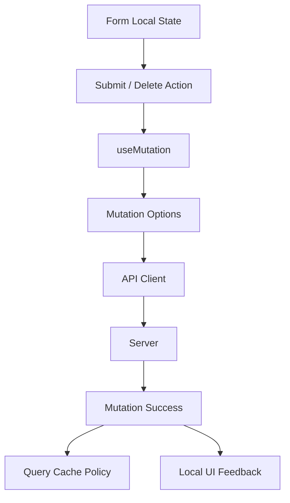

# คำอธิบายเพิ่มเติมเกี่ยวกับ Todo Mutation Panel

ไฟล์: `src/features/todos/components/todo-mutation-panel.tsx`

## ภาพรวม

---

## Component Contract

### Props

---

### Local State

---

### External Dependencies

---

## `AddTodoPanel`

### Props

---

### Local State

---

### Initial State

---

### Submit Flow

---

### Mutation Interaction

---

### Success / Error Handling

---

## `EditTodoPanel`

### Props

---

### Local State

---

### Update Flow

---

### Delete Flow

---

### Mutation Interaction

---

### `onDeleted`

---

### Success / Error Handling

---

## Logic Breakdown

### Event Handlers

---

### Rendering Logic

---

### Loading State

---

### Error State

---

### Success State

---

## Data Flow

---

## Separation of Concerns

### Presentation

---

### Interaction

---

### Server State

---

### URL State

---

### Business Logic

---

## Production-Ready Analysis

### Performance Optimization

---

### Security First

---

### Accessibility

---

### Scalability & Maintainability

---

### Testability

---

## Edge Cases

---

## สรุปสาระสำคัญ
