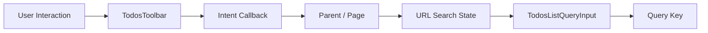

# คำอธิบายเพิ่มเติมเกี่ยวกับ TodosToolbar

ไฟล์: `src/features/todos/components/todos-toolbar.tsx`

## ภาพรวม

---

## Component Contract

### Props

---

### Local State

---

### External Dependencies

---

## Logic Breakdown

### Input State

---

### User Interaction

---

### `onChange`

---

### `onReset`

---

### Conditional Rendering

---

### Pagination Reset Rules

---

## Data Flow

---

## Separation of Concerns

### Presentation

---

### Interaction

---

### Server State

---

### URL State

---

### Business Logic

---

## Production-Ready Analysis

### Performance Optimization

---

### Security First

---

### Accessibility

---

### Scalability & Maintainability

---

### Testability

---

## Edge Cases

---

## สรุปสาระสำคัญ
