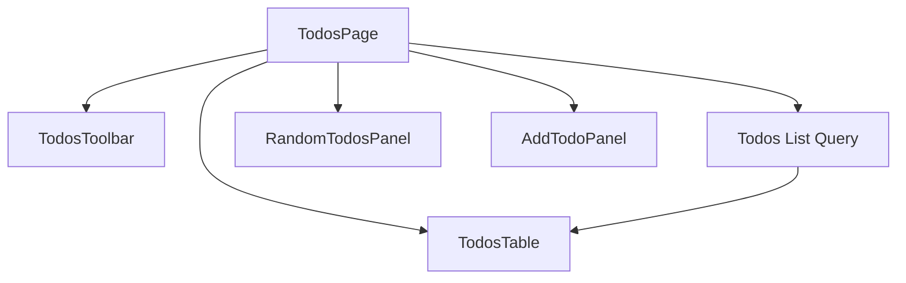
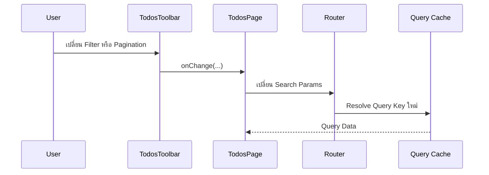

# คำอธิบายเพิ่มเติมเกี่ยวกับ TodosPage

ไฟล์: `src/features/todos/pages/todos-page.tsx`

## ภาพรวม

---

## Page Responsibility

### สิ่งที่ Page เป็นเจ้าของ

---

### สิ่งที่ Page ไม่ควรเป็นเจ้าของ

---

## Inputs

### Props

---

### Route / Search State

---

### Query Input

---

## Dependencies

### Query Options

---

### Toolbar

---

### Table

---

### Random Todos Panel

---

### Mutation Panel

---

## Data Loading

### Query ที่ใช้

---

### Cache ที่อ่าน

---

### Loading Behavior

---

### Error Behavior

---

## Page Composition

---

## Interaction Flow

---

## Orchestration Analysis

### Query Consumption

---

### Child Component Coordination

---

### URL State Coordination

---

### Mutation Coordination

---

## Separation of Responsibilities

### Presentation

---

### Server State

---

### URL State

---

### Business Logic

---

## Production-Ready Analysis

### Performance Optimization

---

### Security First

---

### Accessibility

---

### Scalability & Maintainability

---

### Testability

---

## Edge Cases

---

## สรุปสาระสำคัญ
